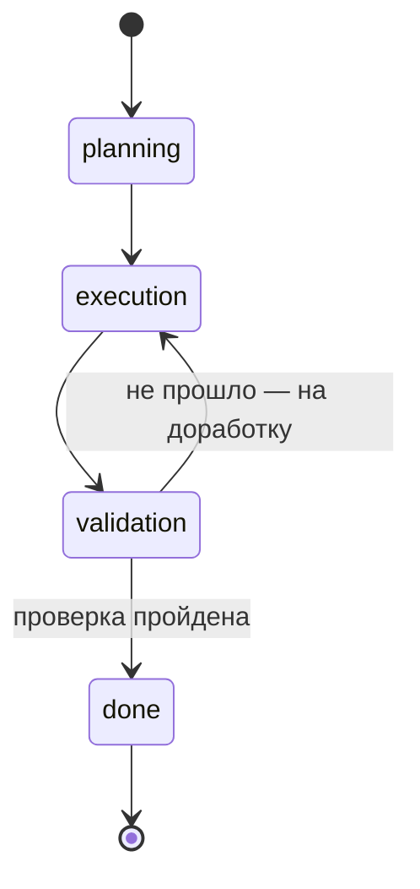

# 🔥 День 13. Состояние задачи (Task State Machine)

## Задание

Реализуйте состояние задачи как **конечный автомат**: этап задачи, текущий шаг,
ожидаемое действие. Пример состояний: **planning → execution → validation → done**.

Проверьте: паузу на любом этапе; продолжение без повторных объяснений.
Результат: агент с формализованным состоянием задачи.

> **Накопительный агент.** task-13 = дни 11–12 (память + персонализация) + конечный
> автомат поверх. `-report` показывает только сегодняшнюю фичу. Переходы
> **детерминированные** (в коде) — лектор: «попроще и надёжнее». Один агент; рой
> агентов/оркестратор — финал недели.

---

## Схема автомата

После `validation` есть две дороги: вперёд в `done` (проверка пройдена) или **назад в
`execution`** на доработку. Прыгать через этап нельзя — переходы контролируются в коде.



Тот же автомат текстом (для терминала/редактора без рендера Mermaid):

```
        ┌─────────┐      ┌───────────┐      ┌────────────┐      ┌──────┐
  [*]──▶│ planning│─────▶│ execution │─────▶│ validation │─────▶│ done │──▶[*]
        └─────────┘      └───────────┘      └────────────┘      └──────┘
                              ▲                    │
                              └────────────────────┘
                               не прошло → доработка
```

| state | ожидаемое действие | переходы |
|-------|--------------------|----------|
| planning | собрать требования, предложить план; не писать финальный код | → execution |
| execution | выполнять текущий шаг плана; не перепрыгивать | → validation |
| validation | проверить результат на соответствие плану | → done **или** → execution |
| done | задача завершена | — (терминальное) |

Состояние — часть `TaskContext` (рабочая память дня 11): поле `state` + `current`.
В System каждого запроса добавляется блок `[ЭТАП ЗАДАЧИ]` с текущим state и ожидаемым
действием. Переключает **код** (`mem.Advance()` → `transition()` проверяет допустимость).

> **Не путать два уровня.** В лекции (слайд 33) агент определён как
> `AGENT = ⟨PERCEPTION, MEMORY, REASONING, PLANNING, ACTION, FEEDBACK⟩` — это 6
> **составляющих агента** (из чего он состоит как сущность). А `planning → execution →
> validation → done` — это **этапы задачи**, по которым движется наш конечный автомат.
> Это разные вещи: первое — анатомия агента, второе — жизненный цикл одной задачи.

## Пауза и продолжение

- **Пауза** — явное действие: `pause` (или `-confirm` ставит паузу перед переходом).
  Состояние сохраняется в `working.json`.
- **Продолжение без повторных объяснений** — при следующем запуске агент читает
  `working.json`, видит `state`/`current`/план и продолжает с того же этапа. Если CLI
  просто закрыли — последний сохранённый state остаётся.

## Опция `-confirm`

```bash
go run ./week-3/task-13 -confirm
```

Перед каждым переходом пауза + вопрос: `y` (перейти) / `n` (доработать — с validation
вернёт в execution) / `pause` (сохранить и выйти). Без флага автомат идёт до `done` сам.

---

## Что добавлено по сравнению с днём 12 (по файлам)

Новые файлы:

- **`state.go`** (новый) — сам конечный автомат: тип `TaskState`
  (planning/execution/validation/done), карта разрешённых переходов `transitions`
  (включая возврат `validation → execution`), карта `expectedAction` (ожидаемое
  действие на этапе) и функции контроля `canTransition` / `nextState` / `transition`
  (require-стиль: запрещённый переход возвращает ошибку).
- **`pipeline.go`** (новый) — `Pipeline` прогоняет задачу по этапам детерминированно:
  `stageQuery(state, task)` формирует запрос под этап, `Run` идёт от текущего state до
  `done` через `mem.Advance()`, `askConfirm` реализует паузу/подтверждение в режиме
  `-confirm`. Печатает `[этап]`, `[запрос]` и `[переход]`.

Изменённые файлы (по сравнению с днём 12):

- **`memory.go`** — в `TaskContext` (WorkingMem) добавлено поле `State TaskState`;
  `SetTask` ставит начальный `planning`; добавлены `State()`, `Advance()` (детерминир.
  переход с контролем), `Goto()` (явный переход под контролем), геттеры `TaskName()` /
  `TaskGoal()`. `renderWorking` теперь печатает этап и ожидаемое действие; `Build`
  подмешивает в System блок `[ЭТАП ЗАДАЧИ]`; `ResetTask` сбрасывает в `planning`.
- **`report.go`** — переписан под задание дня 13: таблица разрешённых переходов,
  проверка запрета прыжка через этап, печать задачи в шапке и детерминированный прогон
  planning→done; память/персонализация в отчёт больше не выносятся.
- **`main.go`** — добавлен флаг `-confirm`, создание `Pipeline`, команды `/state`,
  `/run`, `/advance`, сообщение о возобновлении задачи при старте (если в `working.json`
  есть незавершённая задача).

Без изменений с дня 12 (перенесены как есть): **`agent.go`**, **`profile.go`**,
**`usage.go`**, **`profiles/*.md`** — память (3 слоя) и персонализация (профили).

---

## Как это работает (и зачем)

### Общий поток

Состояние задачи — это поле `state` внутри `TaskContext` (рабочая память дня 11). Оно
живёт вместе с задачей и сохраняется в `working.json`. Весь автомат — это цикл в
`Pipeline.Run`, который повторяет один и тот же шаг, пока не дойдёт до `done`:

1. Смотрим текущий `state` (например, `planning`).
2. `stageQuery(state, task)` формирует запрос под этот этап («составь план» / «выполни
   шаг» / «проверь результат»).
3. Агент отвечает. В System при этом уже подмешаны профиль (день 12), рабочая память и
   отдельный блок `[ЭТАП ЗАДАЧИ]` — где написано, на каком мы этапе и что на нём делать.
4. Код детерминированно двигает состояние вперёд: `mem.Advance()` берёт следующий этап
   по `nextState` и пропускает его через `transition()` (проверка допустимости).
5. Сохраняем (`working.json`) и повторяем. Дошли до `done` — выходим.

То есть «мозги» (что писать) — у модели, а «коробка передач» (на каком мы этапе и можно
ли переключиться) — у кода. Модель не управляет переходами, она работает внутри этапа.

### Почему так сделано

- **Состояние — внутри `TaskContext`, а не отдельно.** Этап — это свойство задачи,
  поэтому он лежит там же, где план и решения, и сохраняется тем же `Save()`. Благодаря
  этому пауза/продолжение получаются почти бесплатно: при следующем запуске агент читает
  `working.json` и продолжает с того же этапа — задачу не нужно объяснять заново.

- **Переходы детерминированные, в коде (а не «модель сама решит»).** LLM услужлива: если
  спросить её «переходим дальше?», она почти всегда согласится — даже если этап на самом
  деле не закончен. Поэтому решение о переходе принимает код по чётким правилам. Это
  надёжнее и воспроизводимо (лектор: «попроще и надёжнее»), и совпадает с принципом
  «LLM предлагает — код решает».

- **Карта `transitions` + `transition()` (require-стиль).** Это формализация граничных
  условий: какие переходы вообще разрешены. Прыжок через этап (`planning → validation`)
  невозможен — функция вернёт ошибку. В прогоне видно строку, что такой переход запрещён.

- **Блок `[ЭТАП ЗАДАЧИ]` в System.** Без него модель на запрос «выполни план» могла бы
  сразу написать весь код, проигнорировав текущий шаг. Блок задаёт ей рамку этапа —
  поэтому в прогоне на execution она пишет «Стоп, не перепрыгиваю» и делает шаги по
  порядку. Это и есть «текущий шаг + ожидаемое действие» из задания.

- **Возврат `validation → execution`.** На проверке может найтись брак. Без дороги назад
  пришлось бы пересоздавать задачу с нуля (этот реальный кейс обсуждали в чате). Поэтому
  у `validation` два разрешённых перехода: вперёд в `done` или назад в `execution` на
  доработку.

- **Пауза/продолжение через `working.json`.** Пауза — явное действие (`pause` или
  остановка в `-confirm`): код просто сохраняет текущее состояние. Если CLI закрыли —
  последнее сохранённое состояние остаётся на диске. Продолжение = чтение того же файла.

- **Флаг `-confirm` (человек в контуре).** Иногда нужно подтвердить результат этапа
  прежде, чем идти дальше. Флаг ставит паузу перед каждым переходом и спрашивает
  `y/n/pause`; на `n` с этапа `validation` задача уходит обратно в `execution`. Без флага
  автомат проходит всё сам — режим «дал задачу и ушёл».

---

## Уточнения из обсуждения (чат курса, 17.06)

Тезисно — что подтвердил Алексей Гладков по дню 13:

**Переходы между этапами:**
- Переключение состояний — **автоматическое**, не вручную («само-само»; «автоматически
  надо, а то смысл теряется»).
- Два валидных способа: **детерминированно в коде** (лектор: «попроще и надёжнее» — наш
  выбор) или через оркестратор/LLM. Для дня 13 хватает детерминированного.
- Принцип перехода: «завершилась часть, родился артефакт → поехали в следующую».

**Пауза:**
- Активируется **явным прерыванием**; если CLI закрыли — остаётся последний сохранённый
  стейт.
- Валидация переходов человеком — **опция** (флаг «спрашивать перед этапом» / признак
  этапа «валидируется человеком»). У нас это `-confirm`. Мотивирующий кейс из чата: без
  подтверждения задача проскочила к validation с кривым планом.

**Сколько агентов для дня 13:**
- Можно **одним** агентом, переводя задачу по состояниям («пока не обязательно»
  несколько) — это наш вариант.
- На вырост: по агенту на статус + детерминированная передача между ними. Рой агентов /
  оркестратор (вплоть до «оркестратора оркестраторов») — **финал недели**, не день 13.

**Что такое агент (фундамент на финал недели):**
- Агент = **аналог класса в ЯП**: сущность под конкретную задачу, со входными/выходными
  условиями, system prompt и зарегистрированными тулами; у «класса» может быть **много
  инстансов**.
- Агент — **не обязательно отдельный исполняемый файл**; даже объект в программе,
  держащий свой контекст/system prompt, уже агент.
- Слайд 33: `AGENT = ⟨PERCEPTION, MEMORY, REASONING, PLANNING, ACTION, FEEDBACK⟩` — это
  6 составляющих агента, **не** этапы задачи (см. врезку выше).

**Вывод для этой задачи:** наш выбор (один агент, детерминированные переходы в коде,
`-confirm` как опция, пауза/resume через `working.json`) совпадает с тем, что лектор
подтвердил для дня 13. Определение «агент = класс с инстансами» — задел на дни 14–15.

---

## Режимы запуска

```bash
go run ./week-3/task-13 -report     # демонстрация автомата (задание дня 13)
go run ./week-3/task-13             # чат, автомат идёт сам
go run ./week-3/task-13 -confirm    # пауза + подтверждение перед переходами
```

Команды состояния: `/state`, `/run`, `/advance`, `pause`. Плюс команды памяти/профиля
из дней 11–12 (`/task`, `/plan`, `/decide`, `/profile`, `/mem`…).

---

## Реальный прогон `-report`

> Видно: задача печатается в шапке; на каждом этапе виден `[запрос]` к модели и ответ.
> На **planning** — план с уточнениями и trade-offs; на **execution** агент НЕ
> перепрыгивает, фиксирует дефолты и делает шаги по порядку; на **validation** сверяет
> результат с планом и находит конкретные расхождения (код оборван, нет кэша/сеттеров/
> тестов). Переходы детерминированные; прыжок planning→validation запрещён.

````text
% go run ./week-3/task-13 -report
=== День 13: состояние задачи (Task State Machine) ===

# Автомат: planning → execution → validation → done (переходы в коде)
Разрешённые переходы:
  planning    → execution
  execution   → validation
  validation  → done, execution
  done        → нет (терминальное состояние)

# Контроль переходов: прыжок через этап запрещён
  planning → validation: переход planning → validation запрещён (разрешено: execution)
  planning → execution: разрешён

# Прогон задачи по этапам
Задача: парсер CSV на Go — написать функцию чтения CSV в структуры
Старт. state=planning

[этап planning] собрать требования и предложить план; не писать финальный код
[запрос] Задача: парсер CSV на Go. Составь короткий план (3–5 шагов). Только план, без кода.
## План: CSV → структуры
1. Зафиксировать требования (источник io.Reader; маппинг по тегам csv:"name";
   заголовок; типы/авто-конверсия; объём — []T или потоково).
2. Определить контракт API (Unmarshal[T](r, opts) / потоковый Decoder[T].Next();
   functional options).
3. Спроектировать reflection-слой (один проход по типу T; кэш метаданных; сеттеры по Kind).
4. Обработка ошибок (номер строки/колонки, %w; fail-fast vs сбор всех; на базе encoding/csv).
5. Стратегия тестирования (table-driven; бенчмарки, нулевые аллокации).
Открытые вопросы: потоковый режим vs []T? кастомные конвертеры (time.Time, enums)?
Подтверди выбор — перейдём к дизайну API.
[переход] planning → execution

[этап execution] выполнять текущий шаг плана; не перепрыгивать шаги
[запрос] Выполни план по шагам и дай результат (код/артефакт).
Выполняю план. По открытым вопросам беру разумные дефолты (отмечу trade-offs).
## Шаг 1: Требования (зафиксировано) — io.Reader; теги csv:"name"; заголовок обязателен;
авто-конверсия + интерфейс для кастома; оба режима (Unmarshal поверх Decoder).
## Шаг 2: Контракт API
    func NewDecoder[T any](r io.Reader, opts ...Option) (*Decoder[T], error)
    func (d *Decoder[T]) Next() (T, error)        // io.EOF в конце
    func Unmarshal[T any](r io.Reader, opts ...Option) ([]T, error)
## Шаги 3–4: reflection-слой + ошибки (config, Option, Unmarshaler, field, Decoder[T],
NewDecoder, buildMeta…) — фрагмент кода, обрывается на построении метаданных типа.
[переход] execution → validation

[этап validation] проверить результат на соответствие плану; найти расхождения
[запрос] Проверь результат на соответствие плану. Кратко: что ок, что нет.
## Валидация: результат vs план
⚠️ Главное: код оборван (buildMeta не дописан) — артефакт некомпилируем.
  Шаг 1 Требования  ✅ ОК
  Шаг 2 Контракт API ✅ ОК
  Шаг 3 Reflection  ⚠️ частично (нет кэша типов, сеттеры не написаны)
  Шаг 4 Ошибки      ⚠️ частично (нет контекста строка/колонка)
  Шаг 5 Тесты       ❌ нет
Вывод: дизайн (1–2) плану соответствует; реализация (3–4) ~40%, тесты отсутствуют.
Дописать недостающее?
[переход] validation → done
[pipeline] задача в состоянии done — завершено.

Итог: state=done, done=true

# Пауза и продолжение без повторных объяснений
В чате `pause` сохраняет state в working.json; при следующем запуске
агент читает состояние и продолжает с того же этапа — задача не объясняется заново.
(working.json переживает закрытие CLI — стейт сохраняется автоматически.)

=== Что проверяет задание ===
• Этап задачи / текущий шаг / ожидаемое действие — поля TaskContext (state, current, expectedAction).
• Переходы planning→execution→validation→done — детерминированно, под контролем кода (require-стиль).
• Пауза на любом этапе + продолжение с того же состояния без повторных объяснений.
````

## Вывод по заданию и прогону

**Задание выполнено.** Состояние задачи формализовано как конечный автомат: этап
(`state`), текущий шаг (`current`) и ожидаемое действие (`expectedAction`) — поля
`TaskContext`. Переходы `planning → execution → validation → done` (и возврат
`validation → execution`) детерминированные, под контролем кода — прыжок через этап
запрещён (проверено прогоном и тестами).

**Прогон подтвердил поведение по этапам.** planning — сбор требований + план с
trade-offs; execution — работа строго по текущему шагу, без перепрыгивания; validation —
сверка результата с планом и список расхождений. Автомат сам довёл задачу до `done`.

**Пауза/продолжение.** `pause` (или `-confirm`) сохраняет `state` в `working.json`; при
следующем запуске агент продолжает с того же этапа без повторных объяснений (стейт
переживает закрытие CLI).

**Накопительность.** Память (день 11) и персонализация (день 12) остались в агенте;
`-report` показывает только сегодняшнюю фичу — конечный автомат.

---

## Файлы

- `state.go` — конечный автомат (типы, переходы, контроль).
- `pipeline.go` — детерминированный прогон этапов + режим `-confirm`.
- `memory.go` — `TaskContext` со `state`; `Advance()`/`Goto()`; state в System; персист.
- `agent.go`, `profile.go`, `usage.go` — память + персонализация (дни 11–12).
- `report.go` — демонстрация только автомата (задание дня 13).
- `main.go` — `-report` / чат с `-confirm` и командами состояния.
- `profiles/*.md` — профили (день 12).

## Запуск

```bash
# .env должен содержать ANTHROPIC_API_KEY
go run ./week-3/task-13 -report
go run ./week-3/task-13 -confirm
```