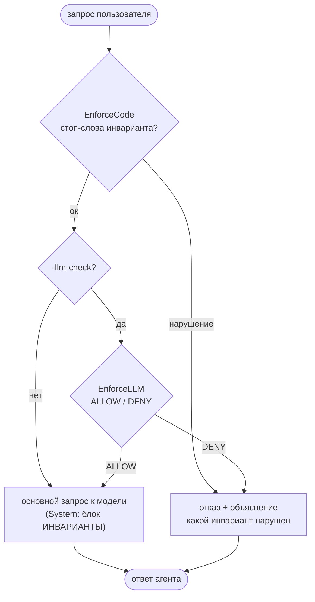

# 🔥 День 14. Инварианты и ограничения состояния

## Задание

Добавьте в ассистента **инварианты**, которые он не имеет права нарушать (выбранная
архитектура, принятые техрешения, ограничения по стеку, бизнес-правила). Сделайте так,
чтобы инварианты хранились **отдельно от диалога**, ассистент **явно учитывал** их в
рассуждениях и **отказывался** предлагать решения, которые их нарушают.

Проверьте: что происходит при конфликте запроса и инварианта; как ассистент объясняет
отказ. Результат: ассистент, работающий в рамках заданных инвариантов.

> **Накопительный агент.** task-14 = дни 11–13 (память + персонализация + стейт-машина)
> + инварианты поверх. `-report` показывает только сегодняшнюю фичу.

---

## Модель инвариантов

Инвариант — правило, которое агент обязан соблюдать. Два **источника**:

- **system** — подкапотные ограничения (юзер может о них не знать и не имеет к ним
  отношения): например, «стек только Go», «не хардкодить секреты». Заданы в коде.
- **user** — заданные пользователем самозапреты (как «задачка со звёздочкой» у лектора:
  «на проект — не пиши на Java»). Добавляются командой, хранятся в `invariants.json`.

Хранятся **отдельно от диалога**: системные — в коде, пользовательские — в
`invariants.json` (не в истории сообщений). В System каждого запроса добавляется блок
`[ИНВАРИАНТЫ]` — агент обязан их учитывать.

> **Уточнение из чата.** Инварианты — это «подкапотные» ограничения: пользователь может
> о них не знать и пытаться обойти, не подозревая об их существовании, а агент не даст
> их нарушить (аналогия из обсуждения: запрещён мат → юзер просит матный анекдот →
> агент отказывает). Подтверждено лектором.

## Две проверки конфликта (не взаимоисключающие)

Лектор: «это два разных способа, они друг друга не исключают — проверь оба». Реализованы
обе:

1. **Детерминированная (код)** — `EnforceCode`: ищет стоп-слова инварианта в запросе
   (`strings.Contains`). Быстро, дёшево, предсказуемо. Ловит явное («перепиши на Java»).
2. **Семантическая (LLM)** — `EnforceLLM`: отдельный проверяющий-промпт получает
   инварианты + запрос и выдаёт `ALLOW|DENY` + причину. Ловит то, что код пропустит
   (запрос без стоп-слова, но по смыслу нарушающий правило). Включается флагом `-llm-check`.

При срабатывании любой проверки агент **не идёт в основную модель**, а возвращает
**отказ с объяснением**, какой инвариант нарушен, и предлагает снять ограничение явно
или переформулировать.

> **На вырост (из обсуждения в чате).** Лектор предложил третий уровень — **взаимопроверку
> несколькими LLM**: пишущего агента контролируют несколько разных «проверял», которые
> ещё и спорят между собой. В нашем минимальном варианте достаточно одного проверяющего
> (`EnforceLLM`); несколько проверял с консенсусом — задел на финал недели (оркестрация).

### Схема enforcement

Запрос проходит две «заставы» (код → LLM); нарушение на любой — отказ с объяснением.
Только если обе пропустили, идём в основную модель (где в System уже лежат инварианты).



Тот же поток текстом (для терминала/редактора без рендера Mermaid):

```
                          ┌───────────────────────────┐
 запрос ─────────────────▶│ EnforceCode (стоп-слова)  │
                          └─────────────┬─────────────┘
                              нарушение │ ок
                    ┌───────────────────┘
                    ▼                   ▼
        ┌───────────────────┐   ┌──────────────────┐   -llm-check?
        │ ОТКАЗ + объяснение │   │  EnforceLLM      │◀── да
        │ (какой инвариант)  │   │  ALLOW / DENY    │
        └─────────▲─────────┘   └────────┬─────────┘
                  │ DENY                  │ ALLOW / (нет флага)
                  └───────────────────────┤
                                          ▼
                        ┌─────────────────────────────────┐
                        │ основной запрос к модели          │
                        │ (System: блок [ИНВАРИАНТЫ])        │
                        └─────────────────────────────────┘
```

---

## Что добавлено по сравнению с днём 13 (по файлам)

### Новые файлы

**`invariants.go` — модель и хранение инвариантов.**
- *Что:* тип `Invariant` (`id`, `text` — человекочитаемое правило, `kind` —
  `system`/`user`, `deny` — список стоп-слов в нижнем регистре) и `InvariantSet` —
  набор правил с привязкой к каталогу.
- *Как:* при создании `NewInvariantSet(dir)` сначала загружаются системные правила
  (`systemInvariants()` — захардкожены: «только Go», «не хардкодить секреты»), затем
  поверх читаются пользовательские из `invariants.json`. `Add()` добавляет
  пользовательское правило и сразу сохраняет в файл (`save()` пишет **только**
  `kind == user`, системные не дублируются на диск). `Render()` собирает текст для
  System-блока, `CheckCode()` — детерминированную проверку.
- *Зачем:* задание требует, чтобы инварианты хранились **отдельно от диалога** — поэтому
  это отдельная сущность и отдельный файл, а не часть истории сообщений. Разделение на
  `system`/`user` закрывает оба источника: подкапотные ограничения (юзер о них может не
  знать) и самозапреты пользователя.

**`enforce.go` — две проверки конфликта.**
- *Что:* тип `Verdict` (разрешено/нарушения/причина/способ/сырой ответ LLM) и две
  функции — `EnforceCode` и `EnforceLLM`.
- *Как:* `EnforceCode` ищет стоп-слова правила в запросе через `strings.Contains` по
  нижнему регистру — быстро и без сети. `EnforceLLM` отправляет **отдельный**
  проверяющий-промпт (инварианты + запрос) и парсит ответ строгого формата
  `DECISION: ALLOW|DENY` + `REASON` (`parseVerdict`).
- *Зачем:* лектор прямо сказал, что детерминированная и семантическая проверки —
  «два разных способа, друг друга не исключают, проверь оба». Код ловит явные нарушения
  дёшево; LLM ловит то, что не выражено стоп-словом, но нарушает правило по смыслу.

### Изменённые файлы

**`agent.go` — подключение инвариантов и отказ.**
- *Что/как:* у `Agent` появилось поле `*InvariantSet` и флаг `llmCheck`. В `build`
  к System-промпту добавляется отдельный блок `[ИНВАРИАНТЫ]` (`Render()`), чтобы агент
  **явно учитывал** правила в рассуждениях. В `ask` **перед** основным запросом
  выполняется enforcement: сперва `EnforceCode` (всегда), затем — если включён
  `-llm-check` — `EnforceLLM`. При нарушении агент не идёт в основную модель, а
  возвращает `refuse()` — отказ с объяснением, какой инвариант нарушен и каким способом
  пойман. В `Reply` добавлены поля `Refused`, `Violated`, `RefusedBy` («код»/«LLM»),
  `CheckVerdict` (сырой вердикт LLM — для прозрачности вывода).
- *Зачем:* это ядро задания — «ассистент отказывается предлагать решения, которые
  нарушают инварианты». Проверка идёт до основной модели, чтобы запрещённый запрос
  вообще не исполнялся, а отказ был объяснимым.

**`report.go` — прозрачная демонстрация.**
- *Что/как:* переписан под день 14. Прогоняет три кейса (допустимый запрос; конфликт со
  стеком, который ловит код; конфликт по смыслу, который ловит LLM) и печатает по
  каждому весь конвейер: `[запрос]` → `[вердикт LLM-проверяющего]` (DECISION/REASON) →
  `[результат]` с пометкой, чем поймано → полное `[объяснение агента]` (без обрезки,
  с отступами через `indentLines`).
- *Зачем:* по нашему правилу `-report` показывает **только сегодняшнюю фичу**, и при этом
  процесс должен быть полностью виден — чтобы в видео/проверке было ясно, как именно
  срабатывает каждая проверка.

**`main.go` — флаг и команды.**
- *Что/как:* добавлен флаг `-llm-check` (включает семантическую проверку), загрузка
  `InvariantSet` из каталога памяти и команды чата: `/invariants` (список), `/forbid
  <стоп-слово>` (быстрый запрет с проверкой кодом), `/invariant <правило>` (семантическое
  правило, проверяется LLM).
- *Зачем:* даёт пользователю задавать **свои** инварианты в рантайме (второй источник) и
  выбирать строгость проверки.

### Без изменений (перенесены из дней 11–13)

`memory.go` (3 слоя памяти), `state.go` и `pipeline.go` (стейт-машина), `profile.go`
(персонализация), `usage.go`, `profiles/*.md` — это накопленный функционал агента,
работает как раньше.

---

## Режимы запуска

```bash
go run ./week-3/task-14 -report                # демонстрация инвариантов (день 14)
go run ./week-3/task-14                         # чат, проверка инвариантов кодом
go run ./week-3/task-14 -llm-check              # + семантическая проверка через LLM
```

Команды инвариантов: `/invariants` (список), `/forbid <слово>` (запрет по стоп-слову,
проверка кодом), `/invariant <правило>` (семантическое правило, проверяется LLM).
Плюс команды состояния/памяти/профиля из дней 11–13.

---

## Реальный прогон `-report`

> Видно весь процесс по каждому запросу: `[запрос]` → `[вердикт LLM-проверяющего]`
> (DECISION/REASON) → `[результат]` с пометкой, чем поймано (код/LLM) → полное
> `[объяснение агента]`. Запрос 1 разрешён (LLM: ALLOW); запрос 2 с «на Java» отсечён
> кодом; запрос 3 (веб-фреймворк+ORM без стоп-слова) отсечён LLM с альтернативой
> `net/http` + `database/sql`.

````text
% go run ./week-3/task-14 -report
=== День 14: инварианты и ограничения состояния ===

# Инварианты (хранятся отдельно от диалога, подмешиваются в System)
  [system/stack-go] Стек только Go. Не предлагать другие языки (Java, Python, Rust…) без явного снятия инварианта.
  [system/no-secrets] Не хардкодить секреты/ключи в коде; только через переменные окружения.
  [user/user-3] Не использовать тяжёлые фреймворки; только стандартная библиотека Go.

Включены обе проверки: детерминированная (код) + семантическая (LLM).

# Запрос 1 — допустимый
[запрос] Подскажи, как структурировать конфиг сервиса.
[вердикт LLM-проверяющего]
    DECISION: ALLOW
    REASON: Запрос о структурировании конфига не нарушает ни один инвариант — его можно
    выполнить на Go со стандартной библиотекой и без хардкода секретов.
[результат] разрешено, ответ агента:
    Для конфига Go-сервиса без зависимостей — стандартный подход: Config со структурами
    HTTPConfig/DBConfig, Load() -> (*Config, error) (fail-fast), секреты только из env,
    хелперы envStr/envInt/envDuration, валидация в Load(). + таблица trade-offs.
    (полный код в выводе: package config, Load(), env-хелперы)

# Запрос 2 — конфликт со стеком (ловит КОД: стоп-слово «на java»)
[запрос] Перепиши наш сервис на Java, так быстрее.
[результат] ОТКАЗ (поймано: код), нарушено: [stack-go]
[объяснение агента]
    Не могу выполнить: запрос нарушает инвариант. Стек только Go. Не предлагать другие
    языки (Java, Python, Rust…) без явного снятия инварианта. (проверка кодом).
    Предложи вариант, не нарушающий инвариант, или сними ограничение явно.

# Запрос 3 — конфликт по смыслу без стоп-слова (ловит LLM)
[запрос] Добавь, пожалуйста, веб-фреймворк с DI-контейнером и ORM для роутинга.
[вердикт LLM-проверяющего]
    DECISION: DENY
    REASON: Запрос нарушает инвариант [user-3], так как требует тяжёлый веб-фреймворк
    с DI-контейнером и ORM вместо стандартной библиотеки Go.
    Допустимая альтернатива: net/http для роутинга и database/sql для БД — без тяжёлых
    сторонних зависимостей.
[результат] ОТКАЗ (поймано: LLM), нарушено: []
[объяснение агента]
    Не могу выполнить: запрос нарушает инвариант [user-3]… (LLM-проверка).
    Предложи вариант, не нарушающий инвариант, или сними ограничение явно.

=== Что проверяет задание ===
• Инварианты хранятся отдельно от диалога (invariants.json / системные в коде).
• Агент явно учитывает их: блок [ИНВАРИАНТЫ] в System каждого запроса.
• При конфликте — отказ с объяснением, какой инвариант нарушен.
• Видно весь процесс: запрос → вердикт проверки (код/LLM) → отказ/ответ.
````

## Вывод по заданию и прогону

**Задание выполнено.** Инварианты (system + user) хранятся отдельно от диалога
(`invariants.json` / системные в коде), подмешиваются в System блоком `[ИНВАРИАНТЫ]`
и реально влияют на поведение: при конфликте агент **отказывает с объяснением**, какой
инвариант нарушен, и предлагает допустимую альтернативу.

**Прогон подтвердил обе проверки.** Запрос «на Java» отсекается **детерминированно
(код)** по стоп-слову; запрос «веб-фреймворк с DI и ORM» — без стоп-слова, но нарушает
правило по смыслу — отсекается **семантически (LLM)**, причём проверяющий ещё и
предложил `net/http` + `database/sql`. Допустимый запрос проходит (LLM: ALLOW).
Способы не взаимоисключают друг друга — работают вместе.

**Прозрачность.** В выводе виден весь конвейер: запрос → вердикт проверки (с текстом
DECISION/REASON для LLM) → отказ/ответ с полным объяснением.

**Накопительность.** Память (11), персонализация (12) и стейт-машина (13) остались в
агенте; `-report` показывает только сегодняшнюю фичу — инварианты.

## Файлы

- `invariants.go` — модель и хранение инвариантов (system + user, отдельно от диалога).
- `enforce.go` — проверки конфликта: код (`EnforceCode`) + LLM (`EnforceLLM`).
- `agent.go` — инварианты в System + отказ с объяснением при нарушении.
- `report.go` — демонстрация только инвариантов (день 14).
- `main.go` — `-llm-check`, команды инвариантов.
- `memory.go`, `state.go`, `pipeline.go`, `profile.go`, `usage.go` — дни 11–13.

## Запуск

```bash
# .env должен содержать ANTHROPIC_API_KEY
go run ./week-3/task-14 -report
go run ./week-3/task-14 -llm-check
```