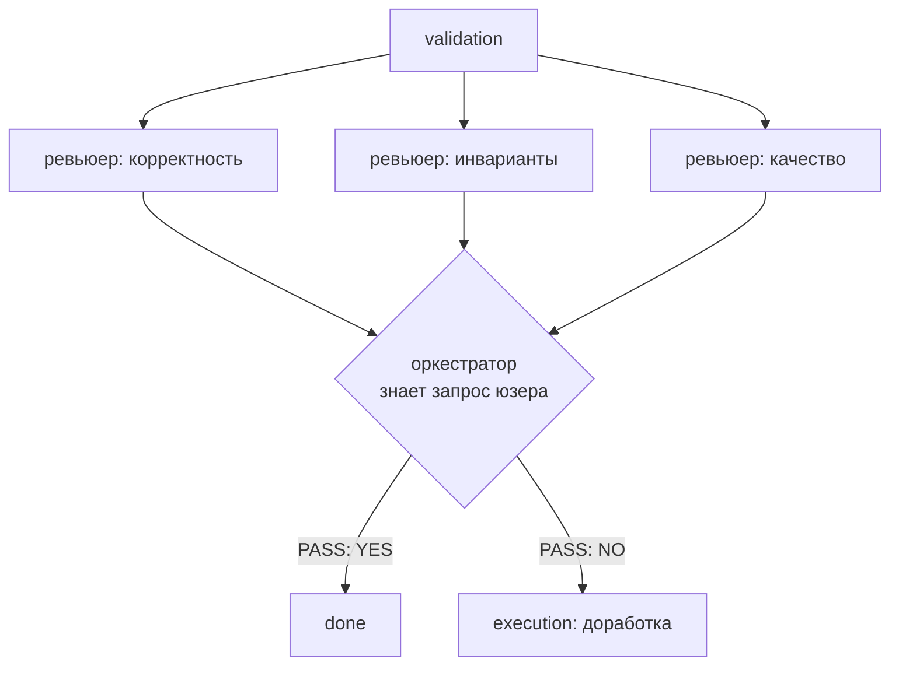
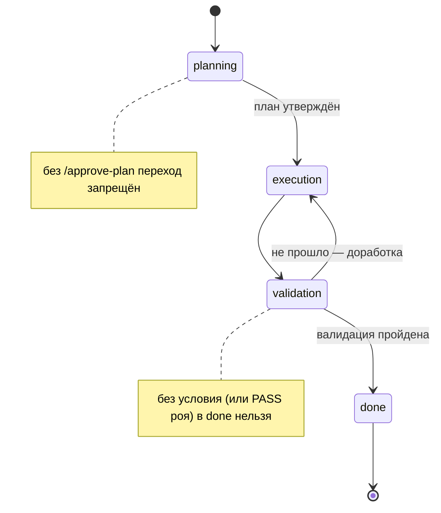

# 🔥 День 15. Контролируемые переходы состояний

## Задание

Реализуйте **явные переходы** между состояниями задачи: допустимые состояния,
разрешённые переходы, ассистент не может «перепрыгнуть» этап. Примеры: нельзя
реализацию до утверждённого плана; нельзя финал без валидации.

Проверьте: попытки перейти в недопустимое состояние; реакцию ассистента; корректность
продолжения после паузы. Результат: ассистент с контролируемым жизненным циклом задачи.

> **Накопительный агент.** task-15 = дни 11–14 (память + персонализация + стейт-машина +
> инварианты) + контроль переходов с **условиями перехода** и **роем агентов** на validation.
> `-report` показывает только сегодняшнюю фичу.

---

## Что нового по сравнению с днём 13

День 13 уже дал конечный автомат (planning → execution → validation → done, переходы в
коде, запрет прыжка). День 15 добавляет **условия перехода** — переход разрешён не просто
«по порядку», а только при выполнении условия:

| переход | условие перехода |
|---------|--------------|
| planning → execution | план должен быть **утверждён** (`/approve-plan`) |
| validation → done | валидация должна быть **пройдена** (`/validate-ok` или рой) |

Это и есть «нельзя реализацию до утверждённого плана» и «нельзя финал без валидации».
Плюс **явная реакция** на недопустимый переход: попытка `/goto` запрещённого перехода
возвращает отказ с причиной, а не молча прыгает.

## Условия перехода (state.go + memory.go)

`WorkingMem` (TaskContext) получил два флага: `PlanApproved` и `Validated`. Переходы
проходят двойной контроль:

1. `transition()` — разрешён ли переход по карте `transitions` (запрет прыжка, день 13);
2. `gateError()` — выполнено ли условие перехода (день 15).

`Advance()` и `Goto()` вызывают оба; при невыполнении условия (в коде — `gateError`) состояние **не меняется**, а
наверх идёт ошибка с причиной. Флаги сохраняются в `working.json` → после паузы контроль
остаётся в силе.

## Рой агентов на validation (swarm.go)

Включается флагом `-swarm`; этап выбирается флагом `-swarm-stage planning|validation`
(по умолчанию `validation`). Лектор советовал «обкатать рой хотя бы на одном этапе»,
и его пример был про этап исследования (≈ planning) — поэтому этап настраиваемый.
На выбранном этапе запускается несколько **ревьюеров**
(разные роли: корректность / инварианты / качество) — каждый отдельный агент-инстанс со
своим system prompt. Их мнения сводит **оркестратор**, который знает исходный запрос
пользователя и выносит сводное решение `PASS: YES|NO`:

Перед роем работает **лёгкий детерминированный гейт** `CheckResult` (`artifact.go`): если
результат execution оборван (`stop_reason=max_tokens` / незакрытый блок) или пуст — рой не
запускается, сразу доработка/пауза. Отсутствие кода ошибкой НЕ считается (бывают задачи
без кода).
Результат роя:
- `YES` → ставится флаг `Validated` → разрешён переход в `done`;
- `NO` → задача возвращается в `execution` на доработку (флаг не ставится).

Это реализует совет лектора: «обмазать валидациями и подключить рой агентов; они
предлагают варианты оркестратору, который знает запрос юзера и принимает сводное решение».



---

## Схема жизненного цикла с условиями перехода



Текстом (терминал/редактор без Mermaid):

```
                 план утверждён           валидация пройдена
  [*] ─▶ planning ───────────▶ execution ─▶ validation ───────────▶ done ─▶ [*]
            │ (нет /approve-plan)              │   ▲ не прошло           │ (нет условия)
            ✗ запрещено                        └───┘ доработка           ✗ запрещено
```

---

## Что добавлено по сравнению с днём 14 (по файлам)

### Новый файл

**`swarm.go` — рой ревьюеров + оркестратор.**
- *Что:* `Reviewer` (имя роли + свой system prompt), `Swarm` (набор ревьюеров для этапа +
  модель), `ReviewResult` (вердикт + заметки одного ревьюера). Функции `Review` (опрашивает
  всех ревьюеров) и `Orchestrate` (сводит мнения в `PASS YES|NO`).
- *Как:* `NewSwarm(client, model, stage)` выбирает набор ролей по этапу —
  `validationReviewers()` (корректность / инварианты / качество) или `planningReviewers()`
  (архитектура / риски / стек). Каждый ревьюер — **отдельный вызов** `client.Messages.New`
  со своим system prompt и чистым контекстом; ответы парсятся из строгого формата
  (`VERDICT: OK|ISSUES` / `NOTES`). Оркестратор получает запрос юзера + мнения и возвращает
  `PASS: YES|NO` + summary (`parsePass`).
- *Зачем:* задание дня 15 (а лектор прямо советовал) — «обмазать валидациями, подключить
  рой; они предлагают варианты оркестратору, который знает запрос юзера». Разделение на
  роли даёт раздельную проверку по осям (корректность/инварианты/качество), а оркестратор
  принимает сводное решение — это надёжнее одного общего «проверь всё».

### Изменённые файлы

**`memory.go` — условия перехода (gate).**
- *Что/как:* в `TaskContext` добавлены два булевых флага — `PlanApproved` и `Validated`.
  Методы `ApprovePlan()`/`MarkValidated()` их ставят, `PlanApproved()`/`Validated()` читают.
  Ключевое — функция `gateError(from, to)`: возвращает ошибку, если переход требует условия,
  а оно не выполнено (`planning→execution` без утверждённого плана; `validation→done` без
  пройденной валидации). `Advance()` и `Goto()` теперь вызывают **и** `transition()` (карта
  переходов, день 13), **и** `gateError()` — при невыполнении любого состояние не меняется.
  Флаги сериализуются в `working.json` и видны в `Inspect`.
- *Зачем:* это ядро задания — «нельзя реализацию до утверждённого плана; нельзя финал без
  валидации». День 13 проверял лишь «допустим ли переход в принципе»; день 15 добавляет
  «и только если выполнено условие». Хранение флагов в памяти даёт корректный resume:
  после паузы условия остаются в силе.

**`pipeline.go` — выставление условий и запуск роя по этапам.**
- *Что/как:* в цикле `Run` после ответа модели на этапе planning ставится `ApprovePlan()`
  (план утверждён → откроется переход в execution), на validation — либо `MarkValidated()`
  (без роя), либо запуск роя. Добавлены `runSwarm()` (validation: ревьюеры судят план+
  результат; при PASS ставит `Validated`, при не-PASS возвращает в execution через `Goto`)
  и `runSwarmPlanning()` (planning: ревьюеры оценивают план, оркестратор сводит). Печатается
  весь вход роя (`[вход роя] план/результат`, `[вход оркестратора]`) для прозрачности.
- *Зачем:* условия должны выставляться **по ходу реального прогона**, а не вручную, иначе
  автомат не доедет до `done`. Рой подключается именно на нужном этапе и реально влияет на
  переход (его вердикт = условие `Validated`).

**`main.go` — флаги и команды управления переходами.**
- *Что/как:* добавлены флаги `-swarm` и `-swarm-stage` (+ парсер `swarmStageOf`), создание
  `Swarm` и подключение к пайплайну. Новые команды чата: `/approve-plan`, `/validate-ok`,
  `/goto <state>` (с **явным отказом** и причиной при запрещённом переходе), `/state` теперь
  показывает флаги условий.
- *Зачем:* чтобы условиями и переходами можно было управлять интерактивно и наглядно видеть
  реакцию на недопустимый переход (требование задания «проверьте реакцию ассистента»).

**`report.go` — демонстрация дня 15 (контроль + живой прогон).**
- *Что/как:* Часть 1 — на «голой» механике показывает попытки недопустимых переходов и
  отказы (без API). Часть 2 — реальный прогон задачи через `Pipeline.Run` по этапам с
  видимыми `[запрос]`/ответами LLM; при `-swarm` — рой на выбранном этапе. Печатается задача
  в шапке.
- *Зачем:* по нашему правилу `-report` показывает только сегодняшнюю фичу, но при этом должен
  быть прозрачным — видно и контроль переходов, и живой диалог с моделью, и работу роя.

### Без изменений (перенесены из дней 11–14)

`state.go` (карта переходов и автомат — используется как есть, условия добавлены в
`memory.go`), `agent.go`, `invariants.go`, `enforce.go` (инварианты, день 14),
`profile.go`, `usage.go`, `profiles/*.md` (персонализация, день 12).


---

## Режимы запуска

```bash
go run ./week-3/task-15 -report           # демонстрация контроля переходов (день 15)
go run ./week-3/task-15 -report -swarm                      # рой на validation (по умолч.)
go run ./week-3/task-15 -report -swarm -swarm-stage planning # рой на planning (пример лектора)
go run ./week-3/task-15 -report -swarm -max-tokens 8000        # больше токенов → парсер уложится, рой отработает
go run ./week-3/task-15                     # чат
go run ./week-3/task-15 -swarm -confirm     # чат с роем и подтверждением переходов
```

Команды переходов: `/state` (с флагами условий), `/approve-plan`, `/validate-ok`,
`/goto <state>` (явный переход — с отказом, если запрещён), `/run`, `/advance`, `pause`.
Плюс команды инвариантов/памяти/профиля из дней 11–14.

---

## Реальный прогон `-report -swarm`

### Как работает `-report`

`-report` — **неинтерактивный демо-режим**: программа один раз прогоняет сценарий и
завершается (в отличие от чата, где есть приглашение `> ` и можно вводить команды).
Внутри две части: Часть 1 — контроль переходов на «голой» механике (без обращения к LLM);
Часть 2 — реальный прогон демо-задачи «парсер CSV на Go» по этапам через LLM (`Pipeline.Run`),
с детерминированным гейтом, роем на validation (при `-swarm`) и паузой. Лимит ответа задаётся
флагом `-max-tokens` (по умолчанию 4096): если поднять его так, чтобы код парсера уложился
целиком, гейт пропускает результат и **рой реально отрабатывает** на нём. Поскольку режим
неинтерактивный, на паузе программа не ждёт ввод, а просто завершает демо с текущим статусом.

Ниже два реальных прогона: **А** — рой отработал и пропустил (`PASS=true`), показывает
слепую зону LLM-валидации; **Б** — гейт поймал обрыв по токенам и остановил процесс. Вместе
они показывают обе стороны: содержательную работу роя и детерминированную страховку гейта.

### Почему задача в демо не доходит до готового кода

Демо-задача намеренно «крупная» (полный CSV-парсер), а ответы модели ограничены
`MaxTokens`, поэтому на этапе execution код **обрывается на полуслове** (в этом прогоне —
на `timeLayout: time.`). Это не баг агента, а свойство демо: цель `-report` — показать
**контроль переходов и работу роя**, а не получить готовую библиотеку. Агент при этом
ведёт себя правильно — не пропускает недописанный код дальше по этапам.

Важное наблюдение из прогонов: при оборванном артефакте рой может дать как `PASS=false`
(поймал недоделку), так и иногда `PASS=true` (пропустил) — это **недетерминизм LLM** и
следствие того, что рой на одной модели имеет общие слепые зоны (см. FAQ «зачем разные
точки зрения»). Чтобы это не зависело от «настроения» модели, перед роем добавлен лёгкий
детерминированный гейт `CheckResult` (ловит обрыв по `stop_reason=max_tokens` / незакрытый
блок / пустоту — без хрупкого `go build`; подробнее ниже в разделе про петлю).

### Прогон А — рой завернул, потом одобрил (`PASS=false → доработка → PASS=true → done`)

> Самый показательный прогон: результат уложился в токены → гейт `CheckResult` дал **OK**
> → запустился **рой**. На **первом круге** ревьюер «качество» дал ISSUES, оркестратор —
> `PASS=false` → возврат в execution на доработку (осталось кругов: 1). На **втором круге**
> над тем же артефактом все три ревьюера дали OK, оркестратор — `PASS=true` → переход в
> `done`.
>
> Здесь в одном прогоне видно сразу: работу роя и оркестратора, **петлю доработки**
> (`PASS=false` → execution) и **недетерминизм LLM-валидации** — один и тот же неизменный
> результат рой сначала завернул, а потом одобрил. Плюс честная оговорка: готового кода в
> результате так и нет (агент остановился на согласовании дефолтов), но рой в итоге
> пропустил — это слепая зона, которую надёжно закрывает лишь запуск `go test` над кодом.

````text
% go run ./week-3/task-15 -report -swarm
=== День 15: контролируемые переходы состояний ===

# Часть 1. Контроль переходов: допустимые состояния и попытки прыжков
  planning    → execution
  execution   → validation
  validation  → done, execution
  done        → нет (терминальное состояние)
Старт: state=planning, план утверждён=false
  /goto validation (прыжок через этап): ЗАПРЕЩЕНО — переход planning → validation запрещён (разрешено: execution)
  /goto execution без плана: ЗАПРЕЩЕНО — нельзя в execution: план не утверждён (нужно /approve-plan)
  /approve-plan → /goto execution: РАЗРЕШЕНО (state=execution)
  /goto done без валидации (state=validation): ЗАПРЕЩЕНО — нельзя в done: валидация не пройдена (нужно /validate-ok)

# Часть 2. Прогон задачи по этапам (живой диалог с LLM)
Задача: парсер CSV на Go — написать функцию чтения CSV в структуры
Старт: state=planning
(рой включён на этапе validation)

[этап planning] собрать требования и предложить план; не писать финальный код
[запрос] Задача: парсер CSV на Go. Составь короткий план (3–5 шагов). Только план, без кода.
## План: CSV-парсер в структуры (5 шагов: требования; API; внутренности reflect+кэш;
краевые случаи; тесты+бенчмарк). Trade-offs: reflection vs codegen, дженерики vs interface{}.
Вопросы по требованиям и API.
[переход] planning → execution

[этап execution] выполнять текущий шаг плана; не перепрыгивать шаги
[запрос] Выполни план по шагам и дай результат (код/артефакт).
Этап execution, но Gate: валидация не пройдена; шаги 1–2 с открытыми вопросами.
Выполняю шаг 1 (требования) — таблица дефолтов; задаю 4 вопроса (time.Time, семантика
ошибок, режим маппинга, пустые значения). Готовый код не выдаю до подтверждения п.1–2.
[переход] execution → validation

[этап validation] проверить результат на соответствие плану; найти расхождения
[запрос] Проверь результат на соответствие плану. Кратко: что ок, что нет.
Шаг 1 ⚠️ частично (вопросы не закрыты), шаги 2–5 ❌, код-артефакт ❌ отсутствует.
Главное расхождение: запрошен код — кода нет. validation=false. Блокер — ответы по
time.Time и семантике ошибок.

[проверка результата] OK — результат полный, передаю рою на содержательную проверку.
[рой] запускаю ревьюеров на validation…
  [вход роя] план: ## План: CSV-парсер в структуры …
  [вход роя] результат: Этап execution, но Gate: валидация не пройдена …
  [ревьюер: корректность] OK — корректно отработал шаг 1, не прыгнул в код; минор: в таблице опущен codegen-вариант, хотя план требовал решение по нему.
  [ревьюер: инварианты] OK — только stdlib (encoding/csv, reflect), без тяжёлых зависимостей, секретов нет.
  [ревьюер: качество] ISSUES — кода ещё нет, оценивать не на чем; по дизайну: оборачивать ошибки %w со строкой/колонкой; кастомные типы — через интерфейс (TextUnmarshaler), а не фиксированную мапу.
  [вход оркестратора] запрос юзера: "парсер CSV на Go" + мнения 3 ревьюеров
  [оркестратор] PASS=false — упущен разбор codegen; в дизайне заложить %w с координатами и интерфейс для кастомных типов.
  [рой] есть замечания → возврат в execution на доработку (осталось кругов: 1).
[переход] validation → validation

[этап validation] проверить результат на соответствие плану; найти расхождения
[запрос] Проверь результат на соответствие плану. Кратко: что ок, что нет.
Результат не изменился — тот же вердикт (validation=false, кода нет). Замечание про
зацикливание: нужно действие, а не ещё проверка (ответить на вопросы / принять дефолты /
скорректировать план).

[проверка результата] OK — результат полный, передаю рою на содержательную проверку.
[рой] запускаю ревьюеров на validation…
  [вход роя] план: ## План: CSV-парсер в структуры …
  [вход роя] результат: Этап execution, но Gate: валидация не пройдена …
  [ревьюер: корректность] OK — корректно остановился на шагах 1–2, не прыгнул в код; минор: дефолт по кастомным типам стоило заложить в эскиз API.
  [ревьюер: инварианты] OK — только stdlib (encoding/csv, reflect), инварианты стека соблюдены, секретов нет.
  [ревьюер: качество] OK — план грамотен (io.Reader, encoding/csv, дженерик-API, кэш плана маппинга); заложить Unmarshaler-интерфейс и оборачивать ошибки с координатами.
  [вход оркестратора] запрос юзера: "парсер CSV на Go" + мнения 3 ревьюеров
  [оркестратор] PASS=true — все ревьюеры одобрили; замечания рекомендательные, блокеров нет.
[переход] validation → done
[pipeline] задача в состоянии done — завершено.

Итог прогона: state=done, done=true (условия перехода соблюдены автоматически)

# Пауза и продолжение
Состояние и флаги условий сохраняются в working.json; после паузы продолжаем
с того же этапа, переходы по-прежнему контролируются (прыжки/без условия запрещены).

=== Что проверяет задание ===
• Допустимые состояния и разрешённые переходы заданы явно (в коде).
• Прыжок через этап и переход без выполненного условия — запрещены (Часть 1).
• Реакция на недопустимый переход — явный отказ с причиной.
• Условия: нельзя execution без утверждённого плана; нельзя done без валидации.
• Прогон по этапам идёт через LLM с видимыми запросами/ответами (Часть 2).
• Рой агентов на validation + оркестратор: 1-й круг PASS=false → доработка, 2-й PASS=true → done.
• После паузы продолжение корректно: состояние и контроль сохраняются.
````

**Что происходит по шагам (Прогон А):**
1. **Часть 1** — три попытки недопустимых переходов (прыжок через этап; execution без
   плана; done без валидации) отбиты с явными причинами; после `/approve-plan` переход в
   execution разрешён.
2. **planning** — план из 5 шагов с trade-offs и уточняющими вопросами (кода нет).
3. **execution** — агент не «перепрыгнул»: дал таблицу дефолтов и вопросы, готовый код
   отложил. Артефакт сохранён в working memory.
4. **validation, круг 1** — гейт `CheckResult` дал OK (ответ полный) → рой: ревьюер
   «качество» — ISSUES (кода нет + замечания по дизайну), оркестратор → **`PASS=false`** →
   возврат в execution на доработку (осталось кругов: 1).
5. **validation, круг 2** — артефакт **не изменился**, но на этот раз все три ревьюера
   дали OK, оркестратор → **`PASS=true`** → переход в `done`.

**Вывод по прогону А.** В одном прогоне видно три вещи сразу: (1) рой и оркестратор
работают; (2) **петля доработки** — `PASS=false` честно возвращает задачу в execution;
(3) **недетерминизм LLM-валидации** — один и тот же неизменный результат рой сначала
завернул, а потом одобрил. И та же слепая зона, что и раньше: готового кода в результате
нет, но рой в итоге пропустил, потому что ревьюеры судят процесс, а не наличие артефакта.
Детерминированный гейт здесь не помогает (ответ формально полный); надёжно ловит такое
только запуск `go test` над реальным кодом.


### Прогон Б — гейт поймал обрыв по токенам → доработка → пауза

> Тот же сценарий, но ответ на validation **оборвался по лимиту токенов**. Детерминированный
> гейт `CheckResult` это поймал (`stop_reason=max_tokens`) и **не запустил рой** (ревьюить
> нечего) → доработка → после 2 кругов **пауза** (`state=validation, done=false`) с передачей
> решения человеку. Здесь видно противоположную прогону А ситуацию: гейт не зависит от
> «настроения» модели и не пропускает неполный результат.

````text
% go run ./week-3/task-15 -report -swarm
=== День 15: контролируемые переходы состояний ===

# Часть 1. Контроль переходов: допустимые состояния и попытки прыжков
  planning    → execution
  execution   → validation
  validation  → done, execution
  done        → нет (терминальное состояние)
Старт: state=planning, план утверждён=false
  /goto validation (прыжок через этап): ЗАПРЕЩЕНО — переход planning → validation запрещён (разрешено: execution)
  /goto execution без плана: ЗАПРЕЩЕНО — нельзя в execution: план не утверждён (нужно /approve-plan)
  /approve-plan → /goto execution: РАЗРЕШЕНО (state=execution)
  /goto done без валидации (state=validation): ЗАПРЕЩЕНО — нельзя в done: валидация не пройдена (нужно /validate-ok)

# Часть 2. Прогон задачи по этапам (живой диалог с LLM)
Задача: парсер CSV на Go — написать функцию чтения CSV в структуры
Старт: state=planning
(рой включён на этапе validation)

[этап planning] собрать требования и предложить план; не писать финальный код
[запрос] Задача: парсер CSV на Go. Составь короткий план (3–5 шагов). Только план, без кода.
# План: CSV-парсер в структуры (5 шагов: требования; API; reflect-маппинг + кэш;
конверсия и ошибки; тесты/edge-cases). Trade-offs: []T vs итератор, reflect vs codegen,
strict vs lenient. Вопросы по требованиям (стриминг? маппинг по тегам?).
[переход] planning → execution

[этап execution] выполнять текущий шаг плана; не перепрыгивать шаги
[запрос] Выполни план по шагам и дай результат (код/артефакт).
Стоп — gate-условие: план утверждён, но шаг 1 (требования) не закрыт. Предлагаю senior-
дефолты (таблица), выполняю только шаг 2 — API-контракт:
  Unmarshal[T any](r io.Reader, opts ...Option) ([]T, error)
  + WithComma / WithLenient / WithRequireAllColumns.
Жду подтверждения дефолтов. После
[переход] execution → validation

[этап validation] проверить результат на соответствие плану; найти расхождения
[запрос] Проверь результат на соответствие плану. Кратко: что ок, что нет.
✅ Шаг 2 (API) корректен; дисциплина этапа соблюдена. ❌ шаг 1 не подтверждён (дефолты),
шаги 3–5 не выполнены; скрытое ограничение time-layout у TextUnmarshaler. Вердикт:
частичное соответствие, validation=false.

[проверка результата] неполный результат — ответ оборван по лимиту токенов (stop_reason=max_tokens)
  рой не запускаю (результат неполный) → возврат в execution (осталось кругов: 1).
[переход] validation → validation

[этап validation] проверить результат на соответствие плану; найти расхождения
[запрос] Проверь результат на соответствие плану. Кратко: что ок, что нет.
Валидация повторная: новых артефактов нет, статус без изменений (validation=false).
Замечание: повтор той же проверки без новых данных — зацикливание; нужен вход человека.

[проверка результата] неполный результат — ответ оборван по лимиту токенов (stop_reason=max_tokens)
  рой не запускаю (результат неполный) → возврат в execution (осталось кругов: 0).
[переход] validation → validation

[этап validation] проверить результат на соответствие плану; найти расхождения
[запрос] Проверь результат на соответствие плану. Кратко: что ок, что нет.
Стоп. Третий идентичный запрос — новых артефактов нет, ответ не изменится.
Нужен один ответ человека (дефолты ок? time-layout — опция или на пользователе?).

[проверка результата] неполный результат — ответ оборван по лимиту токенов (stop_reason=max_tokens)
  не сошлось за 2 круга доработки — СТОП.
  [пауза] результат неполный; решение человека (дореализовать / сузить / закрыть).
[pipeline] пауза: доработка не сходится. Состояние сохранено; нужно решение человека.

Итог прогона: state=validation, done=false (условия перехода соблюдены автоматически)

# Пауза и продолжение
Состояние и флаги условий сохраняются в working.json; после паузы продолжаем
с того же этапа, переходы по-прежнему контролируются (прыжки/без условия запрещены).

=== Что проверяет задание ===
• Допустимые состояния и разрешённые переходы заданы явно (в коде).
• Прыжок через этап и переход без выполненного условия — запрещены (Часть 1).
• Реакция на недопустимый переход — явный отказ с причиной.
• Условия: нельзя execution без утверждённого плана; нельзя done без валидации.
• Прогон по этапам идёт через LLM с видимыми запросами/ответами (Часть 2).
• Детерминированный гейт: неполный/оборванный результат (stop_reason=max_tokens) → рой не запускается.
• Рой агентов на этапе validation + оркестратор сводит мнения в решение.
• После 2 кругов без полного результата — пауза с передачей решения человеку.
````

**Что происходит по шагам (Прогон Б):**
1. **Часть 1** — то же, что в А: попытки недопустимых переходов отбиты.
2. **planning / execution** — агент планирует и начинает отвечать, но на этом прогоне
   ответ **обрывается по лимиту токенов** (`stop_reason=max_tokens`).
3. **validation** — перед роем срабатывает детерминированный гейт `CheckResult`: видит
   обрыв → `[проверка результата] неполный результат` → **рой не запускается** (ревьюить
   нечего) → возврат в execution на доработку.
4. **петля доработки** — артефакт не меняется, гейт снова ловит обрыв; счётчик
   «осталось кругов: 1 → 0».
5. **пауза** — после 2 кругов `СТОП`: пайплайн сохраняет состояние и встаёт на паузу
   (`state=validation, done=false`), передавая решение человеку.

**Вывод по прогону Б.** Здесь работает **детерминированная страховка**: гейт не зависит от
«настроения» модели и не пропускает неполный результат — в отличие от прогона А, где рой
одобрил формально полный ответ. Плюс виден фикс **бесконечной петли**: доработка ограничена
2 кругами, после чего управление отдаётся человеку, а не крутится вечно.

### Вывод по паре прогонов

Два прогона показывают **два уровня проверки и их границы**:
- **Прогон А** — содержательная проверка роем (LLM): работает и умеет завернуть на
  доработку (`PASS=false`), но недетерминирована (тот же артефакт во 2-м круге одобрила) и
  имеет слепую зону — может одобрить «правильный процесс» без требуемого результата.
- **Прогон Б** — детерминированный гейт: дёшев и надёжен против объективного брака
  (обрыв/пустота), не зависит от «настроения» модели, но не судит о смысле.

Вместе они дополняют друг друга: гейт отсекает заведомо неполное **до** роя, рой оценивает
смысл того, что прошло. Недетерминизм роя (виден в А) и его слепая зона надёжно закрываются
только запуском тестов (`go test`) над реальным кодом — это следующий шаг «на вырост».


## Вывод по заданию и прогону

**Задание выполнено.** У задачи есть допустимые состояния и явные разрешённые переходы;
ассистент не может «перепрыгнуть» этап (запрет в коде) и не может перейти без
выполненного **условия перехода** (план утверждён / валидация пройдена). На попытку
недопустимого перехода — явный отказ с причиной. Состояние и условия сохраняются в
`working.json`, поэтому после паузы продолжение корректно и контроль остаётся в силе.

**Прогон подтвердил.** Часть 1 — три попытки запрещённых переходов отбиты с причинами.
Часть 2 — задача пошла по этапам через LLM; на validation результат уложился в лимит →
гейт `CheckResult` дал OK → запустился **рой**. В прогоне А виден полный цикл роя с
**доработкой**: на первом круге оркестратор дал `PASS=false` → возврат в execution, на
втором — `PASS=true` → переход в `done`. Контроль переходов, условия, рой, оркестратор и
петля доработки — всё отработало.

**Честная оговорка (видна в прогонах).** Рой недетерминирован (тот же артефакт получил
`PASS=false`, затем `PASS=true`) и имеет слепую зону: может одобрить результат без
требуемого кода, потому что ревьюеры судят процесс, а не наличие артефакта. Детерминированный
гейт `CheckResult` закрывает только объективный обрыв/пустоту (прогон Б); «решает ли результат
задачу по сути» надёжно проверяется лишь запуском тестов (`go test`) над реальным кодом —
это направление «на вырост».

**Накопительность.** Память (11), персонализация (12), автомат (13) и инварианты (14)
остались в агенте; `-report` показывает только сегодняшнюю фичу — контроль переходов
(и опц. рой).

---

## Вопросы и ответы (по ходу разработки дня 15)

**Рой обязательно на validation? Так советовал лектор?**
Не обязательно. Лектор сказал «обкатай рой **хотя бы на одном** этапе», а его пример был
про этап **исследования** (≈ planning), не validation. Поэтому этап роя **настраиваемый**
(`-swarm-stage planning|validation`, по умолчанию validation). Другие участники делали
по-разному: рой на planning, проверяющий на каждом стейдже, по агенту на этап.

**Что такое «условие перехода» (gate)?**
Это замок на переходе: переход разрешён не просто «по порядку этапов», а только при
выполнении доп-условия. У нас два: planning→execution только если план утверждён;
validation→done только если валидация пройдена. День 13 контролировал «можно ли вообще
из A в B» (карта переходов); день 15 добавляет «и только если выполнено условие».

**Рой — это разные LLM или разные запросы к одной?**
У нас — **несколько разных запросов к ОДНОЙ модели** (`Opus`), различаются они
**system-промптом и ролью**, а не моделью. Каждый ревьюер и оркестратор — отдельный
вызов в чистом контексте. По определению лектора «агент = класс с инстансами» это уже
полноценный рой. **Для этого задания одной модели достаточно** — разные LLM не требуются.

Что тут «лучше», а что опционально (без переупрощения):
- **Роли (заточка под конкретное мнение) — лучше всегда.** Узкий ревьюер («проверь ТОЛЬКО
  инварианты») копает глубже общего «проверь всё». Это у нас уже сделано и не зависит от
  числа моделей.
- **Разные LLM — лучше для НЕЗАВИСИМОСТИ мнений, но это необязательная оптимизация со
  своей ценой.** Одна модель даже в разных ролях имеет общие слепые зоны: чего она не
  знает — пропустит во всех ролях. Разные модели (например, ревьюеры на Haiku — дешевле,
  оркестратор на Opus) дают по-настоящему независимые точки зрения и экономят токены. Но:
  это сложнее (несколько ключей/форматов), а слабая модель-ревьюер может шуметь неверными
  вердиктами — тогда «разнообразие» вредит. Поэтому разные LLM оправданы на ответственных
  проверках, а не как обязательное правило.

Итог: **роли — обязательны и всегда полезны; разные LLM — опциональное улучшение
независимости с оговорками.** В коде модель ревьюеров вынести в поле `Reviewer` —
небольшая правка, если решишь попробовать разные модели.

**Зачем вообще разные точки зрения (если модель одна)?**
- *Фокус внимания:* узкая роль («проверь ТОЛЬКО инварианты») копает глубже, чем один
  общий вопрос «проверь всё»; три узких прохода ловят больше, чем один широкий.
- *Раздельные критерии:* «корректность по плану», «инварианты», «качество Go» — разные
  оси, иногда конфликтующие; раздельно каждая получает честную оценку, а противоречия
  сводит оркестратор (он знает запрос юзера).
- *Меньше «соглашательства»:* критическая роль заставляет искать проблемы, а не одобрять;
  несколько ролей = несколько шансов поймать замыленное.
- *Аудируемость:* отдельные вердикты по осям прозрачнее, чем одно мутное «вроде ок».
- *Честная оговорка:* разные роли на **одной** модели не дают независимых ошибок (общую
  слепую зону пропустят все) и стоят N запросов вместо одного — поэтому рой оправдан на
  ответственных этапах (валидация перед `done`, исследование), а не на каждый шаг.

## Уточнения из обсуждения (чат курса, 19.06)

- Лектор: «надо всё соединить, **обмазать валидациями** и желательно подключить **рой
  агентов**» — рой это «желательно», не строго.
- Рой: «попробуй для этапа 5 агентов… **хотя бы на одном обкатай**; например, этап
  исследования кода 5 агентами с разных сторон». Они «предлагают варианты **оркестратору**,
  который знает запрос юзера и принимает сводное решение».
- «Почти у каждого агента есть пачка **инвариантов**» (связка с днём 14): что-то, на что
  смотришь «ну как так можно писать» — кандидат в инвариант.
- Многие подтвердили, что ядро (строгая последовательность + валидация) уже сделано в
  дне 13 — день 15 это формализует условиями перехода и добавляет рой.
- Работаем **только по API** (не Claude Code/Codex) — внутри своего агента.

---

## Известный баг и его починка: бесконечная петля валидации

**Симптом (нашли на реальном прогоне).** При `-swarm` на validation, если рой выдаёт
`PASS=false`, пайплайн возвращал задачу `validation → execution` на доработку. Но
execution-агент не может сам дописать код без ответа пользователя — он возвращал тот же
оборванный артефакт. Дальше снова validation → снова рой → снова `PASS=false` → опять в
execution… и так по кругу. В выводе это видно как повторяющееся `[переход] validation →
validation` и идентичные вердикты роя (прогоны №1…№6), пока процесс не прервёшь вручную.

**Причина.** В детерминированном цикле `execution ↔ validation` не было условия выхода,
если артефакт не улучшается. `runSwarm` при `PASS=false` всегда делал `Goto(execution)`
без ограничения числа кругов — отсюда бесконечная молотилка.

**Починка (вариант с паузой).** Введён лимит кругов доработки `defaultReworkRounds = 2`
(`Pipeline.reworkLeft`). Логика в `runSwarm`:
- `PASS=true` → ставим `Validated`, идём в `done`;
- `PASS=false` и круги остались → `Goto(execution)`, уменьшаем счётчик (печатается «осталось
  кругов: N»);
- `PASS=false` и круги исчерпаны → выставляем `reworkExhausted`, **не** возвращаем в
  execution; `Run` сохраняет состояние и **встаёт на паузу**, передавая решение человеку
  (дореализовать код / сузить план / закрыть на текущем каркасе).

Это и корректнее по сути: после пары безуспешных кругов нужно решение человека, а не
бесконечная автоматическая проверка неизменного артефакта. Поведение покрыто тестом
`TestReworkLimitFinite` (петля конечна).

**Как это видно в прогоне** (раздел «Реальный прогон» выше): на validation ответ оборвался
по лимиту токенов, детерминированный гейт `CheckResult` это поймал (`stop_reason=max_tokens`),
рой не запускался, счётчик отсчитал «осталось кругов: 1 → 0», затем `СТОП` и пауза с
`state=validation, done=false` — без зацикливания.

**Детерминированная проверка результата (реализовано, `artifact.go`).** Вердикт роя — это
LLM, поэтому недетерминирован: один и тот же отсутствующий/оборванный результат мог
получить `PASS=true` или `PASS=false` (рой «соглашательски» пропускал неполный результат
под видом «корректного процесса»). Чтобы это убрать, **перед роем** добавлен лёгкий
детерминированный гейт `CheckResult` — без хрупкого `go build`. Он ловит только
**объективный обрыв/пустоту**:
- `stop_reason == max_tokens` — штатный сигнал API, что ответ упёрся в лимит токенов
  (объективный обрыв, без всякого парсинга кода);
- незакрытый блок ```` ``` ```` — признак обрыва, если оборвалось не по токенам;
- пустой результат этапа.

Важно: **отсутствие кода — НЕ ошибка.** Бывают задачи без кода (план, анализ, документация) —
их по сути проверяет рой. Гейт ловит только неполный/оборванный результат и в этом случае
не запускает рой (ревьюить нечего) → доработка или пауза. «Решает ли результат задачу по
сути» остаётся за роем. Покрыто тестами `TestResultEmpty`, `TestResultTruncatedByTokens`,
`TestResultUnclosedCodeBlock`, `TestResultNoCodeIsOK`, `TestResultClosedCodeIsOK`.

## Полная инструкция: флаги, команды и работа с агентом

**Где что вводится.** **Флаги** (`-report`, `-swarm`, `-profile` …) пишутся в терминале
**при запуске**, до старта программы. **Команды со слэшем** (`/run`, `/state`, `/goto` …)
вводятся **внутри** уже запущенного чата, в приглашении `> `. Режим `-report`
неинтерактивный (прогоняет демо и выходит) — слэш-команды там не вводятся.

### Флаги командной строки

| Флаг | Значение | По умолчанию |
|------|----------|--------------|
| `-report` | разовый прогон-демо (контроль переходов + живой прогон), затем выход | выкл |
| `-swarm` | включить рой ревьюеров + оркестратора | выкл |
| `-swarm-stage planning\|validation` | на каком этапе работает рой | `validation` |
| `-confirm` | пауза + подтверждение перед каждым переходом этапа | выкл |
| `-llm-check` | семантическая проверка инвариантов через LLM (день 14) | выкл |
| `-profile <id>` | активный профиль персонализации (день 12) | `senior-go` |
| `-max-tokens <n>` | лимит токенов ответа модели (выше → парсер уложится, рой отработает) | `4096` |
| `-profiles <dir>` | каталог профилей | рядом с кодом |
| `-mem <dir>` | каталог памяти (`working.json`, `short-term.json`, `invariants.json`) | рядом с кодом |

### Команды чата (режим без `-report`)

**Состояние и переходы (день 13/15):**
- `/state` — текущий этап + флаги условий (план утверждён / валидация пройдена).
- `/run` — прогнать задачу по этапам автоматически до `done` (с роем, если включён).
- `/advance` — один детерминированный переход вперёд (с проверкой условий).
- `/approve-plan` — утвердить план (открывает переход `planning → execution`).
- `/validate-ok` — отметить валидацию пройденной (открывает `validation → done`).
- `/goto <state>` — явный переход в состояние; при запрете — отказ с причиной.
- `pause` — пауза: состояние сохраняется, можно продолжить позже.

**Рабочая память / задача (день 11/13):**
- `/task <имя>` — задать задачу. `/goal <текст>` — цель.
- `/plan a; b; c` — план шагов. `/current <шаг>` — текущий шаг. `/done <шаг>` — отметить выполненным.
- `/decide k=v` — записать решение в рабочую память. `/reset-task` — очистить задачу.
- `/mem` — показать все слои памяти (диалог + TaskContext + профиль).

**Инварианты (день 14):**
- `/invariants` — список инвариантов (system + user).
- `/forbid <стоп-слово>` — добавить запрет с проверкой кодом.
- `/invariant <правило>` — добавить семантическое правило (проверяется LLM при `-llm-check`).

**Персонализация (день 12):**
- `/profile <id>` — переключить профиль. `/profiles` — список. `/whoami` — активный профиль.

**Прочее:** `exit` — сохранить память и выйти.

### Типовой сценарий работы

```text
go run ./week-3/task-15 -swarm                 # старт чата с роем на validation
> /task парсер CSV на Go                        # задаём задачу (state=planning)
> /run                                          # агент идёт по этапам:
                                                #   planning → (план) → /approve-plan авто
                                                #   execution → (код по шагам)
                                                #   validation → рой ревьюеров + оркестратор
                                                #   → PASS=yes → done; PASS=no → назад в execution
> /state                                        # проверить, где находимся
> pause                                         # прерваться (состояние в working.json)
# ... перезапуск ...
go run ./week-3/task-15 -swarm                 # агент возобновляет задачу с того же этапа
```

Контроль переходов работает в любом режиме: попытка `/goto` через этап или без
выполненного условия → отказ с причиной, а не «тихий» прыжок.


- `swarm.go` — рой ревьюеров + оркестратор (validation).
- `artifact.go` — лёгкая детерминированная проверка результата перед роем (обрыв по `stop_reason`/незакрытый блок/пустота; БЕЗ `go build`).
- `memory.go` — условия перехода (`PlanApproved`/`Validated`) + персист артефактов этапов
  (`PlanText`/`ExecText`/`ExecStop`), чтобы рой и гейт работали и после resume.
- `pipeline.go` — прогон этапов + рой на validation.
- `state.go` — автомат и карта переходов (день 13).
- `agent.go`, `invariants.go`, `enforce.go` — инварианты (день 14).
- `profile.go`, `usage.go`, `profiles/*.md` — персонализация (день 12).
- `report.go` — демонстрация контроля переходов (день 15).
- `main.go` — флаги `-swarm`/`-confirm`/`-llm-check`, команды переходов.

## Запуск

```bash
# .env должен содержать ANTHROPIC_API_KEY
go run ./week-3/task-15 -report                              # контроль переходов + живой прогон
go run ./week-3/task-15 -report -swarm                       # + рой на validation (по умолч.)
go run ./week-3/task-15 -report -swarm -swarm-stage planning # + рой на planning (пример лектора)
```