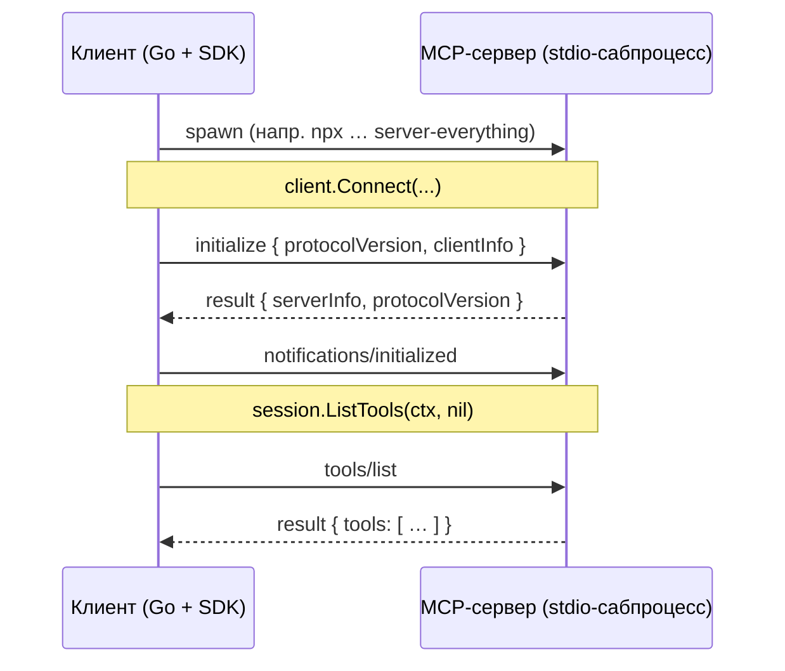

# День 16. Подключение MCP

Минимальный MCP-клиент на **официальном Go SDK**
(`github.com/modelcontextprotocol/go-sdk`): устанавливает соединение с **готовым**
MCP-сервером по stdio и получает у него список инструментов (`tools/list`).

## Задание и критерии

| Требование задания | Где закрыто |
|---|---|
| Устанавливает MCP-соединение | `client.Connect(...)` — SDK делает рукопожатие `initialize` + `notifications/initialized` |
| Получает список доступных инструментов | `session.ListTools(ctx, nil)` — запрос `tools/list` |
| Соединение устанавливается | вывод `[mcp] соединение установлено ✓` + `serverInfo` из `InitializeResult()` |
| Список инструментов возвращается корректно | вывод `получено инструментов: N` + перечисление |

Свой MCP-сервер на этом дне писать **не нужно** — это день 17. Здесь мы только
*подключаемся* к существующему серверу и дёргаем у него `tools/list`.

## Стек

- **Go 1.25** (требование SDK — он не собирается на Go < 1.25).
- `github.com/modelcontextprotocol/go-sdk v1.6.1` — официальный SDK.
- Транспорт — **stdio** через `mcp.CommandTransport`: SDK сам поднимает MCP-сервер
  как дочерний процесс и общается с ним newline-delimited JSON-RPC. Это принятый на дне 16
  вариант (локальный сервер как сабпроцесс засчитывается; деплой на VPS не требуется).

> LLM здесь **не участвует** — это чистый протокол MCP, поэтому **API-ключ не нужен**.
> Запускается полностью автономно.
>
> Раньше клиент был написан руками на голой stdlib из-за того, что проект был на Go 1.22,
> а SDK требует Go ≥ 1.25. После апа Go до 1.25.9 берём официальный SDK — кода меньше,
> протокол/транспорт/рукопожатие берёт на себя он.

## Протокол (что делает SDK под капотом)



ASCII-fallback:

```
Клиент (Go+SDK)                     MCP-сервер (stdio)
    |   spawn (npx … everything)         |
    |----------------------------------->|
    |   initialize {proto, clientInfo}   |  <- Connect()
    |----------------------------------->|
    |        result {serverInfo}         |
    |<-----------------------------------|
    |   notifications/initialized        |
    |----------------------------------->|
    |   tools/list                       |  <- ListTools()
    |----------------------------------->|
    |        result {tools: […]}         |
    |<-----------------------------------|
```

После `Connect` данные сервера и согласованная версия протокола доступны через
`session.InitializeResult()` (`ServerInfo`, `ProtocolVersion`).

## Файлы

| Файл | Что | Как / Почему |
|---|---|---|
| `main.go` | Весь клиент | `mcp.NewClient` -> `Connect(ctx, &mcp.CommandTransport{Command: exec.CommandContext(...)}, nil)` (рукопожатие внутри) -> `session.ListTools(ctx, nil)`. Флаги `-schemas`, `-timeout`; команда сервера — из аргументов после `--`. Вывод в прозрачном виде `[mcp] …`. |
| `go.mod` | Модуль | `go 1.25`, `require github.com/modelcontextprotocol/go-sdk v1.6.1`. |

> Workaround с `anthropic.ModelClaudeOpus4_8` здесь **не нужен**: клиент не импортирует
> anthropic SDK (LLM не задействован).

## Запуск

Первый раз — подтянуть зависимости:

```bash
go mod tidy   # заполнит go.sum и indirect-зависимости SDK
```

Дальше:

```bash
# по умолчанию — официальный референс-сервер "everything" через npx
go run .

# показать ещё и input-схему каждого инструмента
go run . -schemas

# любой другой готовый MCP-сервер — команда после "--"
go run . -- npx -y @modelcontextprotocol/server-filesystem /tmp

# (день 17) тем же клиентом можно дёрнуть СВОЙ сервер:
# go run . -- <команда запуска твоего сервера>
```

`node`/`npx` нужен только для npm-серверов из примеров. Свой бинарь/скрипт Node не требует.

## Ожидаемый вывод

`everything` (13 инструментов):

```
[mcp] запускаю сервер: npx -y @modelcontextprotocol/server-everything
[mcp] → connect/initialize
[mcp] ← сервер: Everything Reference Server v2.0.0 (согласован протокол 2024-11-05)
[mcp] соединение установлено ✓
[mcp] → tools/list
[mcp] ← получено инструментов: 13

Доступные инструменты:
   1. echo — Echoes back the input string
   2. get-annotated-message — Demonstrates how annotations can be used to provide metadata about content.
   3. get-env — Returns all environment variables, helpful for debugging MCP server configurati…
   4. get-resource-links — Returns up to ten resource links that reference different types of resources
   5. get-resource-reference — Returns a resource reference that can be used by MCP clients
   6. get-structured-content — Returns structured content along with an output schema for client data validati…
   7. get-sum — Returns the sum of two numbers
   8. get-tiny-image — Returns a tiny MCP logo image.
   9. gzip-file-as-resource — Compresses a single file using gzip compression. Depending upon the selected ou…
  10. toggle-simulated-logging — Toggles simulated, random-leveled logging on or off.
  11. toggle-subscriber-updates — Toggles simulated resource subscription updates on or off.
  12. trigger-long-running-operation — Demonstrates a long running operation with progress updates.
  13. simulate-research-query — Simulates a deep research operation that gathers, analyzes, and synthesizes inf…
```

Тот же клиент против другого готового сервера — `filesystem` (14 инструментов):

```
[mcp] запускаю сервер: npx -y @modelcontextprotocol/server-filesystem /tmp
[mcp] ← сервер: secure-filesystem-server v0.2.0 (согласован протокол 2024-11-05)
[mcp] соединение установлено ✓
[mcp] ← получено инструментов: 14
   1. read_file …  5. write_file …  8. list_directory …  12. search_files …
```

> Соединение и `tools/list` против обоих серверов (everything -> 13 тулов, filesystem -> 14)
> проверены вживую на уровне протокола (`initialize` + `tools/list`). SDK-версия печатает
> те же поля — запусти `go run .` на своём Go 1.25, чтобы снять вывод для видео.

## Обработка ошибок

- **Нет бинаря сервера** -> ошибка от `exec`/`Connect`, выход `1`.
- **Сервер молчит / висит** -> срабатывает `-timeout` (ctx завязан на `exec.CommandContext`,
  процесс будет убит), выход `1`.
- **JSON-RPC error от сервера** -> SDK вернёт ошибку из `Connect`/`ListTools`, печатаем и выходим `1`.
- **stderr сервера** уходит в наш `os.Stderr` (`cmd.Stderr = os.Stderr`).

## Проверка

- `main.go` типокорректен против точных сигнатур SDK v1.6.1 (NewClient / CommandTransport /
  Connect / InitializeResult / ListTools / Tool) — проверено компиляцией против stub
  с этими сигнатурами.
- Финальная сборка — на твоём Go 1.25: `go mod tidy && go vet ./... && go build ./...`.

## FAQ (из обсуждения в чате потока)

**Свой MCP-сервер на 16-й день нужен?**
Нет. День 16 — подключиться к **готовому** серверу и вывести список тулов любым удобным
способом. Свой сервер — день 17.

**Локальный stdio-сервер как сабпроцесс засчитывается?**
Да (подтверждено в чате на примере Alexander Buiko). Деплой на VPS на 16-й день не требуется.

**Нужен ли API-ключ / участвует ли LLM?**
Нет. Задание — про сам протокол MCP (`tools/list`), модель здесь не вызывается.

**Что считается для 16 vs 17?**
16 — клиент + соединение + список тулов (локально или к публичному серверу).
17 — уже **свой** MCP-сервер вокруг любого API, с деплоем.

## Выводы

- Соединение и `tools/list` — на официальном Go SDK, без LLM и без API-ключа.
- Клиент **универсальный**: команда сервера задаётся аргументом, проверен на двух разных
  готовых серверах (`everything`, `filesystem`).
- Это же подготовка к дню 17: свой сервер можно будет проверять этим же клиентом
  (`go run . -- <команда своего сервера>`) или MCP Inspector.