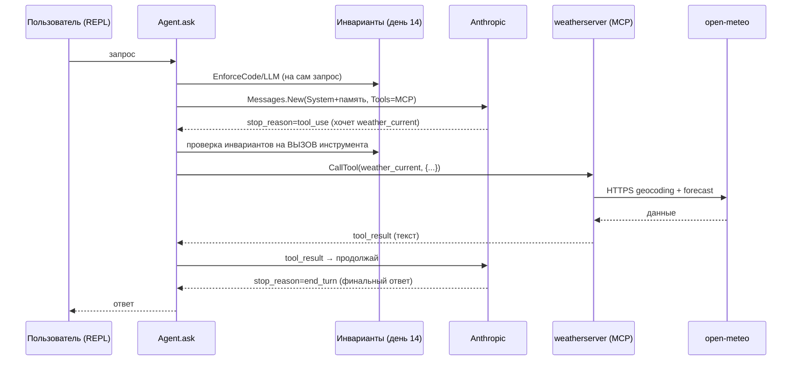

# День 17. Первый инструмент MCP

Свой **MCP-сервер вокруг реального API** (open-meteo, погода, без ключа), вшитый
**в твоего накопительного агента** (память/профили/инварианты/FSM/рой из дней 11–15).
Инструменты доступны агенту всегда; модель сама решает, когда их звать (нативный
tool-use), а инварианты (день 14) проверяют **каждый вызов инструмента**.

## Задание и критерии

| Требование | Где закрыто |
|---|---|
| Свой MCP-сервер вокруг API | `weatherserver/` — обёртка над open-meteo |
| Регистрация инструмента | `server.AddTool(...)` — `geocode`, `weather_current` |
| Описание входных параметров | `InputSchema` (JSON Schema) у каждого тула |
| Возврат результата | `*mcp.CallToolResult` с `TextContent` (+ `IsError`) |
| Подключение инструмента **к своему агенту** | `Agent.SetMCP(...)` + цикл tool-use внутри `Agent.ask` |
| Вызов из приложения | обычный ввод в REPL `main.go` → агент сам зовёт тул |
| Получение и использование результата | `tool_result` уходит модели, она формулирует ответ |

> «Свой агент» здесь — именно твой агент из дней 11–15, а не отдельная программа.
> Это следует из текста задания («подключите к **своему** агенту») и цели недели
> из вводной лекции — «оркестрировать MCP в своём агенте». Поэтому MCP вшит прямо
> в `Agent.ask`, поверх памяти/профилей/инвариантов, а не вынесен в отдельный драйвер.

## Что изменилось (накопительно от дня 16)

**Новые файлы:**
- `mcptools.go` — подключение к MCP-серверу (`ConnectMCP`), хранение сессии и
  сконвертированных в формат Anthropic инструментов; `Call` для вызова тула;
  конвертеры `toAnthropicTools`/`splitSchema`/`mcpResultText`.
- `weatherserver/main.go` — сам MCP-сервер вокруг open-meteo.

**Изменённые файлы:**
- `agent.go`:
  - в `Agent` добавлено поле `mcp *MCPTools` и сеттер `SetMCP`;
  - одиночный `Messages.New` заменён на **цикл tool-use** (до `maxToolRounds=8`):
    инструменты кладутся в каждый запрос; пока `stop_reason == "tool_use"` —
    выполняем запрошенные тулы и возвращаем `tool_result`, иначе отдаём текст;
  - новый метод `runTool`: применяет инварианты к **намерению** вызвать инструмент
    (`EnforceCode` + при `-llm-check` `EnforceLLM`); при запрете инструмент НЕ
    вызывается, модели возвращается `tool_result` с `is_error` и причиной отказа;
  - токены теперь суммируются по всем раундам.
- `main.go`: при старте поднимаем `weatherserver` по stdio (`ConnectMCP`),
  отдаём инструменты агенту (`agent.SetMCP`), печатаем их список; `defer mcpStop()`.

Остальные файлы (`memory.go`, `pipeline.go`, `swarm.go`, `invariants.go`,
`enforce.go`, `profile.go`, `state.go`, `report.go`, `usage.go`, `artifact.go`)
не менялись — берутся из дня 16 как есть.

## Поток (где живёт tool-use)



ASCII-fallback:

```
Пользователь → Agent.ask ──(инвариант на запрос)──→ Messages.New(Tools=MCP)
     ↑                                                      │ stop_reason=tool_use
     │                                                      ▼
   ответ ←── Messages.New(tool_result) ←── CallTool ←── (инвариант на ВЫЗОВ)
                                              │
                                weatherserver → open-meteo (HTTPS)
```

## Где Anthropic стыкуется с MCP (два моста)

Связь модели и MCP-инструментов держится на **двух** местах в `agent.go`, а не на одном.
Прокидывание `params.Tools` — это только половина (объявление); без второй половины
(цикл + фактический вызов) модель просила бы инструмент, но он бы не выполнялся.

**Мост 1 — на ВХОД модели: объявляем инструменты.**
```go
params := anthropic.MessageNewParams{
    Model: a.model, MaxTokens: a.maxTokens, System: system, Messages: msgs,
}
if a.mcp != nil {
    params.Tools = a.mcp.Tools() // MCP-инструменты в формате Anthropic
}
```
`Tools()` отдаёт `[]anthropic.ToolUnionParam` — это MCP-инструменты, сконвертированные
в формат Anthropic (`mcptools.go`, `toAnthropicTools`: имя + описание + JSON-схема входа).
Здесь модель только *узнаёт*, что у неё есть `weather_current`/`geocode` и как их звать.
Ничего ещё не вызвано — переданы лишь **описания**.

**Мост 2 — на ВЫХОД модели: вызываем инструмент и возвращаем результат.**
После `Messages.New` ответ может прийти с `stop_reason == "tool_use"` и блоком `tool_use`
(имя + аргументы, которые модель придумала сама). Тогда выполняем вызов и кормим
результат обратно:
```go
if string(msg.StopReason) != string(anthropic.StopReasonToolUse) {
    // финальный текст — выходим из цикла
}
// иначе модель хочет инструмент:
tu := block.AsToolUse()                       // tu.Name, tu.Input (сырой JSON)
out, isErr := a.runTool(ctx, tu.Name, tu.Input) // → инварианты → a.mcp.Call → CallTool
results = append(results, anthropic.NewToolResultBlock(tu.ID, out, isErr))
// ...
params.Messages = append(params.Messages, anthropic.NewUserMessage(results...))
// цикл повторяет Messages.New уже с результатом — модель его читает и отвечает
```
Реальная стыковка с MCP — внутри `runTool` → `a.mcp.Call` → `session.CallTool(...)`:
запрос модели уходит в твой `weatherserver`, тот ходит в open-meteo, и текст возвращается
модели как `tool_result`.

Схематично, кто что делает:
```
params.Tools = a.mcp.Tools()          ← МОСТ 1: объявили инструменты (вход модели)
        │
Messages.New ──► stop_reason=tool_use, tu.Name="weather_current", tu.Input={...}
        │
a.mcp.Call(tu.Name, tu.Input) ──► session.CallTool ──► weatherserver ──► open-meteo   ← МОСТ 2: вызвали
        │
NewToolResultBlock(tu.ID, out) ──► Messages.New(... + результат)                      ← вернули модели
        │
stop_reason=end_turn ──► финальный ответ
```

Итого:
- **вход модели** — `params.Tools = a.mcp.Tools()`: MCP-схемы → формат Anthropic (модель *знает* про инструменты);
- **выход модели** — `a.mcp.Call(tu.Name, tu.Input)` в `runTool`: запрос модели → реальный `CallTool` к серверу → `tool_result` обратно (инструмент реально *выполняется*).

Цикл крутится до `maxToolRounds=8` раундов — на случай, если модель захочет несколько
инструментов подряд (например, сначала `geocode`, потом `weather_current`).

## MCP-сервер (`weatherserver/`)

Два инструмента вокруг open-meteo (ключ не нужен):
- `geocode` — название города → координаты;
- `weather_current` — город → текущая погода (геокодит и берёт текущие показатели).

`InputSchema` задан JSON-схемой, результат — `TextContent`, ошибки — `IsError`.

## Инварианты на вызовы инструментов

`runTool` гоняет намерение `имя + аргументы` через те же `EnforceCode`/`EnforceLLM`,
что и пользовательский запрос. Это закрывает дыру «обойти инвариант через инструмент»:
модель не сможет, например, дёрнуть тул в обход запрета — получит `tool_result`
с `is_error` и объяснением, и продолжит уже с учётом отказа.

## Запуск

> ⚠️ **`weatherserver/main.go` запускать вручную НЕ надо.** Это не отдельная команда
> для тебя — сервер поднимает сам агент как сабпроцесс по stdio. Ты запускаешь
> **только агента** (`go run ./week-4/task-17`); он сам выполнит `go run ./weatherserver`.
>
> ⚠️ **Обязательно создай подпапку `weatherserver/`** с файлом `main.go` внутри.
> Если её нет — на старте увидишь `directory not found` и
> `MCP недоступен (mcp connect: ... EOF)`, и агент будет работать без инструментов.

Структура каталога должна быть ровно такой:
```
week-4/task-17/
├── agent.go
├── main.go
├── mcptools.go
└── weatherserver/
    └── main.go      ← MCP-сервер; агент запускает его сам, вручную НЕ трогаем
```

Подготовка (из корня репозитория):
```bash
mkdir -p week-4/task-17/weatherserver   # если папки ещё нет — создать и положить main.go
ls week-4/task-17/weatherserver/main.go # проверка: файл должен существовать
```

В корне репозитория добавь в `go.mod`:
```
go 1.25

require github.com/modelcontextprotocol/go-sdk v1.6.1
```
затем — запускаешь **только агента**:
```bash
go mod tidy
go run ./week-4/task-17          # ← запускаем ЭТО (агента), а не weatherserver
```

На старте должно появиться подтверждение, что сервер поднялся:
```
MCP подключён: 2 инструмент(ов) — [geocode weather_current]
```
Если вместо этого `MCP недоступен (... EOF)` — почти всегда нет папки `weatherserver/`
или в ней нет `main.go` (см. предупреждение выше).

В REPL дальше как обычно — просто спрашиваешь, агент сам решит звать ли тул:
```
> какая сейчас погода в Берлине?
```

Node/Python не нужны.

**Проверить сервер отдельно (по желанию, для отладки):** хоть вручную его запускать и
не надо, убедиться, что он поднимается, можно клиентом дня 16 —
`go run ./week-4/task-16 -- go run ./week-4/task-17/weatherserver`. Прямой
`go run ./week-4/task-17/weatherserver` смысла не имеет: сервер просто молча ждёт
stdio-клиента.

## Ожидаемый вывод

```
Накопительный агент: память (3 слоя) + персонализация.
Активный профиль: "senior-go" · профили: [junior senior-go]
MCP подключён: 2 инструмент(ов) — [geocode weather_current]
> какая сейчас погода в Берлине?
[agent→mcp] weather_current {"location":"Берлин"}
[mcp→agent] Berlin, Germany: 12.4°C, ветер 8 км/ч, переменная облачность
В Берлине сейчас около 12 °C, переменная облачность, ветер ~8 км/ч.
[профиль "senior-go" · слои: long-term(профиль), short-term(диалог)]
```

Пример отказа инструмента инвариантом (если правило запрещает действие):
```
[инвариант/код] вызов weather_current отклонён: Запрос нарушает инвариант(ы): …
```

> Полный end-to-end снимаешь у себя: в этом окружении open-meteo и Anthropic API
> недоступны по сети, ключа нет. Проверено здесь: **весь пакет компилируется** —
> твои файлы + вшитый tool-use + `weatherserver` собраны `go build`/`go vet`
> против **настоящего** anthropic-sdk-go v1.6.0 (tool-use API) и сигнатур MCP SDK v1.6.1.
> Значения погоды в примере — иллюстративные.

## FAQ (по условию и чату потока)

**«Свой агент» — это агент из дня 15?**
Да. По тексту задания и цели недели MCP оркеструется в твоём накопительном агенте,
а не в новой программе. Отдельного сообщения в чате именно про «15-й vs новый» нет —
это вывод по формулировке, не цитата куратора.

**Инструменты всегда доступны или по флагу?**
Всегда: `tools/list` подтягивается при старте и кладётся в каждый запрос.

**Инварианты применяются к вызовам инструментов?**
Да — `runTool` проверяет каждый вызов до фактического `CallTool`.

**Локально, без деплоя?**
Да: stdio-сабпроцесс. HTTP-деплой — отдельный шаг (меняется транспорт на сервере и
`StreamableClientTransport` в клиенте; логика тулов не трогается).

## Выводы

- Полный круг внутри твоего агента: **запрос → (инвариант) → модель → tool_use →
  (инвариант на вызов) → MCP-инструмент → open-meteo → tool_result → ответ**.
- Инварианты стали воротами не только на входе, но и на каждом действии агента.
- Сервер реиспользуем клиентом дня 16 и готов к деплою заменой транспорта.