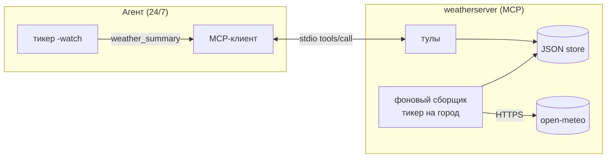

# День 18. Планировщик и фоновые задачи

Накопительно от дня 17. MCP-сервер получает **отложенное/периодическое выполнение**:
по расписанию собирает погоду в фоне, **сохраняет в JSON**, а тул `weather_summary`
возвращает **агрегированный результат**. Агент работает в режиме **24/7** и периодически
печатает сводку.

## Задание (дословно из сообщения)

> 🔥 **День 18. Планировщик и фоновые задачи**
>
> Сделайте MCP-инструмент с отложенным или периодическим выполнением.
>
> Пример:
> 👉 reminder
> 👉 периодический сбор данных
> 👉 регулярный summary
>
> Инструмент должен:
> 👉 сохранять данные (JSON / SQLite)
> 👉 выполняться по расписанию
> 👉 возвращать агрегированный результат
>
> Результат:
> Агент, который работает 24/7 и периодически выдаёт сводку
>
> Формат: Видео + Код

## Задание и критерии

| Требование | Где закрыто |
|---|---|
| MCP-инструмент с отложенным/периодическим выполнением | `track_location` запускает фоновый сбор по тикеру |
| Сохранять данные (JSON / SQLite) | `weatherserver/store.go` — JSON-хранилище (атомарная запись) |
| Выполняться по расписанию | фоновая горутина-сборщик в сервере (`startCollector`) |
| Возвращать агрегированный результат | тул `weather_summary` (кол-во, период, min/avg/max t) |
| Агент работает 24/7 и периодически выдаёт сводку | режим `-watch` / команда `/watch` в `main.go` |

> Хранилище — **JSON** (без зависимостей, под профиль `senior-go`). SQLite — альтернатива
> из задания; для одного процесса и простого агрегата JSON достаточно и не тянет cgo.

## Архитектура (кто кого дёргает)

По консенсусу из чата потока: **планировщик → агент (MCP-клиент) → MCP-сервер**.
Сервер пассивен (отвечает на `tools/call`), но **внутри** крутит фоновый сбор —
это и есть «оба два», к которому пришли в обсуждении:



ASCII-fallback:

```
Агент (тикер -watch) ──weather_summary──► MCP-клиент ──stdio──► weatherserver
                                                                   │
   track_location ──► [фоновый сборщик: тикер/город] ──HTTPS──► open-meteo
                                   │
                                   ▼
                            weather-store.json  ◄── weather_summary читает агрегат
```

Два уровня расписания (намеренно, как в обсуждении):
1. **Сервер** собирает данные сам, без участия LLM и без токенов (`startCollector`).
2. **Агент** по своему тикеру периодически просит агрегат (`weather_summary`) и печатает.

## Что добавилось к дню 17

**Новые файлы:**
- `weatherserver/store.go` — `Store` (JSON, мьютекс, атомарная запись `tmp+rename`),
  типы `Sample`/`Tracked`, методы `Upsert`/`Append`/`List`/`Summary` (агрегация).
- `watch.go` — `runWatch`: ставит города на сбор и в цикле печатает сводку (24/7).

**Изменённые файлы:**
- `weatherserver/main.go`:
  - при старте загружает `weather-store.json` и **возобновляет** сбор по сохранённым городам;
  - `startCollector`/`collectOnce` — фоновая горутина: собрать сразу и далее каждые N сек;
  - новые тулы `track_location`, `weather_summary`, `list_tracked`;
  - `ctx` сервера прокинут в сборщики (живут, пока жив сервер).
- `main.go`:
  - флаги `-watch <сек>`, `-track "<города>"`, `-interval <сек>`;
  - ветка watch-режима (24/7) до REPL;
  - REPL-команды `/track <город> [сек]`, `/summary [город]`, `/watch <сек>`.

Файлы дня 17 (`agent.go`, `mcptools.go` и весь накопленный агент) не менялись.

## Тулы сервера (день 18)

| Тул | Вход | Что делает |
|---|---|---|
| `track_location` | `location`, `interval_sec` | геокодит город и запускает фоновый сбор по тикеру; пишет в JSON |
| `weather_summary` | `location?` | агрегат по накопленным наблюдениям (без `location` — по всем) |
| `list_tracked` | — | какие города отслеживаются и их интервалы |

(плюс `geocode` и `weather_current` из дня 17).

## Запуск

> ⚠️ Как и в дне 17, **`weatherserver` вручную не запускаем** — его поднимает агент.
> Нужна папка `week-4/task-18/weatherserver/` с `main.go` **и** `store.go`.

Накопительно: скопируй `week-4/task-17` → `week-4/task-18`, затем замени `main.go` и
`weatherserver/main.go` на эти и добавь `watch.go` + `weatherserver/store.go`.

**Режим 24/7 (главный для видео, без ключа — токены не тратятся):**
```bash
go run ./week-4/task-18 -watch=20 -track="Berlin,Sofia" -interval=10
```
Сервер начнёт собирать погоду по Берлину и Софии каждые 10 с, а агент каждые 20 с будет
печатать агрегированную сводку. Данные копятся в `weatherserver/weather-store.json`
(переживают перезапуск — сбор возобновится). Выход — Ctrl-C.

**Интерактивно (обычный REPL):**
```bash
go run ./week-4/task-18
> /track Берлин 15        # фоновый сбор каждые 15 с
> /summary               # агрегат по всем
> /watch 30              # 24/7-сводка каждые 30 с (Ctrl-C — назад в REPL)
```

**Через LLM (нужен ключ):** инструменты доступны модели — можно словами:
```
> следи за погодой в Берлине, обновляй раз в минуту
> дай сводку по Берлину
```
Модель сама вызовет `track_location` / `weather_summary` (tool-use из дня 17).

## Ожидаемый вывод (режим 24/7)

```
MCP подключён: 5 инструмент(ов) — [geocode weather_current track_location weather_summary list_tracked]
[watch] слежу за Berlin, Germany — сбор каждые 10 с (данные в weather-store.json)
[watch] слежу за Sofia, Bulgaria — сбор каждые 10 с (данные в weather-store.json)
[watch] агент работает 24/7: сводка каждые 20 с (Ctrl-C — выход)

[сводка 20:31:05]
Сводка по отслеживаемым городам:
  • Berlin, Germany: наблюдений 2 за 10s · t сейчас 12.4°C (min 12.4 / avg 12.5 / max 12.6) · обновление каждые 10 с
  • Sofia, Bulgaria: наблюдений 2 за 10s · t сейчас 18.1°C (min 18.0 / avg 18.1 / max 18.1) · обновление каждые 10 с
```

(в логах сервера параллельно идёт `[collector] Berlin: 12.4°C записано`)

> Полный прогон снимаешь у себя: open-meteo в этом окружении недоступна по сети.
> Проверено здесь: **весь пакет компилируется** — агент + watch + сервер со сборщиком и
> JSON-хранилищем собраны `go build`/`go vet` против настоящего anthropic-sdk-go v1.6.0
> и сигнатур MCP SDK v1.6.1. Значения погоды — иллюстративные.

## Из лекции (по теме задания)

Отдельной лекции по дню 18 не было — есть вводная лекция MCP на неделю
(`MCP-intro-konspekt.md`). Релевантные дню 18 места из неё:

**Цель недели (§9 конспекта):**
- Научиться **реализовывать MCP для публичных тулзов** (GitHub, Яндекс.Трекер и т.п.).
- Научиться **оркестрировать MCP в своём агенте**: тулов много, запрос большой — агент
  должен уметь их выбирать и комбинировать. (Поэтому день 18 вшит в накопительного агента.)
- **Сравнить расход токенов Skill vs MCP** — запустить и то, и то, посмотреть разницу.

**Где MCP нужен (§1) — обоснование сценария «периодический сбор»:**
- Корпоративные системы (таск-трекеры, хранилища кода), внутренние базы знаний,
  DevOps/CI-CD, простой интерфейс к сложным системам (1С/SAP), **персональный ассистент**
  (календарь, почта). Именно сюда ложатся «reminder / периодический сбор / регулярный
  summary» из задания: агент периодически ходит в источник через свой MCP и собирает.

**Токеновая экономика (§8) — почему сбор идёт на сервере, без LLM:**
- MCP при каждом sampling-call заново подкладывает в контекст **схему всех тулов**;
  расход **растёт квадратично** (на ~20 экшенов — сотни тысяч токенов против ~15k у Skill+CLI).
  Есть и **idle-расход** просто за факт подключённого MCP.
- Прямой вывод для дня 18: гонять фоновый сбор через LLM каждый тик — дорого и бессмысленно.
  Поэтому в нашей архитектуре **данные собирает сам MCP-сервер** (горутина+тикер, чистый
  `net/http`, **без вызовов модели и без токенов**), а LLM/агент дёргается только когда
  реально нужна сводка. Это ровно то, о чём предупреждала лекция.

**Минусы MCP (§5), которые держим в уме:** «логические бомбы» и то, что сервер нужен не
всегда — но для отложенного/периодического сбора вокруг внешнего API сервер оправдан.

## Решения по архитектуре (из чата потока)

- **Кто инициатор:** агент (MCP-клиент) дёргает сервер; сервер пассивен на уровне
  протокола. Push из сервера в агента не делаем — это не основной путь (консенсус чата).
- **Где расписание:** сбор данных — на сервере (фоновая горутина, без токенов); периодичность
  «выдачи сводки» — на агенте (тикер watch). Это покрывает «инструмент выполняется по
  расписанию» и «агент работает 24/7».
- **Агрегат, не LLM-суммаризация:** `weather_summary` считает статистику в Go; сервер LLM
  не вызывает (важно и для дня 19 — там та же установка куратора).
- **Персистентность:** JSON с атомарной записью; сбор возобновляется после рестарта сервера.

## Выводы

- MCP-сервер получил фоновое периодическое выполнение и персистентность, оставаясь без LLM.
- Агент — 24/7: ставит задачи на сбор и периодически отдаёт агрегат.
- Заготовка под день 19: тулы уже на одном сервере, цепочку (`track`→`summary`) при желании
  оркеструет LLM из дня 17 без хардкода.