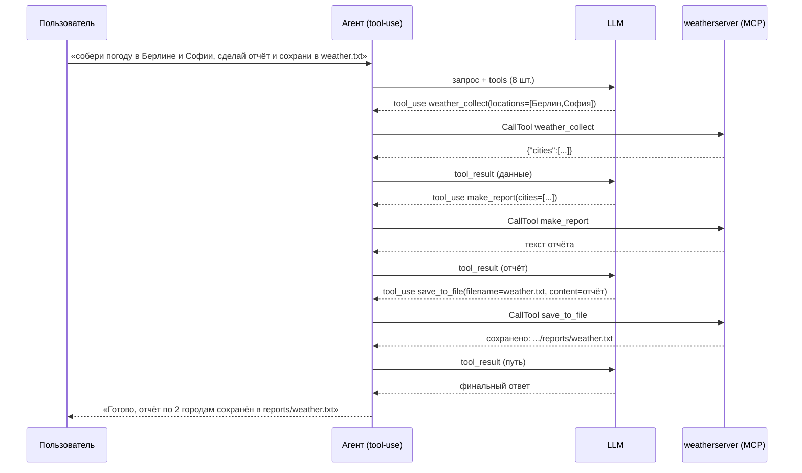

# День 19. Композиция MCP-инструментов

Накопительно от дня 18. На том же (одном) MCP-сервере добавлен **пайплайн из трёх
инструментов**, цепочку которых по запросу пользователя оркеструет **LLM** (без хардкода
в агенте):

```
weather_collect  →  make_report  →  save_to_file
  (получает)         (обрабатывает)    (сохраняет)
```

## Задание (дословно из сообщения)

> 🔥 **День 19. Композиция MCP-инструментов**
>
> Создайте несколько MCP-инструментов, например:
> 👉 search
> 👉 summarize
> 👉 saveToFile
>
> Реализуйте пайплайн:
> 👉 первый инструмент получает данные
> 👉 второй — обрабатывает
> 👉 третий — сохраняет результат
>
> Проверьте:
> 👉 автоматическое выполнение цепочки
> 👉 корректность передачи данных между инструментами
>
> Результат: Автоматический пайплайн из нескольких MCP-инструментов
>
> Формат: Видео + Код

## Уточнения куратора из чата (важно для дня 19)

- Несколько тулов на **ОДНОМ** MCP-сервере, не три разных MCP («не надо делать 3 разных mcp»).
- **Все** тулы — на MCP, не в агенте (суммаризацию/сохранение в агент не выносить).
- Цепочку вызывает **LLM по запросу пользователя**, без хардкода последовательности в агенте.
  Пример куратора: «найди лучший ресторан в Питере и сохрани в заметки» → MCP ищет, делает
  итог, сохраняет в файл.
- «summarize» — неудачный термин: имеется в виду **отчёт/итог**, не обязательно
  LLM-суммаризация. **MCP-сервер LLM не вызывает.** Три любых тула.
- Главное: проходит цепочка `tool → tool → tool` с корректной передачей данных.

## Как это сделано

| Шаг | Тул | Вход | Выход |
|---|---|---|---|
| 1. получает | `weather_collect` | `locations:[]`, `units?` | `{"cities":[{name,country,temp,wind,code,desc}]}` |
| 2. обрабатывает | `make_report` | `cities:[]` (из шага 1), `title?` | текстовый отчёт (рейтинг по t, экстремумы, среднее) |
| 3. сохраняет | `save_to_file` | `filename`, `content` (из шага 2) | путь к файлу в `reports/` |

Ключевые решения:
- **Один сервер, три тула** — добавлены в `weatherserver/pipeline.go`, рядом с тулами дней 17–18.
- **Передача данных** — единый тип `cityWeather` гарантирует, что `weather_collect`
  отдаёт ровно ту схему, которую принимает `make_report` (поле `cities`). Выход
  `make_report` (текст) идёт в `content` у `save_to_file`. Данные «текут» между тулами
  через контекст модели.
- **Оркеструет LLM, не хардкод** — в агенте никакой жёсткой последовательности нет;
  цепочку строит модель на основе запроса (это и есть «автоматическое выполнение цепочки»).
  Работает за счёт tool-use цикла из дня 17 (`maxToolRounds=8` хватает на 3 шага).
- **Сервер без LLM** — `make_report` это итог на чистом Go (сортировка/агрегация), модель не
  вызывается. `save_to_file` пишет только в `reports/`, имя файла очищается от путей
  (защита от traversal).

## Поток (как LLM гонит цепочку)



## Что добавилось к дню 18

**Новый файл:** `weatherserver/pipeline.go` — три тула (`weather_collect`, `make_report`,
`save_to_file`), тип `cityWeather`, `buildReport`, безопасный `saveReport`.

**Изменён:** `weatherserver/main.go` — добавлен вызов `registerPipelineTools(s)`.

Агент (`agent.go`, `main.go`, tool-use цикл) **не менялся** — цепочку он уже умеет
оркестрировать с дня 17. Это и есть смысл «без хардкода»: новые тулы просто появились
у модели, и она сама их связала.

## Запуск

> ⚠️ `weatherserver` вручную не запускаем — поднимает агент. В `weatherserver/` теперь
> три файла: `main.go`, `store.go`, `pipeline.go`.

Накопительно: скопируй `week-4/task-18` → `week-4/task-19`, замени `weatherserver/main.go`
и добавь `weatherserver/pipeline.go`.

Пайплайн **оркеструет LLM**, поэтому нужен ключ (`.env` с `ANTHROPIC_API_KEY`):
```bash
go run ./week-4/task-19
> собери погоду в Берлине, Софии и Париже, сделай сводный отчёт и сохрани в weather.txt
```

## Ожидаемый вывод

```
MCP подключён: 8 инструмент(ов) — [geocode weather_current track_location weather_summary list_tracked weather_collect make_report save_to_file]
> собери погоду в Берлине, Софии и Париже, сделай сводный отчёт и сохрани в weather.txt
[agent→mcp] weather_collect {"locations":["Берлин","София","Париж"]}
[mcp→agent] {"cities":[{"name":"Berlin",...},{"name":"Sofia",...},{"name":"Paris",...}]}
[agent→mcp] make_report {"cities":[...],"title":"Погода в трёх городах"}
[mcp→agent] Погода в трёх городах ===... 1. Sofia ... 2. Paris ... 3. Berlin ...
[agent→mcp] save_to_file {"filename":"weather.txt","content":"Погода в трёх городах..."}
[mcp→agent] сохранено: .../weatherserver/reports/weather.txt (312 байт)
Готово: собрал погоду по 3 городам, отчёт сохранён в reports/weather.txt.
```

Цепочка `weather_collect → make_report → save_to_file` отработала автоматически, данные
передались между тулами (cities → отчёт → файл).

> Полный прогон снимаешь у себя: пайплайн оркеструет модель (нужен ключ), а open-meteo
> в этом окружении недоступна по сети. Проверено здесь: **весь пакет компилируется** —
> сервер с тремя пайплайн-тулами + агент собраны `go build`/`go vet` против настоящего
> anthropic-sdk-go v1.6.0 и сигнатур MCP SDK v1.6.1. Значения погоды — иллюстративные.

## Проверка критериев

- **Автоматическое выполнение цепочки** — LLM сам вызывает 3 тула подряд по одному запросу.
- **Корректность передачи данных** — общий тип `cityWeather`: выход `weather_collect`
  (`cities`) идентичен входу `make_report`; выход `make_report` идёт в `content` у `save_to_file`.
- **Несколько MCP-инструментов** — три тула пайплайна на одном сервере (плюс тулы дней 17–18).

## FAQ (вопросы по ходу)

**Что такое «пайплайн-тулы» и зачем они нужны? В чём суть задания?**
Пайплайн (конвейер) — цепочка инструментов, где выход одного становится входом следующего:
`weather_collect → make_report → save_to_file` (собрал данные → сделал отчёт → записал в файл).
«Пайплайн-тулы» — не особая сущность MCP, а просто три обычных тула, задуманных работать
в связке. Суть задания — **композиция**: по одному запросу пользователя агент выполняет
несколько тулов подряд, правильно прокидывая данные между ними. Это ближе к реальным
задачам — почти всё полезное состоит из нескольких шагов («найди и сохрани», «выгрузи,
оформи, положи в файл»). Задание проверяет два момента: цепочка отрабатывает **автоматически**
(пользователь не диктует шаги — порядок строит модель) и **данные корректно передаются**
между тулами.

**Мы говорим LLM, что умеем 3 вещи, а она сама выбирает что и как вызвать? В какой момент сообщаем?**
Да. Сообщаем один раз — в начале каждого запроса, в поле `Tools` запроса к Anthropic
(«Мост 1» из дня 17): `params.Tools = a.mcp.Tools()`. Туда входят имя, **описание** и
**схема входов** каждого тула — это «меню» возможностей. В этот момент модель ничего не
вызывает: она лишь узнаёт, что доступно и как этим пользоваться. Описания (`Description`/
`InputSchema`) — и есть инструкция модели, когда и с какими аргументами звать тул (поэтому
в описаниях прямо написано «Шаг 1 / Шаг 2 / Шаг 3» и «результат передаётся в …»). Дальше
на простой запрос модель не зовёт ничего, а на «собери и сохрани» — выстраивает цепочку.

**Пример задачи и как модель её решает.**
Запрос: «Узнай погоду в Берлине, Софии и Париже, сделай отчёт и сохрани в trip.txt».
1. Модель просит `weather_collect(locations=[...])` → сервер идёт в open-meteo →
   возвращает `{"cities":[...]}`; кладём как `tool_result`.
2. Прочитав данные, модель просит `make_report(cities=[...], title=...)` → сервер (на Go,
   без LLM) возвращает текст отчёта.
3. Модель просит `save_to_file(filename="trip.txt", content=<отчёт>)` → файл записан.
4. `stop_reason=end_turn` → финальный ответ пользователю.
   Нигде в коде не написано «сначала collect, потом report, потом save» — порядок и передачу
   данных между шагами выстроила модель из описаний тулов.

**Где это полезно вне погоды?** Тот же механизм на любых тулах:
- Трекер: «выгрузи задачи за спринт, сгруппируй по статусам, сохрани в standup.md» →
  `fetch_issues → group_by_status → save_to_file`.
- Ресторан (пример куратора): «найди лучший ресторан в Питере и сохрани в заметки» →
  `search_places → make_summary → save_note`.
- Мониторинг: «собери метрики с трёх сервисов, сделай сводку, положи в файл» →
  `collect_metrics → aggregate → save_to_file`.
  Суть везде одна: пользователь задаёт цель одной фразой, а модель из мелких MCP-инструментов
  сама собирает многошаговый сценарий и протаскивает данные по цепочке.

## Выводы

- Композиция получается «бесплатно» поверх дня 17: новые тулы → модель сама строит цепочку.
- Сервер остался без LLM; «обработка» (`make_report`) — детерминированный итог на Go.
- Дальше (день 20) — оркестрация **нескольких MCP-серверов**: тот же агент, но тулы
  приходят с разных серверов.