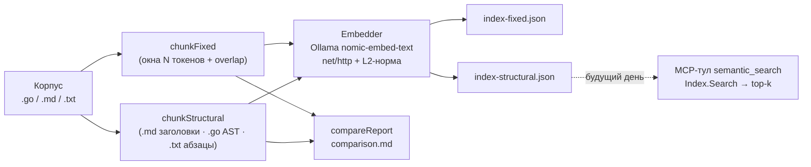

# День 21 — Индексация документов (RAG)

Пайплайн индексации документов под RAG: корпус → **две стратегии chunking** → эмбеддинги (Ollama `nomic-embed-text`) → **JSON-индекс с метаданными на каждый чанк** → **сравнение стратегий**. Реализован как отдельный `package main` в каталоге `ragindex/` — накопительный агент дня 20 не трогается. Индекс сразу спроектирован под будущую обёртку **MCP-тулом семантического поиска** (метод `Index.Search`).

---

## Задание (дословно)

> 🔥 **День 21. Индексация документов**
>
> Возьмите набор документов:
> 👉 README / статьи / код / pdf → текст
> 👉 минимум 20–30 страниц текста суммарно (или эквивалент в коде)
>
> Реализуйте пайплайн индексации:
> 👉 разбиение на чанки (chunking)
> 👉 генерация эмбеддингов
> 👉 сохранение индекса (FAISS / SQLite / JSON)
>
> Усиление:
> 👉 добавьте метаданные к каждому чанку (source, title/file, section, chunk_id)
> 👉 сделайте минимум 2 стратегии chunking и сравните их:
> – по фиксированному размеру
> – по структуре (заголовки/разделы/файлы)
>
> **Результат:** локальный индекс документов с эмбеддингами + метаданные + сравнение 2 стратегий
> **Формат:** Видео + Код
> P.S. Дублируем видео ссылкой — https://disk.yandex.ru/i/01KhOD_G7dBWPw

---

## Выжимка из чата (день 21)

- **Posse:** можно ли делать эмбеддинг «на коленке» без нейросети. **Temi4:** в принципе можно, важна хорошая обвязка из ограничений — но лекция как дефолт тянет именно `nomic-embed-text` через Ollama, его и берём.
- **Anastasiya:** обязательна ли локальная llama. По сути опционально (эмбеддер можно свапнуть на облачный), но в лекции локальный Ollama — дефолт.
- Несколько участников вылетели из чата (кикают), видео остаётся в геткурсе.

Наши зафиксированные решения по реализации:
- Порт на **Go**, к Ollama — **чистый `net/http`** (без внешних SDK; профиль «минимум зависимостей»), с возможностью свапнуть на OpenAI/Voyage за интерфейсом `Embedder`.
- Индекс — **JSON**; метаданные на чанк: `source`, `file` (title), `section`, `chunk_id`.
- **Две стратегии**: `fixed-size + overlap` **vs** `structural` (заголовки/декларации/файлы) + **сравнение**.
- Корпус по умолчанию — **исходники самого агента** (task-21: `.go` + `.md`): «эквивалент в коде» ≥ 20–30 страниц, без NDA-рисков. `-docs` можно навести на любой репозиторий.
- **Реранкинг — отдельный будущий день**, здесь не делаем (в индексе только bi-encoder/первый этап отбора).

---

## Конспект лекции (RAG)

**RAG (Retrieval Augmented Generation)** — паттерн заземления ответов LLM на внешних знаниях **на этапе инференса**.

**RAG vs MCP (формулировка Алексея).** MCP — внешние источники/данные («датчик», дёргается как тул). RAG — внутренние знания, заранее уложенные в базу знаний и подгружаемые на инференсе; это не вызов инструмента, а подмешивание найденного контекста в промпт.

**Before RAG — лимиты.** Context, performance, incorrect data response, отсутствие проверяемых источников. Пример: на вопрос «какая у нас политика code review?» модель уверенно отвечает «обычно 1 апрув, в течение недели» — **галлюцинация без источника**.

**After RAG.** На тот же вопрос — «нужно ≥ 2 апрува до мёржа, максимум 24 часа» + ссылка `confluence/engineering/code-review-policy.md`. Ответ заземлён и проверяем.

**Матрица оптимизаций.** Ось Y — *context optimization* (что модель **знает**), ось X — *LLM optimization* (как модель **действует**). Квадранты: `prompt engineering` → `RAG` (вверх) и `fine-tuning` (вправо), `all of the above` (вверх-вправо). Подходы **additive, не exclusive**: start → prompt engineering → evaluate gaps → RAG (in-context память) или fine-tuning (learned-память), при необходимости стэкаются.

**Where.** Корпоративные базы знаний (чаты/вики/любой контент); закрытые данные, которые не хочется «светить»; узкоспециализированные агенты; глобальный анализ трендов; цифровой двойник.

**Pipeline.** `question → embeddings → retrieval → combine with prompt → chat completion`. Пример со слайда: «What is the population of Canada?» → retrieval по документам → найденный Content подмешивается в промпт → ответ с конкретной цифрой и датой.

**Generative model vs Embedding model.**
- Generative: генерирует новый текст, понимает контекст/строит фразы, текст→текст, для ответов на вопросы (ChatGPT, Claude, YandexGPT, LLama3…).
- Embedding: кодирует текст в вектор, ловит семантические связи, текст→**вектор**, для поиска похожих текстов (Ollama, OpenAI API, Voyage AI, Jina.ai).

**Таблица эмбеддеров.** `nomic-embed-text` (Ollama, 768, free) · `text-embedding-3-large` (OpenAI, 3072, very accurate) · `voyage-large-3` (Voyage, 1536, top-tier) · `jina-embeddings-v3` (Jina, 1024, multilanguage) · `gte-base` (HF, 768, free). Vector size: «кот» → `[0.1, -0.34, 0.88, …]` (768 чисел); «собака» → близкий вектор (семантика).

**Embeddings deep dive** (как из текста получается вектор):
`Input Text → Tokenization → Embedding Layer → Transformer Layer → Pulling → Vector`.
- Tokenization: `"SpaceX was founded in 2002"` → `["Space","X"," was"," founded"," in"," 2002"]`.
- Embedding Layer: каждому токену сопоставляется вектор (`"Space" → [0.2, 0.8, -0.4, …]`).
- Transformer Layer: контекст через внимание `Attention(Q,K,V) = softmax(QKᵀ/√dₖ)·V`.
- Pulling (pooling): усреднение векторов токенов в один вектор предложения (`mean = [(…)/3, …]`).
- Vector: финальный эмбеддинг; обучение через triplet-loss вида `max(0, margin + cos(A, neg) − cos(A, pos))`.

**Chunking (ядро задания).**
- `fixed-size`: режем по N токенов (напр. 500) — рвётся предложение/мысль на стыке, контекст теряется.
- `semantic/structural`: режем по блокам/разделам — каждый чанк = законченная мысль.
- **Overlap**: `chunk_size=500, overlap=50` → окна `1–500 / 451–950 / 901–1400`. Без overlap — потеря контекста на стыках; с overlap — «граница на замке».

**Tuning.** Чанки **500–1000** токенов; overlap **50–100**; вектора хранить в БД; **нормализация** (в лекции упрощённо «делить на макс»; для cosine корректнее **L2-норма** — в коде делаем L2).

**Retrieval quality.** Bi-encoder (отдельные эмбеддинги, быстро, средняя точность) даёт top-20 быстро, но неточно → **reranking** cross-encoder'ом (query+doc вместе, медленно, точно) → top-5 → LLM. Пример: запрос «Как настроить CI/CD для Kotlin Multiplatform?» — «Настройка GitHub Actions для KMP» релевантна, «Обзор CI/CD инструментов 2023» похоже по вектору, но не отвечает на вопрос. **Реранкинг — отдельное задание недели, не день 21.**

**Метрики.** *Context Relevance* (нашли ли правильные чанки; низкий → плохой retrieval); *Faithfulness* (ответ основан на контексте; низкий → галлюцинации); *Answer Correctness* (финальный ответ верен против эталона; низкий → всё плохо).

**Limits of RAG.** Не поможет: нет данных (→ fine-tuning), нужна логика (→ prompt-eng / agents+tools), нужен стиль (→ fine-tuning), устаревший формат (→ multimodal RAG).

**Why Ollama.** Безопасность (данные не покидают машину); нулевая цена (без API-ключа); совместимость (легко перейти на облачный эмбеддер); удобно тестировать (работает на малом — на большом будет лучше). Setup: `brew install --cask ollama` → `ollama serve &` → `ollama pull nomic-embed-text` (768, gguf, family nomic-bert, ~137M). Пример лектора на **Kotlin** (`OllamaClient` на Ktor, `OllamaEmbeddingsRequest{model,prompt}` / `Response{embedding: List<Double>}`) — мы портируем это на Go/`net/http`.

---

## Что построили (день 21)

`task-21/` — это **копия task-20** (накопительный агент с памятью/инвариантами/MCP-оркестрацией остаётся целым и собирается) **+ новый каталог `ragindex/`** — самостоятельный пайплайн индексации. Это соответствует и накопительной конвенции (`task-N = task-(N-1) + фича`), и заданию дня 21 (отдельный пайплайн индексации).

Почему отдельный `package main`, а не в корне: в корне уже живёт агентский `main.go`/`pipeline.go`. По уроку дня 20 (коллизия `pipeline.go`) новый код кладём **в свой подкаталог** — как `notesserver/` и `weatherserver/`. Единый корневой `go.mod` на весь репозиторий сохраняется.

---

## Архитектура



### По файлам (`ragindex/`)

| Файл | Что | Зачем |
|---|---|---|
| `corpus.go` | `loadCorpus` — рекурсивный обход каталога, фильтр по расширениям, skip служебных папок (`memory`, `notes`, `reports`, `ragindex`). `Doc{Path,Rel,Name,Ext,Text}`. | Один вход для обеих стратегий; `Rel`/`Name` → метаданные `source`/`file`. |
| `chunk.go` | `Chunk` (метаданные + текст + вектор). `chunkFixed` (стратегия 1). `chunkStructural` (стратегия 2): `.md` → по заголовкам (`mdHeader`, учёт code-fence), `.go` → по верхнеуровневым декларациям через `go/parser` (`chunkGo` → package/import/type/func, методы как `Тип.Метод`), прочее → по абзацам. `approxTokens`, `slug`. | Ядро задания: две принципиально разные разбивки одного корпуса. |
| `embed.go` | Интерфейс `Embedder`; `OllamaEmbedder` на `net/http` (`POST /api/embeddings`); `l2normalize`. | Эмбеддинги; провайдер за интерфейсом — свап на OpenAI/Voyage без правок пайплайна. |
| `index.go` | `Index` (model/dim/strategy/params/chunks). `embedAll`, `Save`/`LoadIndex` (JSON, атомарно). `Search` (top-k косинус) + `Hit`, `dot`. | Сохранение индекса; `Search` — зерно будущего MCP-тула. |
| `compare.go` | `Stats`, `computeStats`, `endsAtBoundary` (эвристика целостности границы), `compareReport`. | Сравнение двух стратегий (число чанков, размеры, доля целостных границ). |
| `report.go` | `runReport` (режим `-report`) — демонстрационный прогон по шагам: корпус → chunking + контраст → сравнение → метаданные → эмбеддинги → индекс → поиск → чеклист. Деградирует без Ollama. | Один прогон для записи видео: показывает весь чеклист задания. |
| `main.go` | CLI: флаги, сборка корпуса, обе стратегии, печать сравнения, эмбеддинги, сохранение индексов, опц. `-query`; диспетчер `-report`. | Точка входа и оркестрация. |

---

## Две стратегии chunking

**1. fixed-size + overlap** (`chunkFixed`). Каждый документ режется окнами по `chunk-size` токенов (≈слов) с шагом `chunk-size − overlap`. Структуру игнорирует. Дефолт `500/50` → окна `1–500 / 451–950 / 901–1400` (ровно как на слайде про overlap). Минус: рвёт мысль на стыке; плюс: предсказуемый размер.

**2. structural** (`chunkStructural`) — диспетчеризация по типу файла, каждый чанк = законченная единица:
- `.md` → по заголовкам `#…`; заголовок остаётся в своём чанке; `#` внутри ```` ``` ```` -fence не считается заголовком.
- `.go` → через `go/parser`/`go/ast`: «шапка» (package + import) + по чанку на каждую `func`/`type`/`const`/`var`; doc-комментарий приклеивается к своей декларации; методы именуются `Тип.Метод`.
- прочее (`.txt`, нераспарсенный `.go`) → по абзацам (пустая строка).

### Как читать сравнение

`comparison.md` (и stdout) дают таблицу: число чанков, средний/мин/макс размер в токенах, средний размер в символах и **долю целостных границ** — сколько чанков заканчивается на естественной границе (`. ! ? } : ;`). Эвристика грубая, но контраст показывает суть: у `fixed-size` доля низкая (режет на полуслове), у `structural` — высокая (режет по границам). Пример прогона на смешанном корпусе (статья + код): `fixed-size` 50% целостных границ против `structural` 89%.

---

## Метаданные чанка (усиление)

На каждом чанке (JSON-индекс):

```json
{
  "chunk_id": "memory.go#013-func-Memory.Build",
  "source":   "memory.go",
  "file":     "memory.go",
  "section":  "func Memory.Build",
  "text":     "...",
  "tokens":   137,
  "vector":   [0.013, -0.041, ...]
}
```

- `source` — путь файла относительно корня корпуса;
- `file` (title) — имя файла;
- `section` — заголовок раздела (`.md`) / имя декларации (`.go`) / `part N` (fixed-size);
- `chunk_id` — стабильный уникальный id (`<source>#<порядок>-<slug секции>`).

---

## Эмбеддинги (Ollama)

`OllamaEmbedder.Embed` шлёт `POST http://localhost:11434/api/embeddings` с телом `{"model":"nomic-embed-text","prompt":"..."}`, читает `{"embedding":[...]}` (768 чисел) и **L2-нормирует** вектор (косинус сводится к скалярному произведению). Чистый `net/http`, без SDK.

Свап на облако: добавить реализацию `Embedder` (напр. `OpenAIEmbedder` с `text-embedding-3-large`, dim 3072) — остальной пайплайн не меняется. PDF в корпусе: предварительно конвертировать в `.txt` (`pdftotext`) и положить рядом — пайплайн разберёт как абзацы.

---

## Запуск

```bash
# 0. собрать task-21 как копию task-20 + новый каталог ragindex/
#    (ragindex/ и README.md — из моей выгрузки)
cp -r task-20 task-21
cp -r ВЫГРУЗКА/ragindex   task-21/ragindex
cp    ВЫГРУЗКА/README.md  task-21/README.md

# 1. поднять Ollama и модель эмбеддингов (до записи видео)
brew install --cask ollama      # если не стоит
ollama serve &
ollama pull nomic-embed-text
```

### Для видео — один прогон `-report`

`-report` — демонстрационный режим: за один запуск показывает **весь чеклист задания по шагам** (корпус → 2 стратегии chunking с наглядным контрастом → сравнение → метаданные чанка → эмбеддинги → сохранение индекса → семантический поиск → итог-галочки). Сделан по аналогии с `-report` накопительного агента.

```bash
cd task-21
go run ./ragindex -report -out ./ragindex
#   для быстрой записи можно ограничить число эмбеддингов:
go run ./ragindex -report -out ./ragindex -limit 40
#   свой запрос для шага поиска:
go run ./ragindex -report -out ./ragindex -query "как агент проверяет инварианты"
```

Если Ollama не поднята (или добавить `-dry-run`) — `-report` аккуратно деградирует: показывает шаги 1–4, сохраняет индексы без векторов и помечает эмбеддинги/поиск как невыполненные. Артефакты (`index-fixed.json`, `index-structural.json`, `comparison.md`) ложатся в `-out`.

### Отдельные команды (если нужно вручную)

```bash
# сухой прогон — только chunking + сравнение, без эмбеддингов (Ollama не нужна)
go run ./ragindex -dry-run

# полная индексация (корпус по умолчанию = исходники агента task-21)
go run ./ragindex -out ./ragindex

# семантический поиск по обоим индексам
go run ./ragindex -out ./ragindex -query "как агент проверяет инварианты перед вызовом тула" -k 3

# индексировать сторонний корпус (репозиторий/статьи)
go run ./ragindex -docs /path/to/repo -ext .go,.md,.txt -out ./ragindex
```

Флаги: `-report` (демо для видео), `-docs`, `-ext`, `-out`, `-ollama`/`-model`, `-chunk-size`/`-overlap`, `-query`/`-k`, `-limit`, `-max-embed-chars`, `-dry-run`.

### Ожидаемый вывод (полный прогон, корпус = код агента)

```
Корпус: N файлов, ~M токенов (≈K стр. по 500 слов) из <путь>
Чанки: fixed-size=…, structural=…

Сравнение стратегий chunking
============================
Метрика                  | fixed-size           | structural
----------------------------------------------------------------------
Чанков                   | …                    | …
Токенов — среднее        | ~500                 | плавает
Целостных границ         | ~50%                 | ~85–95%
…
Эмбеддинги (fixed-size):    эмбеддинг X/X
Эмбеддинги (structural):    эмбеддинг Y/Y
Сохранено: index-fixed.json (… чанков, dim=768) · index-structural.json (… чанков, dim=768)
```

---

## Проектирование под будущий MCP-тул поиска

`Index.Search(ctx, embedder, query, k)` уже делает всё, что нужно семантическому поиску: эмбеддит запрос, считает косинус по L2-нормированным векторам, отдаёт top-k `Hit{Chunk, Score}`. В будущий день это оборачивается третьим MCP-сервером (рядом с `weatherserver`/`notesserver`): на старте `LoadIndex("index-structural.json")`, тул `semantic_search{query, k}` → `idx.Search(...)` → текст чанков с `source`/`section`. Накопительный агент через свою MCP-оркестрацию (день 20) получит поиск по базе знаний. Это первый этап (bi-encoder); cross-encoder reranking — отдельный день.

---

## FAQ (концептуальное)

**Почему «токен ≈ слово»?** Точный счёт требует BPE-токенизатора модели. Для chunking и сравнения стратегий нужен стабильный воспроизводимый размерный сигнал — слова по пробелам его дают, без зависимостей. В конспекте и коде это отмечено как сознательное упрощение; при переходе на точные лимиты модели меняется только `approxTokens`.

**Чанк не влез в эмбеддер (Ollama 500 «input too large»)?** У `nomic-embed-text` контекст/батч — **2048 токенов**. На плотном коде одно «слово» бьётся BPE на ~3–4 модель-токена, поэтому 500-словный `fixed-size`-чанк (и крупные `structural`-декларации) перелетают лимит. Защита: вход эмбеддера усекается по символам (флаг `-max-embed-chars`, дефолт 1800 — для этой модели число токенов ≤ числа символов, так что лимит по рунам гарантированно влезает в 2048; счётчик усечений печатается в отчёте). Чтобы не усекать на код-корпусе — уменьшай окно: `-chunk-size 200`. Прод-альтернатива усечению — под-резать длинный чанк на части и усреднять их векторы (mean-pooling).

**Почему L2-норма, а не «делить на макс» из лекции?** Для косинусной близости корректна именно L2: после неё `cos(a,b) = a·b`, и поиск — одно скалярное произведение. «Делить на макс» — упрощение лектора; в коде делаем правильно, в конспекте отмечено честно.

**Почему код режется через `go/parser`, а не регекспами?** AST даёт точные границы деклараций и корректно тащит doc-комментарии — это и есть «структура» для кода (аналог заголовков для markdown). Stdlib, без зависимостей. Если файл не парсится — деградируем до абзацев, чтобы не потерять документ.

**Зачем overlap?** Без него мысль на стыке окон рвётся и теряется при поиске. Overlap 50–100 токенов «защищает границу»: соседние окна перекрываются, релевантный кусок целиком попадает хотя бы в один чанк. В `structural` overlap не нужен — там границы и так по смыслу.

**Почему две стратегии дают так по-разному число чанков?** `fixed-size` нарезает по объёму (≈равные окна), `structural` — по смысловым единицам (заголовок/декларация), которых обычно больше и они мельче. Это и есть предмет сравнения: равномерность размера против целостности мысли.

---

## Выводы

- Пайплайн индексации собран ровно по заданию: chunking → эмбеддинги → JSON-индекс с метаданными, + **усиление** (метаданные на чанк, **2 стратегии и сравнение**).
- `structural` для кода реализован «по-честному» через AST, для markdown — по заголовкам с учётом code-fence; `fixed-size` — с overlap как в лекции.
- Эмбеддер за интерфейсом (`net/http` к Ollama, L2-норма) — провайдер свапается без правок пайплайна.
- Индекс и `Index.Search` подготовлены под будущий MCP-тул семантического поиска для накопительного агента; реранкинг — отдельный день.
- Накопительный агент дня 20 не затронут: новый код изолирован в `ragindex/`, единый корневой `go.mod` сохранён.