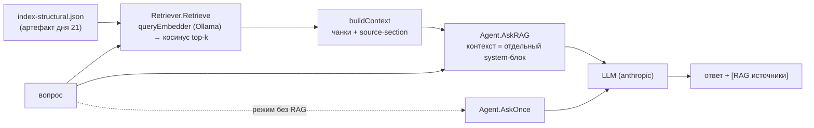

# День 22 — Первый RAG-запрос

RAG встроен в накопительного агента: **вопрос → поиск чанков в индексе дня 21 → подмешивание контекста → запрос к LLM**. Два режима (с RAG / без RAG) + контрольный прогон из 10 вопросов по базе знаний со сравнением качества.

`task-22/` = копия `task-21/` (агент целиком + `ragindex/`) + новые файлы агента `rag.go`, `eval.go` и правки `agent.go`, `main.go`.

---

## Задание (дословно)

> 🔥 **День 22. Первый RAG-запрос**
>
> Реализуйте функцию:
> 👉 вопрос → поиск релевантных чанков → объединение с вопросом → запрос к LLM
>
> Сравните:
> 👉 ответ модели без RAG
> 👉 ответ модели с RAG
>
> Усиление:
> 👉 составьте мини-набор из 10 контрольных вопросов по вашей базе
> 👉 для каждого вопроса зафиксируйте:
> – ожидание (что должно быть в ответе)
> – какие источники должны быть использованы (если применимо)
>
> **Результат:** агент с двумя режимами (с RAG / без RAG) + 10 контрольных вопросов и сравнение качества
> **Формат:** Видео + Код

---

## Выжимка из чата (день 22)

- **Денис Абрашкин → Алексей:** на этой неделе дешевле делать проект вокруг проиндексированных документов или пристроить RAG в существующего агента? **Алексей:** «и так, и так можно, что дешевле — зависит от проекта». → Это и есть наша развилка; выбран **второй путь** (RAG в накопительного агента), он точнее ложится на формулировку «агент с двумя режимами».
- Остальная часть чата — спор «писать код руками vs не закапываться в красоту» (Maleks против Denis Suprun/Artem). Для задания не действие; по сути это про баланс «понимать реализацию» и «успеть за неделю». Мы держим линию «понимать»: AST-структура, заземление, инварианты.
- Artem: «лучше бы книгу на чанки нарезал, перережем» — про выбор корпуса (у нас корпус = код агента, см. ниже).

---

## Конспект лекции (RAG-запрос, продолжение дня 21)

Пайплайн RAG из лекции: `question → embeddings → retrieval → combine with prompt → chat completion`. День 21 закрыл первые два шага (индексация + эмбеддинги). День 22 — **retrieval + combine + completion**.

- **Retrieval.** Вопрос эмбеддится той же моделью, что и чанки (иначе вектора в разных пространствах). Косинусная близость по L2-нормированным векторам = скалярное произведение. Берём top-k (bi-encoder, первый этап; reranking cross-encoder'ом — отдельный день).
- **Combine.** Найденные чанки склеиваются в блок контекста и подмешиваются к запросу. В лекции — в промпт; у нас контекст уходит **отдельным system-блоком** с инструкцией заземления (см. дизайн).
- **Completion.** LLM отвечает, опираясь на контекст; в ответе указываются источники (грунтинг + проверяемость — главная ценность RAG из дня 21: «After RAG» даёт ответ со ссылкой на источник вместо галлюцинации).
- **Сравнение качества.** Метрики из лекции: *Context Relevance* (подняли ли нужные чанки), *Faithfulness* (ответ основан на контексте), *Answer Correctness* (ответ верен против эталона). Эталон — наши 10 контрольных вопросов с ожиданием и ожидаемыми источниками.

---

## Дизайн (ключевые решения)

**Единая точка правды формата — пакет `ragcore`.** Изначально `ragindex` (день 21) — `package main`, импортировать его типы нельзя, поэтому первый вариант агент читал индекс по формату файла, дублируя структуры. Чтобы убрать дублирование, формат вынесен в общий импортируемый пакет **`ragcore`** (`ai-challenge/week-5/task-22/ragcore`): `Chunk`, `Index`, `Embedder`/`OllamaEmbedder`, `Search`, `LoadIndex`. Теперь **и `ragindex` (cmd), и агент импортируют `ragcore`** — тип индекса объявлен один раз, рассинхрон полей между продьюсером и консьюмером невозможен. Агент по-прежнему зависит от файла-индекса как от **артефакта** (читает то, что записал `ragindex` — индекс как БД), но сам тип этого артефакта общий. Каноничный Go-лейаут «cmd + library»: бинари тонкие, формат и логика — в пакете.

**RAG-контекст — отдельным system-блоком, не в тексте вопроса.** Если подмешивать ретривнутый код прямо в текст запроса, инвариантная проверка стоп-слов (`stack-go`: «на python», «на rust» …) сработает **ложно** на словах из чужого кода и агент откажет. Поэтому `AskRAG` кладёт контекст в отдельный system-блок `[КОНТЕКСТ ИЗ БАЗЫ ЗНАНИЙ]` с инструкцией «отвечай только по контексту, указывай источники». Проверка инвариантов идёт по самому вопросу — false-positive исключён.

**База знаний = исходники самого агента** (как в дне 21). Тематически элегантно: агент отвечает на вопросы о собственном устройстве. 10 контрольных вопросов — про память, FSM, инварианты, swarm, lazy-tools, usage, серверы.

---

## Рефакторинг: единая точка правды (`ragcore`)

**Проблема.** В первой версии дня 22 формат индекса жил в двух местах: типы `Chunk`/`Index` объявлены в `ragindex` (день 21), а агент в `rag.go` держал свои копии (`ragChunk`/`ragIndex`) и читал тот же JSON. Это работало (индекс — артефакт-файл, как контракт между двумя процессами), но дублировало структуру: переименуешь поле в индексаторе — и агент молча начнёт читать пустоту, компилятор об этом не скажет.

**Почему нельзя было просто импортировать `ragindex`.** `ragindex` — это `package main` (исполняемая утилита). Пакеты `main` в Go импортировать нельзя — значит, агент физически не мог переиспользовать его типы.

**Решение.** Общий формат вынесен в отдельный импортируемый пакет **`ragcore`** (`ai-challenge/week-5/task-22/ragcore`). Туда переехали: `Chunk`, `Index`, методы `Save`/`LoadIndex`/`Search`/`EmbedAll`, тип `Hit`, интерфейс `Embedder` и `OllamaEmbedder` с L2-нормализацией. Теперь **оба** консьюмера импортируют `ragcore`:

```
ai-challenge/week-5/task-22/
├── ragcore/         ← пакет-библиотека: формат + эмбеддер + поиск (одно объявление)
│   ├── embed.go     (Embedder, OllamaEmbedder, L2-норма)
│   └── index.go     (Chunk, Index, Save/LoadIndex/Search/Hit/EmbedAll)
├── ragindex/        ← cmd (день 21): корпус, чанкеры, сравнение — строят ragcore.Chunk
│   └── corpus/chunk/compare/report/main.go   (embed.go и index.go УДАЛЕНЫ — переехали)
├── rag.go           ← агент (день 22): Retriever = тонкая обёртка над *ragcore.Index
└── … (agent.go, eval.go, main.go, серверы)
```

**Что это даёт.**
- Тип индекса объявлен **один раз** — рассинхрон полей между индексатором и агентом невозможен (поймает компилятор, а не пустой ответ в рантайме).
- Каноничный Go-лейаут «cmd + library»: исполняемые `ragindex`/агент тонкие, формат и логика поиска — в переиспользуемом пакете.
- Связь с днём 21 концептуально не изменилась: агент по-прежнему читает индекс как **артефакт-файл** (как БД — `ragcore.LoadIndex`), просто тип этого артефакта теперь общий, а не скопированный.

**Что изменилось в коде.** В `ragindex` удалены `embed.go`/`index.go`, остальные файлы квалифицируют `ragcore.Chunk`/`ragcore.Index`/`ragcore.NewOllamaEmbedder`. В агенте `rag.go` переписан: `Retriever` оборачивает `*ragcore.Index` + `*ragcore.OllamaEmbedder`, `Retrieve` = `idx.Search`; локальные `ragChunk`/`ragIndex`/`queryEmbedder`/`normalize`/`cosine` удалены. Поведение и формат файла индекса не поменялись — индекс дня 21 читается без переиндексации.

---

## Что изменилось по файлам

| Файл | Статус | Что |
|---|---|---|
| `ragcore/` (`embed.go`, `index.go`) | **новый пакет** | Единая точка правды формата: `Chunk`, `Index` (+`Save`/`LoadIndex`/`Search`/`Hit`/`EmbedAll`), `Embedder`/`OllamaEmbedder`, L2-нормализация. Импортируется и `ragindex`, и агентом. Только stdlib + `net/http`. |
| `ragindex/` (`chunk`, `corpus`, `compare`, `report`, `main`) | переписан | Чанкеры и сравнение теперь строят `ragcore.Chunk`/`ragcore.Index`; `embed.go` и `index.go` **удалены** (их содержимое переехало в `ragcore`). Логика индексации не изменилась. |
| `rag.go` | **новый / переписан** | `Retriever` — тонкая обёртка над `*ragcore.Index` + `*ragcore.OllamaEmbedder`; `Retrieve` = `idx.Search` из `ragcore`; `buildContext`, `sourcesOf`, `ragReply`. Локальных копий структур/эмбеддера больше нет. |
| `eval.go` | **новый** | `controlQuestions()` — 10 вопросов с ожиданием и ожидаемыми источниками; `runEval` — **самодокументируемый отчёт-демонстрация** (флаг `-eval`): баннеры по шагам, на каждый вопрос печатает оба режима (без RAG / с RAG), поднятые чанки (`ragcore.Hit`), долю попадания в источники и финальный чеклист задания. Рассчитан на немое видео — всё подписано в выводе. |
| `agent.go` | изменён | `Reply` +`RAGUsed`/`Sources`; новый метод `AskRAG(ctx, query, p, ragContext)`; в `ask` добавлен параметр `ragContext` — при непустом подмешивается system-блок с инструкцией заземления. Существующие `Ask`/`AskOnce` не изменили поведение. |
| `main.go` | изменён | флаги `-rag`, `-index`, `-rag-k`, `-ollama`, `-embed-model`, `-eval`; подключение `Retriever`; режим `-eval` (10 вопросов) с ранним выходом; команда REPL `/rag on|off`; ветка `Ask` маршрутизируется через `ragReply` при включённом RAG, печатает `[RAG источники: …]`. |

Остальные файлы агента (`memory.go`, `state.go`, `swarm.go`, `pipeline.go`, `mcptools.go`, `invariants.go`, `enforce.go`, `usage.go`, `watch.go`, `report.go`, `profile.go`, `artifact.go`, серверы) — без изменений, наследуются из `task-21`.

---

## Архитектура



Поток `-eval`: вводный баннер (что показываем + инфо об индексе), затем на каждый из 10 вопросов — `AskOnce` (без RAG) и `ragReply` (с RAG), печать обоих ответов, поднятых чанков и совпадения источников, в конце — итог retrieval + чеклист задания. Каждый блок подписан баннером/меткой — выход читается без озвучки.

---

## 10 контрольных вопросов (база = код агента)

| # | Вопрос | Ожидание (кратко) | Ожидаемые источники |
|---|---|---|---|
| 1 | Сколько слоёв памяти и какие? | три: short-term, working, long-term | `memory.go` |
| 2 | Этапы FSM и разрешённые переходы? | planning→execution→validation→done; validation↺execution; прыжки запрещены | `state.go` |
| 3 | Что мешает planning→execution? | gate: план не утверждён (`/approve-plan`) | `memory.go`, `state.go` |
| 4 | Как проверяются инварианты перед вызовом тула? | `runTool`: EnforceCode + опц. EnforceLLM; отказ как tool_result is_error | `agent.go`, `enforce.go` |
| 5 | Код vs LLM проверка инвариантов? | стоп-слова (детерм.) vs семантика модели; не взаимоисключают | `enforce.go`, `invariants.go` |
| 6 | Что делает lazy-загрузка схем? | каталог серверов → `load_tools` подмешивает схемы, экономия токенов | `mcptools.go`, `agent.go` |
| 7 | Как swarm решает на validation? | ревьюеры → VERDICT/NOTES → PASS YES/NO; не-PASS → возврат, лимит кругов | `swarm.go`, `pipeline.go` |
| 8 | Как считается стоимость запроса? | `costFor`: токены × цена/1e6 (Opus 5/25, Haiku 1/5) | `usage.go` |
| 9 | Как сервер погоды хранит наблюдения и почему ключ — координаты? | Store в JSON; ключ-координаты против дублей 'Berlin'/'Берлин' | `weatherserver/store.go` |
| 10 | Что при паузе пайплайна и как возобновление? | состояние/флаги в working.json; продолжаем с того же этапа | `pipeline.go`, `memory.go` |

Эти вопросы заданы в `eval.go` (`controlQuestions`) с ожиданием и источниками; `runEval` печатает оба ответа и реально поднятые RAG-источники + долю попадания.

---

## Запуск

```bash
# из корня репозитория ai-challenge/

# 1. Ollama должна быть поднята (в отдельном окне), модель скачана
ollama serve &                 # если ещё не запущена
ollama pull nomic-embed-text   # если ещё нет

# 2. ПЕРЕсобрать индекс — обязательно (старые вектора без search_document: несовместимы)
go run ./week-5/task-22/ragindex -report -out ./week-5/task-22/ragindex

# 3. прогнать демо-отчёт
go run ./week-5/task-22 -eval

# 4. интерактивный режим RAG
go run ./week-5/task-22 -rag
> как агент проверяет инварианты перед вызовом тула?
#   → ответ + [RAG источники: enforce.go · func EnforceCode; agent.go · func Agent.runTool]
> /rag off      # сравнить тот же вопрос без RAG
> /rag on
```

Флаги дня 22: `-rag`, `-index` (дефолт `ragindex/index-structural.json`), `-rag-k` (4), `-ollama`, `-embed-model` (должна совпадать с индексом), `-eval`.

**Команда для видео — одна:** `go run . -eval`. Это самодокументируемый отчёт: каждый шаг подписан прямо в выводе (баннеры `[N] …`, метки `БЕЗ RAG`/`С RAG`, поднятые источники, чеклист задания). **Видео без звука — ничего проговаривать не нужно**, весь смысл читается с экрана. Опционально для живости — короткий интерактив `-rag` с `/rag on|off`.

### Ожидаемый вывод `-eval` (сокращённо)

```
======================================================================
  [0] RAG-АГЕНТ — ДЕМОНСТРАЦИЯ (день 22)
======================================================================
ЧТО ПРОИСХОДИТ: на каждый вопрос агент отвечает ДВАЖДЫ —
  [БЕЗ RAG] обычный ответ модели (только знания внутри модели);
  [С RAG]   вопрос → поиск чанков в индексе → контекст → ответ со ссылкой на источники.
ЦЕЛЬ: видно, что [С RAG] опирается на конкретные файлы базы, а [БЕЗ RAG] — общие слова.

БАЗА ЗНАНИЙ: исходники самого агента, проиндексированы в день 21.
ФОРМАТ ИНДЕКСА: общий пакет ragcore — и индексатор (ragindex), и агент
                используют один тип Index/Chunk (без дублирования структур).
ПОДКЛЮЧЁННЫЙ ИНДЕКС: 254 чанков · strategy=structural · model=nomic-embed-text · dim=768 · top-4
ВОПРОСОВ В ПРОГОНЕ: 10 (у каждого — ожидаемый ответ и ожидаемые файлы-источники)

======================================================================
  [1] ВОПРОС 1 из 10
======================================================================
ВОПРОС:             Сколько слоёв памяти у агента и какие они?
ОЖИДАЕМ В ОТВЕТЕ:   три слоя: short-term (диалог), working (TaskContext), long-term (профиль)
ОЖИДАЕМ ИСТОЧНИКИ:  memory.go

── ОТВЕТ БЕЗ RAG (модель сама по себе) ───────────────────────────────
<общая формулировка, часто без точных имён слоёв>

── ОТВЕТ С RAG (с контекстом из базы) ────────────────────────────────
<три слоя с именами short-term/working/long-term, опираясь на memory.go>

RAG ПОДНЯЛ ИЗ БАЗЫ (top-4, чем выше score — тем ближе по смыслу):
   1. score=0.71  memory.go · type Memory
   2. score=0.68  memory.go · func Memory.Build
   ...
ИСТОЧНИКИ: подняли 1 из 1 ожидаемых для этого вопроса

  … (вопросы 2…10 в том же формате) …

======================================================================
  [11] ИТОГ
======================================================================
RETRIEVAL: ожидаемые файлы-источники подняты в N из M случаев по всем вопросам
КАЧЕСТВО: ответы [С RAG] называют конкретные файлы базы и приводят источники;
          ответы [БЕЗ RAG] — общие формулировки, без ссылок, иногда мимо деталей.

ЧЕКЛИСТ ЗАДАНИЯ ДНЯ 22:
  [x] функция: вопрос → поиск чанков → объединение с вопросом → запрос к LLM
  [x] два режима: ответ без RAG и ответ с RAG (видно построчно выше)
  [x] 10 контрольных вопросов с ожиданием и ожидаемыми источниками
  [x] сравнение качества двух режимов
  [x] формат индекса вынесен в общий пакет ragcore (единая точка правды)
```

---

## FAQ (концептуальное)

**Почему контекст в system-блоке, а не в тексте вопроса?** Инварианты (`EnforceCode`) сканируют запрос на стоп-слова. Ретривнутый код может содержать «python»/«rust» и т.п. → агент ложно откажет. System-блок обходит проверку запроса, при этом сам вопрос по-прежнему проверяется.

**Почему `nomic-embed-text` требует префиксов и почему это критично?** Модель обучена с префиксами задачи: индексируемые чанки эмбеддятся с `search_document: `, запрос — с `search_query: ` (асимметрично). Без префиксов пространство эмбеддингов «схлопывается» — один длинный обзорный документ (профиль/README) становится near-центроидом и матчит почти любой запрос, вытесняя нужные .go-файлы. Поэтому `ragcore.Embedder` разделён на `EmbedDocument`/`EmbedQuery`, а `OllamaEmbedder` подставляет правильный префикс. **Важно:** префиксы должны стоять и на индексации, и на запросе — поэтому после обновления индекс надо пересобрать (старые вектора посчитаны без `search_document:`).

**Почему агент не импортирует `ragindex` напрямую?** `ragindex` — `package main`, его типы не импортируются. Поэтому общий формат вынесен в пакет `ragcore`, который импортируют оба (и `ragindex`, и агент). Сам индекс остаётся артефактом-файлом (агент читает то, что записал индексатор, как БД), но тип артефакта объявлен один раз в `ragcore` — дублирования структур нет.

**Почему эмбеддер вопроса — отдельный, а не из ragindex?** Индекс уже содержит вектора чанков; агенту нужно эмбеддить только вопрос. Та же модель (`-embed-model` должна совпадать с `model` в индексе), иначе вектора несопоставимы.

**Чем «с RAG» лучше «без RAG» на этой базе?** Без RAG модель даёт общие/правдоподобные ответы и может ошибиться в деталях (имена слоёв, условия gate, лимиты), без ссылок. С RAG ответ опирается на конкретные файлы (`memory.go`, `state.go`…) и приводит источники — проверяемо. `runEval` показывает это по 10 вопросам.

**Что с реранкингом?** Здесь только bi-encoder (косинус top-k) — первый этап. Cross-encoder reranking — отдельный день (как отмечено в лекции дня 21).

---

## Качество retrieval: что показал прогон и почему это норма для дня 22

Контрольный прогон по 10 вопросам даёт **8/16** попаданий в ожидаемые файлы-источники (после включения префиксов `nomic` было 5/16 → стало 8/16 — префиксы подтвердили диагноз). Важно правильно читать эту цифру:

- **Метрика заведомо строгая и занижает качество.** Она засчитывает попадание, только если поднятый чанк лежит в *точно* указанном файле. Но ответ часто живёт в другом, тоже корректном файле: Q1 («слои памяти») агент верно достал из `agent.go · type Agent` (в doc-комменте прямо «память (3 слоя)»), а не из `memory.go`; Q9 («ключ-координаты») — из `weatherserver/scheduler.go`, а не из `store.go`. Ответы предметные и с цитатами источников — но метрика их считает промахом. Примерно половина «промахов» такого рода.
- **Реальный предел — эмбеддинг сырого кода текстовой моделью.** Русские вопросы vs английские идентификаторы (`EnforceCode`, `expectedAction`), плюс короткие type-декларации с общими doc-комментами (`ArtifactCheck`, `Profile`) садятся у центроида и лезут в топ почти на любой запрос. Скоры плоские (0.63–0.79). Это фундаментальное ограничение bi-encoder-поиска по коду, а не баг реализации.

**Улучшение выдачи — это НЕ день 22.** По условиям курса точное попадание в один конкретный файл не самоцель («не заостряемся на одном файлике»), а второй этап retrieval — **реранкинг, фильтр по порогу релевантности и query rewrite — вынесен в день 23**. Поэтому здесь фиксируем честный результат и диагноз, а лечение разворачиваем в следующем задании. Диагноз ложится в день 23 один-в-один:

- RU↔EN разрыв (русский запрос ↔ английский код) → **query rewrite** (переписать запрос под лексику кода перед поиском);
- центроидные чанки (`ArtifactCheck`/`Profile` в топе на всё) → **порог отсечения + реранкер** (выкинуть шум, top-K после фильтрации меньше и чище);
- те же 10 вопросов остаются бенчем: видно будет **8/16 → выше** на неизменном наборе.

---

## Выводы

- RAG встроен в накопительного агента как режим: retrieve → контекст → LLM, с двумя режимами (с/без RAG) и контрольным прогоном из 10 вопросов — ровно по заданию + усиление.
- Формат индекса вынесен в общий пакет `ragcore` (единая точка правды): и `ragindex`, и агент импортируют его — дублирования структур `Chunk`/`Index` больше нет. Агент по-прежнему читает индекс как артефакт-файл (как БД).
- RAG-контекст идёт отдельным system-блоком с инструкцией заземления — это и грунтит ответ, и не даёт ретривнутому коду ложно срабатывать на инвариантах.
- 10 контрольных вопросов фиксируют ожидание и ожидаемые источники; `runEval` даёт прямое сравнение качества и долю попадания retrieval в нужные файлы.
- Вся демонстрация — **одна команда `go run . -eval`** с самодокументируемым выводом (баннеры по шагам, метки режимов, чеклист): рассчитана на видео без звука, ничего проговаривать не нужно.
- Retrieval даёт 8/16 по строгой метрике при корректных цитируемых ответах; предел — эмбеддинг сырого кода текстовой моделью, а улучшение выдачи (реранк/фильтр/query rewrite) — задача дня 23.
- Сборка пакета чистая (`go vet` + `go build` + `gofmt`) на Go 1.22 с anthropic-sdk-go v1.6.0; модель-константа `ModelClaudeOpus4_8` в коде.