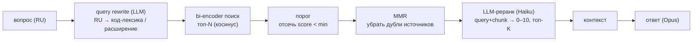

# День 23. Реранкинг и фильтрация

Накопительно: `week-5/task-23/` = копия `task-22` (RAG-агент) + второй проход retrieval
(query rewrite → порог → MMR → LLM-реранк) + сравнение на двух корпусах.

## Задание (дословно)

> 🔥 День 23. Реранкинг и фильтрация
>
> Добавьте второй этап после поиска:
> 👉 reranker или фильтр релевантности (порог similarity / отдельная модель / heuristic)
>
> Настройте:
> 👉 порог отсечения нерелевантных результатов
> 👉 топ-K до и после фильтрации
>
> Сравните:
> 👉 качество без фильтра/rewriting
> 👉 качество с фильтром
>
> Результат: Улучшенный RAG: фильтрация/реранкинг + query rewrite + сравнение режимов
> Формат: Видео + Код

## Выжимка из чата (день 23)

- **Стас** поделился рабочей схемой без cross-encoder: `threshold + MMR + query rewrite`
  (GigaEmbeddings → Qdrant top-10 → отсечь score < 0.65 → MMR убирает дубли из одного
  источника → query rewrite расширяет запрос терминами домена). Отдельный reranker ему не
  нужен — **у него языки совпадают** (русские вопросы + русские транскрипты). Для нашего
  кросс-языкового случая (RU-вопрос ↔ EN-код) советует два варианта: `BAAI/bge-reranker-v2-m3`
  (мультиязычный cross-encoder, через `sentence-transformers`, ~1.1 ГБ, Python) **или**
  LLM-судья. Вывод: «если уже есть Ollama + LLM → LLM-судья проще всего».
- **Anastasiya** независимо описала наш же диагноз: индексируешь код, спрашиваешь по-русски —
  «в векторах русский текст всегда будет ближе к русскому тексту», поиск слабый; на английских
  вопросах работает. Её вывод: **проблема не в reranker-модели, а в индексации**; решение —
  определять язык запроса и переписывать/переводить перед поиском (это и есть query rewrite),
  либо искать по двум языкам.
- **Artem** предупредил про производительность: жирный источник → прогон 10 вопросов 30–60 мин.
  Отсюда решение экономить вызовы (маленький top-N, порог до реранка, батч-реранк).
- Отдельная реплика про **семантику vs навигацию**: RAG-эмбеддинги хороши для «объясни логику /
  найди по смыслу» и плохи для «где определено» (для навигации — AST-индекс, grep). Плюс
  эмбеддинги кода быстро устаревают при изменениях, и иногда логичнее эмбеддить документацию.
  Мы это учли: вопросы по коду размечены `sem`/`nav`.

## Конспект лекции (retrieval quality — материал недели)

Из недельной лекции (тот же конспект, что в дне 21), пункт про качество поиска:

> **Retrieval quality:** top-20 быстро/неточно → **reranking** cross-encoder'ом → top-5 → LLM.
> Bi-encoder (отдельные эмбеддинги, быстро, средне) vs cross-encoder (query+doc вместе, медленно, точно).
> Реранкинг — **отдельное задание недели**.

Метрики (пункт 67): Context Relevance / Faithfulness / Answer Correctness.

Ключевое: лекция задаёт **механизм** (двухэтапность: грубый bi-encoder → точный cross-encoder,
который судит запрос и документ совместно), но **не называет конкретную модель**. «Cross-encoder'ом»
— это про тип оценки (query+doc вместе → один скор), а не про конкретный `bge`.

## Как пришли к решению (ход мысли, с развилками)

Раздел для себя: не только «что сделано», но «почему именно так и что отвергли по дороге».

**0. Корни — в дне 22.** Ещё в дне 22 retrieval дал 8/16, и я поставил диагноз: (а) русские
вопросы ↔ английский код плохо сближаются в bi-encoder; (б) сырой код вообще плохо эмбеддится
текстовой моделью — короткие type-декларации (`ArtifactCheck`, `Profile`) садятся у центроида и
лезут в топ на всё; (в) метрика строгая — половина «промахов» это «ответ верный, но не в том
.go-файле». День 23 (реранкинг/фильтрация) — штатный второй этап RAG, который это и чинит.

**1. Чем реранкать — развилка `bge` vs LLM-судья.** Лекция говорит «cross-encoder», но не
называет модель — это тип механизма (query+doc судятся совместно), а не конкретный `bge`.
Рассматривал два пути:
- *настоящий cross-encoder* (`bge-reranker-v2-m3`, мультиязычный) — но Ollama reranker-модели не
  отдаёт (только embeddings), значит отдельный Python-сервис (`sentence-transformers`, ~1.1 ГБ) —
  новый процесс и стек в Go-проекте, риск на записи видео;
- *LLM-судья* (Haiku оценивает пару 0–10) — тот же cross-encoder-паттерн, чисто в Go, понимает
  кросс-язык RU↔EN из коробки.
  → **Выбрал LLM-судью.** Подтвердилось в чате: Стас (у него всё на русском, cross-encoder не нужен)
  для нашего кросс-языкового кейса советует ровно эти два варианта и резюмирует «есть Ollama+LLM →
  LLM-судья проще всего».

**2. Проверка: а не язык ли всё решает?** Отдельно разобрал вопрос «если бы индекс был на одном
языке — проблемы бы не было?». Вывод: язык — крупнейший фактор, но не единственный. Он определяет
не «reranker vs LLM», а «*если* reranker-модель, то мультиязычная». И одноязычность сняла бы
бо́льшую часть боли, но не всю (остаются слабый эмбеддинг кода, дубли → MMR, строгая метрика).
Показательно: Стас — полностью на русском — всё равно строит threshold+MMR+rewrite.

**3. Развилка корпуса — заменять / добавлять / только русский.** Возник соблазн «раз код плохо
эмбеддится — может, взять русский текст, как все?». Взвесил:
- *полная замена на русский* — отверг: спрячет проблему, а не решит; ломает сквозную линию недели
  (день 21–22 на коде); «взял данные полегче» — слабее для разбора;
- *только добавить, оставив код основным* — правильно, но неполно;
- *прогнать оба дня и на коде, и на русском (матрица 2×2)* — **выбрал это.** Даёт честный контраст
  «трудный кросс-язык (код) vs лёгкий одноязычный (русский)» на одном пайплайне — это и есть
  главная ценность для понимания границ RAG.
  → Подтвердилось в чате: Anastasiya независимо описала тот же эффект («русский текст ближе к
  русскому»), вывод «проблема в индексации, а не в reranker» и идею rewrite/перевода перед поиском.

**4. Русский корпус — отдельным индексом, не в общий.** Из наблюдения Anastasiya: смешаешь код и
русский в одном индексе — русские вопросы утопят код. → два индекса, флаг `-corpus`.

**5. Экономия вызовов.** Artem предупредил: жирный источник → прогон 10 вопросов 30–60 мин. →
маленький top-N=10, порог отсекает ДО реранка, реранк — один батч-запрос на все кандидаты.

**6. Семантика vs навигация.** Из реплики в чате (RAG для смысла, навигация — через AST) разметил
вопросы по коду на `sem`/`nav`, чтобы на видео было видно: реранк тянет семантику, но «где именно
определено» — это не его задача.

**7. MMR** — взял из схемы Стаса (убирает дубли из одного источника); на итоговых настройках
эффект оказался мягким (см. «Результат»), но механизм на месте и управляется λ.

## Дизайн (ключевые решения)

**Реранк = LLM-судья (Haiku), а не отдельная cross-encoder-модель.** LLM, читающий пару
«вопрос + чанк» и ставящий релевантность 0–10, — это cross-encoder **по определению лекции**
(query+doc судятся совместно). Отдельная reranker-модель (`bge-reranker-v2-m3`) и LLM-судья —
два способа реализовать один и тот же паттерн. Выбор в пользу LLM-судьи:
- **кросс-язык.** Ходовые reranker'ы (`ms-marco-MiniLM`) моноязычные и на паре RU-вопрос↔EN-код
  не помогут. Мультиязычный `bge-reranker-v2-m3` существует, но его надо гонять через
  Python-сервис (`sentence-transformers`, ~1.1 ГБ) — отдельный процесс и стек в Go-проекте.
  LLM понимает и русский, и английский из коробки.
- **среда.** Ollama отдаёт `/api/embeddings`, но **не** reranker/classification-эндпоинт —
  «настоящий» cross-encoder через Ollama не вызвать. LLM-судья — чистый Go на `anthropic-sdk-go`,
  ноль новых зависимостей, ничего не поднимать перед записью.

**Язык vs выбор реранкера (важное различение).** Язык **не** решает «reranker-модель или
LLM-судья». Язык решает только: *если* берёшь reranker-модель — она должна быть мультиязычной.
А выбор «модель vs LLM-судья» — это про зависимости/скорость/среду. Одноязычность сняла бы
бо́льшую часть боли дня 22, но **не всю**: остались бы (1) слабый эмбеддинг сырого кода текстовой
моделью, (2) дубли из одного файла в топе → MMR, (3) строгая метрика «ответ не в том файле».
Показательно: Стас — полностью на русском — всё равно строит threshold+MMR+rewrite, значит
retrieval-quality требует работы даже при совпадении языков.

**Русский корпус — ОТДЕЛЬНЫМ индексом.** Нельзя смешивать код и русский текст в одном индексе:
русские вопросы стянутся к русским чанкам и утопят код (наблюдение Anastasiya). Поэтому два
индекса, переключение флагом `-corpus code|ru` / `-index`, `-index-ru`.

**Экономия вызовов (предупреждение Artem).** Второй проход дорог, поэтому: bi-encoder достаёт
маленький **top-N=10** (не 20); **порог отсекает до реранка**; **реранк — один батч-запрос**
на все кандидаты (модель возвращает JSON-массив оценок), а не по вызову на пару.

**Семантика vs навигация (границы code-RAG).** Bi-encoder ловит смысл, а не адрес в коде.
Вопросы по коду размечены `sem` (объясни логику — стихия RAG) и `nav` (где определено — RAG
слаб, тут нужен AST/grep). На видео видно, где RAG уместен.

**Fail-open везде.** Если rewrite или реранк упали (нет сети/ключа) — откат к bi-encoder-выдаче,
пайплайн не рушится.

## Fail-open: что если этап упал (по коду)

Второй проход зависит от сети (LLM для rewrite/реранка) и от Ollama (эмбеддинг запроса). Принцип —
**никогда не рушить ответ из-за отказавшего улучшения**: каждый LLM-этап откатывается к результату
предыдущего, и в худшем случае конвейер деградирует ровно до bi-encoder-поиска дня 22. Точки
(по `rerank.go`):

- **rewrite упал** (`rewriteQuery`): при ошибке запроса к модели — `return query, err`, и в
  `retrieveAdvanced` он игнорируется через `if err == nil` — поиск идёт по **исходному** вопросу.
  Пустой ответ модели → тоже возвращаем исходный запрос. Итог: без rewrite, но поиск работает.
- **реранк упал** (`llmRerank`): ошибка запроса → `return topKByScore(hits, topK), err`; ответ не
  распарсился как JSON-массив оценок → `return topKByScore(hits, topK), nil`. В обоих случаях берём
  **top-K по косинусу bi-encoder** — выдача дня 22 после порога и MMR. Плюс `parseScores` терпит
  ```-обёртки и добивает нулями, если модель вернула меньше оценок, чем фрагментов.
- **порог/MMR** — чистые функции без сети, упасть не могут; при `порог=0` / `λ=1` просто no-op.
- **эмбеддинг запроса упал** (нет Ollama) — это уже не «улучшение», а сам поиск: `Search` вернёт
  ошибку, и `retrieveAdvanced` отдаёт её наверх. Здесь fail-open неуместен — без вектора запроса
  искать нечего, честнее показать ошибку.
- **индекс пустой/битый** — ловится раньше, в `NewRetriever` (`rag.go`): явная ошибка «индекс пуст
  или без векторов», а не молчаливая пустая выдача.

Смысл: reranker/rewrite — *опциональные улучшатели* поверх рабочего bi-encoder. Их отказ понижает
качество до baseline, но не роняет команду — важно для записи видео, где сеть может моргнуть.

## Почему именно эти 8 вопросов по русскому корпусу

Вопросы подбирались не случайно — под три требования, чтобы метрика была честной (в отличие от дня
22, где ожидания задавались небрежно):

1. **Ответ реально есть в корпусе и локализован.** Каждую тему сверил `grep`-ом по 12 лекциям и брал
   только те, что сконцентрированы в 1–2 файлах, а не размазаны по всем. Поэтому «ожидаемый источник»
   — это лекция, где тема **основная**: деревья → `lecture07`, бустинг → `lecture09–10`,
   PCA → `lecture12`, кластеризация → `lecture11`.
2. **Только семантические (sem), без навигационных.** Русский корпус — проза лекций, цель — показать
   RAG в его **стихии** (смысловой поиск на одном языке), чтобы контраст с кодом был чистым.
   Навигационных вопросов («в какой строке формула») тут нет — они не к прозе.
3. **Покрытие курса, разной различимости для поиска.** Восемь тем растянуты по программе (регрессия →
   классификация → деревья → ансамбли → unsupervised) и специально разной трудности:
  - *лексически явные* (В4 «бэггинг/случайный лес», В5 «градиентный бустинг») — термин совпадает с
    текстом лекции, bi-encoder и так находит (baseline высокий);
  - *перефразированные/общие* (В6 «метод главных компонент», В7 «методы кластеризации») — вопрос не
    повторяет лексику лекции дословно, bi-encoder промахивается (baseline 0/1), и тут реранк
    показывает себя (improved 1/1).

То есть набор устроен так, чтобы часть вопросов baseline брал сам (видно, что RAG на русском в целом
работает), а часть — только с реранком (видно, зачем второй проход даже при совпадении языков).
Именно это дало на матрице `ru: 9/12 → 11/12` — рост на «трудных» В6/В7.

## Конвейер (день 23)



Baseline (день 22) = только `bi-encoder → топ-K`. Improved (день 23) = весь конвейер выше.

## Что добавилось по файлам

| Файл | Статус | Содержимое |
|---|---|---|
| `ragcore/rerank.go` | **новый** | Детерминированные (без LLM) этапы: `FilterThreshold` (порог), `MMR` (диверсификация по векторам), `UniqueSources`. Чистые функции над `[]Hit`, живут в общем пакете. |
| `rerank.go` | **новый** | LLM-этапы (нужен клиент агента): `rewriteQuery` (RU→код-лексика или расширение для ru), `llmRerank` (батч-оценка пар query+chunk → JSON 0–10 → top-K), `parseScores`, `retrieveAdvanced` (весь конвейер + трасса этапов), `ragReplyAdvanced`. |
| `eval23.go` | **новый** | `codeQuestions23` (10 вопросов дня 22, размечены sem/nav), `ruQuestions23` (8 по конспектам), `runEval23` — матрица 2×2 {код,русский}×{baseline,improved} с попаданием в источники и размерами этапов. |
| `main.go` | изменён | флаги `-eval23`, `-index-ru`, `-corpus`, `-rerank`, `-rewrite`, `-topn`, `-threshold`, `-mmr`, `-rerank-model`; сборка `RerankConfig`; ветка `-eval23`; интерактив `-rag` маршрутизируется через `ragReplyAdvanced` при `-rerank`. |
| `corpus-ru/` | **новый** | 12 конспектов лекций по ML (Соколов, ФКН ВШЭ; публичный `esokolov/ml-course-hse`), ~397 КБ русского текста. Одноязычный корпус для контраста с кодом. |

## Контрольные вопросы

**Код (тот же бенч дня 22, размечен sem/nav):** 10 вопросов про память, FSM, инварианты, swarm,
lazy-tools, usage, серверы. `nav`-вопросы («какие этапы FSM», «как считается стоимость») — про
адрес в коде, где bi-encoder слаб; `sem`-вопросы — про логику.

**Русский корпус (семантические, источники выверены по содержимому лекций):**

| # | Вопрос | Ожидаемый источник |
|---|---|---|
| 1 | Решающее дерево и критерий разбиения | `lecture07-trees` |
| 2 | Гребневая регрессия / L2-регуляризация | `lecture02–03-linregr` |
| 3 | Логистическая регрессия | `lecture04–06-linclass` |
| 4 | Бэггинг и случайный лес | `lecture08-ensembles` |
| 5 | Градиентный бустинг | `lecture09–10-ensembles` |
| 6 | Метод главных компонент / разложения | `lecture12-factorizations` |
| 7 | Методы кластеризации | `lecture11-unsupervised` |
| 8 | Отступ (margin) в классификации | `lecture04-linclass` |

## Сборка `task-23` (у тебя, из корня репо)

```bash
# 1. task-23 = копия task-22 + переписать import-путь ragcore
cp -r week-5/task-22 week-5/task-23
grep -rl 'week-5/task-22/ragcore' week-5/task-23 | xargs sed -i '' 's#week-5/task-22/ragcore#week-5/task-23/ragcore#g'
#   (на Linux: sed -i без '' )

# 2. добавить файлы дня 23 из выгрузки
cp ВЫГРУЗКА/ragcore/rerank.go week-5/task-23/ragcore/
cp ВЫГРУЗКА/rerank.go ВЫГРУЗКА/eval23.go week-5/task-23/
cp ВЫГРУЗКА/main.go week-5/task-23/main.go        # заменить (день-23 флаги/ветки)
cp -r ВЫГРУЗКА/corpus-ru week-5/task-23/

go build ./...
```

## Демонстрация для видео

Одна команда — самодокументируемая матрица 2×2 (как `-eval` в дне 22, вывод подписан
для немого видео). Перед ней однократно поднять Ollama и собрать два индекса.

```bash
# из корня репозитория ai-challenge/

# --- подготовка (один раз) ---
ollama serve &                         # в отдельном окне, чтобы логи не лезли в кадр
ollama pull nomic-embed-text
go run ./week-5/task-23/ragindex -report -ext .go  -out ./week-5/task-23/ragindex
go run ./week-5/task-23/ragindex -report -ext .txt -docs ./week-5/task-23/corpus-ru -out ./week-5/task-23/ragindex-ru

# --- ЗАПИСЬ: одна команда ---
go run ./week-5/task-23 -eval23 -rerank-model claude-haiku-4-5
```

`-eval23` печатает по каждому вопросу: baseline-выдачу → rewrite → размеры этапов
(top-N → порог → MMR → финал) → improved-выдачу → попадание в источники, и в конце
сводную матрицу {код,русский}×{baseline,improved} + чеклист задания.

Опционально для живости — интерактив вживую (переключить `/rag off` ↔ `/rag on`, показать
источники): `go run ./week-5/task-23 -rag -rerank -corpus code -rerank-model claude-haiku-4-5`.

**Три проверки перед записью:**
- `-rerank-model` — твой реальный id Haiku (иначе rewrite/реранк упадут в fail-open → останется
  голый bi-encoder, и контраст baseline↔improved пропадёт);
- оба индекса собраны (`ragindex/` и `ragindex-ru/`), иначе корпус не поднимется;
- индекс кода свежий (пересобран `-ext .go` с префиксами дня 22) — иначе baseline не тот.

## Запуск (подробно)

```bash
# из корня репозитория ai-challenge/

# 1. Ollama
ollama serve &
ollama pull nomic-embed-text

# 2. два индекса: код (только .go) и русский корпус (.txt) — РАЗДЕЛЬНО
go run ./week-5/task-23/ragindex -report -ext .go  -out ./week-5/task-23/ragindex
go run ./week-5/task-23/ragindex -report -ext .txt -docs ./week-5/task-23/corpus-ru -out ./week-5/task-23/ragindex-ru

# 3. матрица 2×2 {код,русский} × {baseline,improved} — одна команда для видео
#    (укажи свою модель Haiku в -rerank-model, напр. claude-haiku-4-5)
go run ./week-5/task-23 -eval23 -rerank-model claude-haiku-4-5

# 4. интерактив с улучшенным конвейером
go run ./week-5/task-23 -rag -rerank -corpus code -rerank-model claude-haiku-4-5
> /rag on
> как агент проверяет инварианты перед вызовом инструмента?
# по русскому корпусу:
go run ./week-5/task-23 -rag -rerank -corpus ru -index ./week-5/task-23/ragindex-ru/index-structural.json -rerank-model claude-haiku-4-5
```

Тонкая настройка: `-topn` (вход реранка, деф. 10), `-threshold` (порог косинуса, деф. 0),
`-mmr` (λ, деф. 0.7), `-rewrite=false`/`-rerank=false` (отключить этапы для сравнения).

## Ожидаемый вывод `-eval23` (сокращённо)

```
======================================================================
  [0] УЛУЧШЕННЫЙ RAG — СРАВНЕНИЕ 2×2 (день 23)
======================================================================
BASELINE: только bi-encoder → top-K. IMPROVED: rewrite → bi-encoder top-N → порог → MMR → LLM-реранк → top-K.

  [1] КОРПУС «code» — 275 чанков · strategy=structural · ...
── [code] В1/10 · SEM ──────────────────────────────
ВОПРОС:            Сколько слоёв памяти у агента и какие они?
ОЖИДАЕМ ИСТОЧНИКИ: memory.go
  BASELINE  top-4: agent.go(0.68), state.go(0.66), ... → источники 0/1
  REWRITE → memory layers Memory struct short-term working long-term
  этапы: bi-encoder 10 → порог 10 → MMR 6 → финал 4 (уник. источников 4)
  IMPROVED  top-4: memory.go(9.0), agent.go(7.0), ... → источники 1/1
  ...

  [2] КОРПУС «ru» — ... чанков ...
── [ru] В1/8 · SEM ──────────────────────────────
  BASELINE  top-4: lecture07-trees.txt(0.72), ... → источники 1/1
  IMPROVED  top-4: lecture07-trees.txt(9.0), ... → источники 1/1

  [3] ИТОГ — МАТРИЦА RETRIEVAL (попадание в источники)
корпус           | baseline       | improved
--------------------------------------------------
code             | 8/16 (50%)     | 13/16 (81%)
ru               | 9/12 (75%)     | 11/12 (92%)

ЧТО ВИДНО:
  • код (RU↔EN): baseline слаб, improved поднимает за счёт rewrite+реранка.
  • русский: baseline уже высок — RAG в своей стихии.
ЧЕКЛИСТ ЗАДАНИЯ ДНЯ 23: [x] порог+MMR+реранк [x] query rewrite [x] top-K до/после ...
```

(Это фактический прогон на Ollama `nomic-embed-text` + Haiku `claude-haiku-4-5`, индекс кода
301 чанк / русский 473 чанка.)

## FAQ

**Почему LLM-судья, а не `bge-reranker-v2-m3`?** LLM-судья — тот же cross-encoder-паттерн
(query+doc совместно), но чисто в Go, без Python-сервиса, и понимает кросс-язык RU↔EN из коробки.
`bge` мультиязычный и быстрый, но требует `sentence-transformers` (~1.1 ГБ) отдельным процессом —
лишний риск на записи. При совпадении языков и высоком throughput выбор был бы в пользу `bge`.

**Почему русский корпус отдельным индексом, а не подмешать в код?** В смешанном индексе русские
вопросы стягиваются к русским чанкам и топят код (наблюдение из чата). Отдельные индексы + флаг
`-corpus` изолируют кейсы и дают честный контраст.

**Почему вообще не перейти целиком на русский корпус (там метрика красивее)?** Это спрятало бы
проблему, а не решило. День 23 — про улучшение retrieval, а не про выбор удобных данных. Поэтому
код остаётся основным кейсом (сквозная линия недели), а русский корпус добавлен **вторым** для
контраста «трудный кросс-язык vs лёгкий одноязычный».

**Реранк улучшает НАВИГАЦИОННЫЕ вопросы?** Частично. LLM-судья вытягивает семантику лучше
bi-encoder'а, но «где именно определено X» — это задача навигации (AST/grep/LSP), а не смыслового
поиска. Поэтому `nav`-вопросы даже с реранком могут не попадать в точный файл — это ограничение
эмбеддинг-RAG, а не баг. Для навигации нужен отдельный индекс по коду (AST), это вне дня 23.

**Эмбеддинги кода устаревают при изменениях — стоит ли вообще?** Для живой кодовой базы —
операционная боль (нужен инкрементальный реиндекс по diff). Для «объясни логику» code-RAG
оправдан (Cursor/Cody так и делают, но с гибридом AST+BM25+reranker+contextual). Для чистой
навигации дешевле индексировать стабильную документацию. Это разные слои, а не «или/или».

## Результат (фактический прогон)

Прогон `-eval23` на `nomic-embed-text` + Haiku `claude-haiku-4-5` (индекс кода 301 чанк,
русский 473 чанка):

| корпус | baseline (день 22) | improved (день 23) | Δ |
|---|---|---|---|
| **code** (RU-вопрос ↔ EN-код) | 8/16 (50%) | **13/16 (81%)** | +31 п.п. |
| **ru** (одноязычный текст) | 9/12 (75%) | **11/12 (92%)** | +17 п.п. |

Что показывает матрица:

- **Код — главный выигрыш.** `query rewrite` перевёл русские вопросы в код-лексику
  («memory layers agent types», «finite state machine transitions», «cost calculation pricing»),
  и после реранка точные файлы встали наверх с оценкой 9–10. Вытянулись даже навигационные
  вопросы, где baseline давал 0: В1 память 0/1→1/1, В2 FSM 0/1→1/1, В8 стоимость 0/1→1/1,
  В9 weather-store 0/1→1/1. Семантические тоже: В5 код-vs-LLM 1/2→2/2.
- **Русский — RAG в своей стихии.** baseline уже 75% (язык совпадает — bi-encoder работает),
  improved причёсывает до 92%. В6 (PCA) 0/1→1/1 и В7 (кластеризация) 0/1→1/1 — реранк вытащил
  правильную лекцию, которую bi-encoder держал ниже топа.
- **Разрыв code↔ru** (50% vs 75% на baseline) эмпирически подтверждает диагноз: bi-encoder
  уместен для семантики на одном языке, а на сыром коде + кросс-языке нужен второй проход.

Наблюдения (честно про пределы):

- **Один регресс — В7 код (swarm): 2/2 → 1/2.** Реранк оценил все четыре чанка `swarm.go` как
  максимально релевантные и вытеснил `pipeline.go`. Это цена агрессивного реранка при `порог=0` и
  мягком MMR (λ=0.7): на выходе однородная, но менее разнообразная выдача. Лечится порогом >0 или
  более строгим MMR (λ↓) — тюнинг, не трогали, чтобы не подгонять под метрику.
- **MMR на этих прогонах не резал** (везде `MMR 10 → финал 4` — отбор делает реранк). При top-N=10
  и λ=0.7 диверсификация мягкая; эффект MMR виден сильнее при бо́льшем top-N или меньшем λ.
- **Реранк «схлопывает» score к 10/9/8** — это judgment LLM, не косинус. Для метрики источников
  это плюс (точные файлы наверх), но абсолютные числа уже не сравнимы с косинусными baseline.

## Выводы

- Второй проход retrieval собран по лекции (cross-encoder-паттерн) и заданию (порог + MMR +
  query rewrite): `rewrite → bi-encoder top-N → порог → MMR → LLM-реранк → top-K`.
- **Фактический результат: код 8/16 → 13/16 (+31 п.п.), русский 9/12 → 11/12 (+17 п.п.).**
  Улучшение есть на обоих корпусах, но на трудном кросс-языковом код-кейсе оно кратно заметнее —
  ровно то, ради чего второй проход и нужен.
- Реранк реализован LLM-судьёй (Haiku) — тот же cross-encoder по определению лекции, но без
  Python-сервиса и с поддержкой кросс-языка RU↔EN из коробки.
- Детерминированные этапы (порог, MMR) вынесены в `ragcore` (переиспользуемо, без LLM);
  LLM-этапы (rewrite, реранк) — в агенте.
- Сравнение 2×2 показывает границы применимости RAG: bi-encoder уместен для семантики на одном
  языке (русский baseline высокий), а на сыром коде + кросс-языке нужен второй проход.
- Вопросы по коду размечены sem/nav; регресс В7 честно показывает цену агрессивного реранка
  (однородная выдача теряет разнообразие) — управляется порогом и λ MMR.
- Экономия вызовов (маленький top-N, порог до реранка, батч-реранк) — под предупреждение о времени.
- Сборка пакета чистая (`go vet` + `go build` + `gofmt`); модель-константа `ModelClaudeOpus4_8`,
  реранк-модель задаётся флагом `-rerank-model`.