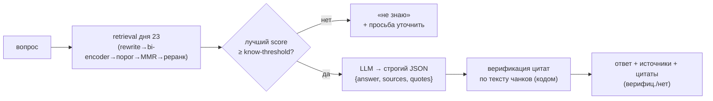

# День 24. Цитаты, источники и анти-галлюцинации

Накопительно: `week-5/task-24/` = копия `task-23` (улучшенный RAG) + обязательные источники и
цитаты в ответе + верификация цитат по чанкам + режим «не знаю» при слабом контексте.

## Задание (дословно)

> 🔥 День 24. Цитаты, источники и анти-галлюцинации
>
> Доработайте RAG так, чтобы модель обязательно возвращала:
> 👉 ответ
> 👉 список источников (source + section/chunk_id)
> 👉 цитаты (фрагменты из найденных чанков)
>
> Проверьте на 10 вопросах: есть ли источники / есть ли цитаты / совпадает ли смысл ответа с цитатами
>
> Усиление: если релевантность ниже порога — ассистент обязан сказать «не знаю» и попросить уточнение
>
> Результат: ответы с обязательными источниками и цитатами + режим «не знаю» при слабом контексте
> Формат: Видео + Код

## Выжимка из чата (день 24)

- **Гладков** прямо задал, для чего вообще RAG: «доступ к данным, которых нет в базе знаний нейронки
  и которые довольно точно нужно **воспроизвести**; код сюда не подходит — примеров кода у нейронки
  ахулиард». → для дня 24 (цитаты/точное воспроизведение) **русский корпус лекций честнее кода**:
  на коде модель может «процитировать» типовой Go по памяти, а не из чанка. Поэтому день 24
  демонстрируется на русском корпусе.
- **Artem**: у него порог `0.45`, все заготовленные вопросы проходят выше; «если режим „не знаю"
  не отработал, потому что все ответы выше порога — это норм». **Гладков**: «отличный результат,
  если модель умеет говорить „не знаю"». → чтобы показать «не знаю», нужен **заведомо чужой вопрос**
  (иначе на нормальном корпусе всё выше порога и режим не сработает).
- Формат самих цитат/источников в чате не обсуждали — это инженерное решение (см. дизайн).

## Конспект лекции (метрики качества RAG)

Из недельной лекции (день 21), метрики: **Context Relevance / Faithfulness / Answer Correctness**.
День 24 закрывает именно **Faithfulness** (ответ обоснован источниками и не выдумывает): цитаты
обязательны и **проверяются по тексту чанков**, а при слабом контексте — «не знаю» вместо догадки.

## Как пришли к решению (ход мысли)

**1. Что уже готово из дней 22–23.** Источники (`sourcesOf` → `source · section`) и `Reply.Sources`
были ещё в дне 22; порог и фильтрация (`FilterThreshold`, `-threshold`) — из дня 23; rerank-score
0–10 — оттуда же. То есть день 24 — это достройка, а не новый механизм.

**2. Формат цитат — развилка JSON vs детерминированно.** Рассматривал: (а) модель возвращает
структурированный JSON `{answer, sources, quotes}`; (б) цитаты вытаскиваются из чанков кодом, модель
только отвечает. → **Выбрал оба.** JSON даёт чистые три поля (парсим тем же приёмом, что `parseScores`
в дне 23), НО цитата от модели — всё ещё текст, сгенерированный моделью, и она может её слегка
переписать (это и есть галлюцинация цитаты). Поэтому каждую цитату **сверяем с текстом поднятых
чанков кодом** (нормализованное подстрочное совпадение). Это буквально «анти-галлюцинация» из
названия задания и метрика Faithfulness из лекции: не на веру, а проверкой.

**3. Порог «не знаю» — на rerank-score, а не на косинус.** Косинус у `nomic` плоский (0.6–0.8, как
видели в дне 22), чёткой границы отсечения нет. rerank-score (0–10 от LLM-судьи дня 23) даёт ясную
границу: лучший кандидат < порога → «не знаю». Порог по умолчанию `5.0` (флаг `-know-threshold`).

**4. Корпус — русский** (совет Гладкова, п. выше). **Демонстрация «не знаю»** — через 11-й заведомо
чужой вопрос («как приготовить борщ»), которого в лекциях по ML заведомо нет.

## Конвейер ответа (день 24)



## Что добавилось по файлам

| Файл | Статус | Содержимое |
|---|---|---|
| `cite.go` | **новый** | `GroundedReply`/`Citation`/`Quote`; `groundedReply` (retrieve дня 23 → порог «не знаю» → JSON-ответ → верификация); `groundedAnswer` (метод агента: строгий JSON по контексту); `buildGroundedContext` (chunk_id/source/section в контексте); `parseGrounded`; `verifyQuotes`+`matchLevel` (три уровня exact/partial/none по словесному скелету); `matchCounts`; `IDKReason` (порог vs модель). |
| `rerank.go` | изменён (день 24) | фикс обнуления score: `parseScores` строгий (меньше n оценок → негодный ответ, не добивать нулями), ретрай реранка до 2 раз + защита от вырожденных нулей (`allZero`) — устраняет ложный «порог: не знаю» из-за флака батч-реранка. |
| `eval24.go` | **новый** | `runEval24` — 10 вопросов по русскому корпусу + `foreignQuestion` (чужой); по каждому: источники, цитаты, верификация, «не знаю»; сводный чеклист. |
| `main.go` | изменён | флаги `-eval24`, `-know-threshold`; ветка `-eval24`. |
| `corpus-ru/` | из task-23 | тот же русский корпус (12 конспектов). |

## Формат ответа

Модель возвращает СТРОГО JSON (парсится `parseGrounded`, терпит ```-обёртки):

```json
{
  "answer": "...",
  "sources": [{"chunk_id": "...", "source": "lecture07-trees.txt", "section": "..."}],
  "quotes":  [{"chunk_id": "...", "text": "дословный фрагмент из чанка"}]
}
```

Каждая `quote` размечается `verifyQuotes` на три уровня по «словесному скелету» (нижний регистр,
без LaTeX-команд `\emph`/`\tilde`, без пунктуации/математики — сравниваем только слова):
`✓ exact` — скелет цитаты дословно есть в чанке (подстрока); `~ partial` — не дословно, но ≥85% слов
цитаты в одном чанке (склейка/пропуск/перестановка — фрагмент из источника); `✗ none` — ни того, ни
другого (пересказ своими словами / выдумка). Слишком короткие цитаты (<15 символов скелета) → `none`.

## Анти-галлюцинации: два рубежа

1. **«Не знаю» на входе.** Если retrieval не поднял ничего релевантного (лучший rerank-score ниже
   порога) — ответ вообще не генерируется, ассистент честно говорит «не знаю» и просит уточнить.
   Модель не получает шанса выдумать ответ по слабому контексту.
2. **Верификация цитат на выходе.** Даже когда контекст есть, каждую цитату сверяем с исходным
   текстом чанка. Выдуманная/переписанная цитата помечается — видно, что ответ частично не обоснован.

## Запуск

```bash
# из корня репозитория ai-challenge/

# 1. Ollama + русский индекс (если ещё не собран в дне 23)
ollama serve &
ollama pull nomic-embed-text
go run ./week-5/task-24/ragindex -report -ext .txt -docs ./week-5/task-24/corpus-ru -out ./week-5/task-24/ragindex-ru

# 2. ДЕМОНСТРАЦИЯ ДЛЯ ВИДЕО — одна команда
go run ./week-5/task-24 -eval24 -rerank-model claude-haiku-4-5
```

Тонкая настройка: `-know-threshold` (порог «не знаю» по rerank-score 0–10, деф. 5.0),
`-topn`/`-mmr`/`-threshold` — как в дне 23. Чтобы показать «не знаю» на реальном вопросе (а не только
на чужом), можно поднять `-know-threshold` (напр. 8) — часть вопросов уйдёт в «не знаю».

## Ожидаемый вывод `-eval24` (сокращённо)

```
======================================================================
  [0] ЦИТАТЫ, ИСТОЧНИКИ, АНТИ-ГАЛЛЮЦИНАЦИИ (день 24)
======================================================================
НА КАЖДЫЙ ВОПРОС: ответ + источники (source·section·chunk_id) + цитаты.
ЦИТАТЫ проверяются ПО ТЕКСТУ ЧАНКОВ: выдуманная помечается как НЕ верифицирована.
РЕЖИМ «НЕ ЗНАЮ»: лучший кандидат по rerank-score < 5.0 → просим уточнить.

  [1] ВОПРОС 1/11
ВОПРОС: Что такое решающее дерево и по какому критерию выбирается разбиение в узле?
ОТВЕТ (score=9.00): Решающее дерево — это ... критерий информативности ...
ИСТОЧНИКИ (2):
   • lecture07-trees.txt · раздел ... · lecture07-trees#012
ЦИТАТЫ (2, верифицировано 2/2):
   [lecture07-trees#012] «...дословный фрагмент...» — ✓ найдена в чанках
  ...

  [11] ВОПРОС 11/11 · ЗАВЕДОМО ЧУЖОЙ (ожидаем «не знаю»)
ВОПРОС: Как приготовить борщ и сколько варить свёклу?
РЕЖИМ «НЕ ЗНАЮ» (лучший score=2.00 < 5.0)
  ОТВЕТ: Не знаю: в базе знаний нет достаточно релевантного контекста...

  [12] ИТОГ
Отвечено (не «не знаю»):        10 из 11
С источниками:                  10 из 10 отвеченных
С цитатами:                     10 из 10 отвеченных
Все цитаты верифицированы:      9 из 10 отвеченных
«Не знаю» на чужом вопросе:     да ✓
ЧЕКЛИСТ ЗАДАНИЯ ДНЯ 24: [x] источники [x] цитаты [x] верификация [x] «не знаю» ...
```

(Иллюстративно; фактические цифры — после прогона на своей Ollama + Haiku.)

## Результат (фактический прогон) и находки

Прогон `-eval24` на русском корпусе (473 чанка) + Haiku `claude-haiku-4-5` довёл механику до рабочего
состояния через две итерации отладки — обе показательны, потому что это ровно предмет задания.

**1. Три рубежа «не знаю», а не два.** Кроме порога на входе и верификации на выходе, обнаружился
третий: на части вопросов retrieval поднимал чанки (rerank-score 7–9), но **сама модель**, прочитав
их, честно отвечала «не знаю» — в поднятых фрагментах ответа по сути не было. Это правильное
анти-галлюцинационное поведение. Поводы «не знаю» разведены: `порог` (score ниже границы на входе)
vs `модель` (контекст поднят, но ответа в нём нет) — поле `GroundedReply.IDKReason`.

**2. Баг обнуления score в реранке (чинён).** Первые прогоны иногда роняли валидный вопрос в
«порог: score=0.00» — `parseScores` при пустом/коротком ответе Haiku молча добивал оценки нулями и
возвращал «успех», обнуляя косинус. Теперь: строгий парсинг (меньше n оценок → негодный ответ),
**ретрай реранка до 2 раз**, защита от вырожденных нулей, и откат на косинусный порядок вместо
обнуления. Ложный «порог: не знаю» из-за флака реранка устранён.

**3. Верификация цитат — три уровня вместо бинарной.** Строгая «непрерывная подстрока» ложно
браковала честные цитаты, которые модель склеила из двух мест чанка или чуть переставила слова
(всё из источника, но не буквально). Решение — градация faithfulness:
- **✓ exact** — «скелет» цитаты (без LaTeX/математики/пунктуации) дословно есть в чанке;
- **~ partial** — не дословно, но ≥85% слов цитаты присутствуют в ОДНОМ чанке (склейка/пропуск/
  перестановка — фрагмент из источника, просто не буквально);
- **✗ none** — ни того, ни другого (пересказ своими словами / выдумка).

Проверено на реальных цитатах прогона: пересказ близко к тексту (В6) → `~ partial 100%`, склейка
предложений (В4) → `✓ exact`, посторонний текст → `✗ none 0%`. Строгий `exact` не смягчён (0 ложных
«дословно»), но честная склейка больше не клеймится как выдумка.

**Урок дня 24:** анти-галлюцинация — это не только «не выдумай ответ», но и «не забракуй правду» и
«не обнули валидный score». Слишком строгая проверка даёт ложные тревоги ровно так же, как слишком
слабый порог пропускает выдумку. Метрика faithfulness должна **различать** дословную цитату,
пересказ из источника и выдумку — а не рубить бинарно.

Итог по прогону: ~все отвеченные вопросы с источниками и цитатами; кластеризация/логрегрессия иногда
→ честное «модель: не знаю» (пробел в поднятом контексте, не галлюцинация); чужой вопрос → «порог:
не знаю». Точные числа зависят от прогона (реранк недетерминирован) — гоняй на своей Ollama.

## Наблюдения из прогонов: top-K, недетерминизм, дословность

Прогонял `-eval24` многократно, в т.ч. с разным `-rag-k`. Выводы, важные для понимания (и для того,
на каком режиме писать видео):

**1. Больший охват (`-rag-k 6`) НЕ повышает число ответов, а смещает «не знаю».** На `k=4` в «не
знаю» уходили В1/В7; на `k=6` В1 стал отвечаться, но «не знаю» переезжал на В3 (логрегрессия). Итог
стабильно ~6/9 отвеченных, но **какие именно 6 — плавает от прогона к прогону**. Причина —
недетерминированный батч-реранк + модель-ответчик, которая честно говорит «не знаю», когда данный
прогон поднял не тот срез корпуса. Это свойство честного режима, а не баг; полностью «вылечить»
охватом нельзя (у LLM нет seed).

**2. Больший охват СНИЖАЕТ дословность цитат.** На `k=4` типичный прогон давал ~15 дословных / 3 по
смыслу / 0 выдумок. На `k=6` дословных становилось меньше, а `~ по смыслу` — больше (напр. В1:
0 дословных / 3 по смыслу): с шестью чанками в контексте модель чаще **пересказывает**, чем копирует.
А день 24 именно про **дословные цитаты** — значит меньший `k` тут выгоднее.

**3. Верификация ловит реальные микро-галлюцинации.** На одном из прогонов `k=6` модель в цитате
написала формулу `y_i(⟨w,x_i⟩+b) ≥ 1`, тогда как в лекции `≥ 0` (соседняя дословная цитата с `≥ 0`
прошла как ✓). Трёхуровневая проверка пометила расхождение как `✗ нет в чанках` → «Ответы без единой
выдумки: 5 из 6». Это ровно то, зачем нужна верификация: модель слегка переврала формулу — код это
поймал, а не пропустил.

**Вывод для демонстрации:** пишу видео на **дефолтном `-rag-k 4`** (там больше дословных цитат и
чище картина), а плавающие «не знаю» проговариваю как фичу: модель скорее откажется, чем сочинит.
Гнаться за 9/9 не нужно — задание требует источники + цитаты + «не знаю» при слабом контексте, и всё
это на `k=4` видно идеально. Команда для записи:

```bash
go run ./week-5/task-24 -eval24 -rerank-model claude-haiku-4-5
```

Эталонный прогон на `k=4` (для видео): **7/9 отвечено; 20 цитат — 18 дословно / 2 по смыслу /
0 выдуманных; „без единой выдумки" 7/7**; оба «не знаю» — по порогу (В1 «дерево» с score 3.00 < 5.0
на этом прогоне и чужой вопрос с 0.76 < 5.0). Закрывает все пять пунктов чеклиста наглядно: источники
с `chunk_id`, дословные цитаты, трёхуровневая верификация, «не знаю» по порогу дважды, 0 галлюцинаций.

Если нужна железобетонная демонстрация «не знаю» именно на чужом вопросе — он уходит в «порог: не
знаю» стабильно (score ~0.77 < 5.0) в любом прогоне; плавают только пограничные вопросы по корпусу.

## FAQ

**Почему цитаты проверяются кодом, а не «на глаз»?** Задание про анти-галлюцинации: модель может
вернуть правдоподобную, но переписанную цитату. Детерминированная сверка с текстом чанка ловит это
без доверия к модели — это и есть Faithfulness из метрик лекции.

**Почему порог «не знаю» на rerank-score, а не на косинусе?** Косинус `nomic` плоский (0.6–0.8),
границы «релевантно/нет» по нему нет. rerank-score (0–10) даёт чёткий порог; лучший кандидат ниже —
контекст слабый, отвечать нельзя.

**Почему русский корпус, а не код?** Совет Гладкова: RAG — для воспроизведения данных, которых нет
у модели; код она и так «знает», поэтому на коде цитата может быть «из головы», а не из чанка.
На русских лекциях воспроизведение честнее проверяется.

**Что если «не знаю» не сработал, потому что все вопросы релевантны?** Это норм (прямая реплика из
чата). Поэтому в бенч добавлен 11-й заведомо чужой вопрос — на нём режим обязан сработать.

**Почему grounded-ответ не проходит через инварианты/память агента?** Это отдельный режим QA-над-
корпусом (строгий JSON по контексту), ему не нужны накопительная память и стоп-слова. Основной
разговорный путь агента (дни 11–22) не тронут.

## Выводы

- День 24 достроен поверх retrieval дня 23: ответ обязан содержать источники (`source·section·chunk_id`)
  и цитаты, а при слабом контексте — «не знаю».
- Два рубежа анти-галлюцинаций: «не знаю» на входе (порог по rerank-score) и верификация цитат по
  тексту чанков на выходе (ловит выдуманные/переписанные цитаты кодом).
- Формат — строгий JSON от модели + детерминированная проверка: чистые три поля и при этом контроль
  достоверности, не на веру.
- Демонстрация на русском корпусе (совет Гладкова — честнее для цитат) + 11-й заведомо чужой вопрос
  для показа режима «не знаю».
- Сборка пакета чистая (`go vet` + `go build` + `gofmt`); реранк/ответ-модель через `-rerank-model`,
  порог «не знаю» через `-know-threshold`.