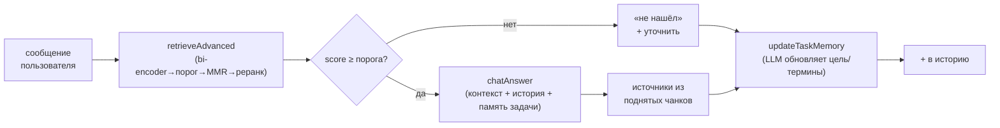

# День 25. Мини-чат с RAG + памятью (production-like)

Финал недели и всего накопительного агента. `week-5/task-25/` = копия `task-24` + мини-чат, который
собирает воедино RAG-конвейер дней 21–24 и трёхслойную память дней 11–15.

## Задание (дословно)

> 🔥 День 25. Мини-чат с RAG + памятью (production-like)
>
> Реализуйте мини-чат (CLI/веб), который:
> 👉 хранит историю диалога
> 👉 при каждом новом вопросе ищет контекст в базе через RAG
> 👉 отвечает с учётом найденной информации
> 👉 всегда выводит источники
>
> Усиление: добавьте «память задачи» (task state): что пользователь уже уточнил / какие
> ограничения/термины зафиксированы / что является целью диалога
>
> Проверьте: на 2 длинных сценариях по 10–15 сообщений / что ассистент не теряет цель и продолжает
> выдавать ответы с источниками
>
> Результат: мини-чат с RAG + источниками + памятью задачи. Формат: Видео + Код

## Выжимка из чата

- **Denis Suprun** ещё в середине недели: «сдаётся мне, что мы тут свой NotebookLM пишем». День 25
  это подтверждает — финал собирает индексацию → RAG → реранк → цитаты → чат в мини-продукт.
- **Dmitry Kuznetsov**: «desktop-приложение можно?» → **Гладков**: «да вполне». Форма (CLI/веб/
  desktop) свободная; у нас CLI, накопительно от дней 11–24.
- **Гладков** (ранее): RAG — для данных, которых нет у модели и которые нужно точно воспроизвести →
  корпус русский (лекции), как в днях 23–24.

## Что переиспользовано (накопительность)

День 25 — **интеграция**, а не новый механизм. Из готового:

| Требование дня 25 | Откуда берётся |
|---|---|
| история диалога | short-term слой памяти (`Memory.Dialog`, день 11) + `ChatSession.History` |
| RAG на каждый вопрос | `retrieveAdvanced` (день 23): rewrite→bi-encoder→порог→MMR→реранк |
| ответ с учётом контекста | `chatAnswer` (новый) — контекст RAG + история + память задачи |
| всегда источники | `sourcesFromHits` — из реально поднятых чанков (детерминированно, всегда есть) |
| режим «не знаю» | порог по rerank-score (день 24) |
| память задачи (task state) | `TaskMemory` (новый) — автоизвлекается LLM после каждого хода |

## Дизайн (ключевые решения)

**Память задачи — автоизвлечение, а не команды.** `TaskMemory{Goal, Terms, Constraints, Clarified}`
после каждого хода обновляется моделью из истории диалога (строгий JSON). Это ближе к «production-like»:
пользователь просто разговаривает, а система сама вытягивает цель/термины/ограничения. В промпт ответа
память задачи инжектится отдельным блоком — так ассистент «держит нить» и не теряет цель на длинной
дистанции. (Ручные команды из дня 13 остались бы возможны, но задание про то, что система понимает
диалог сама.)

**Источники — детерминированно из поднятых чанков.** Задание требует «ВСЕГДА выводит источники».
Поэтому источники берутся не из ответа модели (та может забыть их указать), а из реально поднятых
RAG-чанков (`sourcesFromHits`: `source · section · chunk_id`). Гарантия: если ответ был (не «не
знаю») — источники есть всегда.

**«Не знаю» сохранён (день 24).** Если retrieval не поднял релевантного (лучший rerank-score ниже
порога) — ассистент честно говорит «не нашёл в базе», а не выдумывает. В сценариях это тоже
проверяется (напр. вопрос вне лекций).

**Rewrite отключён для чата.** Корпус русский, вопросы русские — кросс-языкового разрыва нет,
query rewrite не нужен. Отключён (`chatCfg.Rewrite=false`), чтобы экономить вызовы; реранк оставлен
(он и даёт качество + score для порога «не знаю»).

**История ограничена окном.** В промпт идут последние ~6 ходов (`recentHistory`) — чтобы контекст не
рос неограниченно, но нить сохранялась. Память задачи при этом накопительная (не забывается с окном).

## Конвейер одного хода



## Что добавилось по файлам

| Файл | Статус | Содержимое |
|---|---|---|
| `chat.go` | **новый** | `TaskMemory` (память задачи) + `render`; `ChatSession` (история + память); `Ask` (ход: RAG → «не знаю»/ответ → источники → обновление памяти); `chatAnswer` (ответ с историей и целью); `updateTaskMemory` (LLM извлекает task-state, JSON); `sourcesFromHits`; `recentHistory`; `runInteractiveChat`. |
| `eval25.go` | **новый** | `scenarios25` (2 сценария по ~10 сообщений, у каждого заявленная цель); `runEval25` — авто-прогон с источниками на каждом ходе, снимками памяти задачи и проверкой удержания цели через `goalOverlap` (совпадение с заявленной, а не «непусто ли»). |
| `main.go` | изменён | флаги `-chat25` (авто-прогон), `-chat` (интерактив), `-chat-know-threshold` (порог «не знаю» для чата, деф. 3.0 — мягче дня 24); rewrite отключён для чата. |
| `corpus-ru/` | из task-24 | тот же русский корпус (12 конспектов). |

## Два сценария (проверка)

Оба — связные линии по ~10 сообщений, специально с проверкой удержания цели и памяти:

- **Сценарий 1 «Ансамбли»**: бэггинг → случайный лес → декорреляция → бустинг → градиентный бустинг →
  функции потерь → переобучение бустинга → борьба с ним → **возврат к цели** («лес или бустинг, если
  данных мало?») → резюме. Проверяет, что к 9–10 ходу ассистент помнит исходную цель.
- **Сценарий 2 «Линейные модели»**: линрегрессия → переобучение → регуляризация → L1 vs L2 →
  гребневая → **фиксация ограничения** («меня интересует только L2, L1 не трогаем») → логрегрессия →
  отступ → связь margin/регуляризации → **резюме с учётом ограничения**. Проверяет, что зафиксированное
  ограничение (`Constraints`) держится до конца.

## Запуск

```bash
# из корня репозитория ai-challenge/

# 1. Ollama + русский индекс (если ещё не собран в днях 23–24)
ollama serve &
ollama pull nomic-embed-text
go run ./week-5/task-25/ragindex -report -ext .txt -docs ./week-5/task-25/corpus-ru -out ./week-5/task-25/ragindex-ru

# 2. ДЕМОНСТРАЦИЯ ДЛЯ ВИДЕО — авто-прогон 2 сценариев одной командой
go run ./week-5/task-25 -chat25 -rerank-model claude-haiku-4-5

# 3. Живой интерактив (по желанию)
go run ./week-5/task-25 -chat -rerank-model claude-haiku-4-5
> Что такое бэггинг?
> А чем от него отличается случайный лес?
> /mem      # показать память задачи (цель/термины/ограничения)
```

## Ожидаемый вывод `-chat25` (сокращённо)

```
======================================================================
  [0] МИНИ-ЧАТ С RAG + ПАМЯТЬЮ ЗАДАЧИ (день 25)
======================================================================
Каждый ход: RAG-поиск → ответ с учётом истории и цели → ИСТОЧНИКИ → обновление памяти задачи.
ПРОВЕРЯЕМ: источники в каждом ходе + цель диалога не теряется.

  [1] СЦЕНАРИЙ 1: Ансамбли: от бэггинга к бустингу
ЗАЯВЛЕННАЯ ЦЕЛЬ: разобраться в ансамблевых методах и выбрать между лесом и бустингом

── ход 1/10 ──
Пользователь: Что такое бэггинг?
Ассистент:    Бэггинг (bootstrap aggregation) — это ...
Источники:    lecture08-ensembles.txt#para-020, lecture08-ensembles.txt#para-024
...
── ход 2/10 ──
...
── ПАМЯТЬ ЗАДАЧИ (после хода 2) ──
Цель диалога: разобраться в бэггинге и случайном лесе
Зафиксированные термины: бэггинг; случайный лес; бутстрап
...
── ход 10/10 ──
Пользователь: Резюмируй, что мы обсудили по ансамблям.
Ассистент:    Мы обсудили бэггинг, случайный лес и бустинг ... (помнит всю линию)
Источники:    ...
── ПАМЯТЬ ЗАДАЧИ (после хода 10) ──
Цель диалога: выбрать между случайным лесом и градиентным бустингом
...

── ИТОГ СЦЕНАРИЯ ──
Источники в ответах:   10 из 10 содержательных ходов
Цель зафиксирована:    да ✓
Цель удержана к концу:  да ✓

  [3] ЧЕКЛИСТ ЗАДАНИЯ ДНЯ 25: [x] история [x] RAG [x] источники [x] память задачи [x] 2 сценария ...
```

(Иллюстративно; фактические ответы и память — после прогона на своей Ollama + Haiku.)

## Результат (фактический прогон) и находки

Первый прогон `-chat25` на русском корпусе (473 чанка) + Haiku показал рабочий мини-чат, но вскрыл
две вещи — обе поучительные и обе поправлены.

**Что сразу работало:** источники на каждом содержательном ходе (9/9 и 7/7); память задачи копит
термины по ходу; **зафиксированное ограничение держится** — в сценарии 2 ход 6 «только L2, L1 не
трогаем» → в конце `Ограничения: рассматриваем только L2, L1 исключаем` и резюме именно про L2;
история работает (ходы ссылаются на ранее обсуждённое); «не знаю» честно срабатывает на пробелах.

**Находка 1 — метрика «цель удержана» была слишком мягкой (поправлено).** Первая версия считала цель
удержанной, если `Goal` непустой и стабильный. Но в сценарии 1 `Goal` **застрял** на «объяснить
бэггинг» (сформировался на ходе 2 и не обновился), хотя диалог ушёл в бустинг и к выбору. Метрика
показывала ✓ именно потому, что цель застряла — то есть поощряла застревание. Исправлено двусторонне:
(а) промпт `updateTaskMemory` теперь просит **обновлять goal при смене фокуса** (переход к выбору/
сравнению, возврат к исходной задаче), а не «менять редко»; (б) метрика сравнивает финальную цель с
**заявленной** целью сценария по пересечению ключевых слов (`goalOverlap`), а не «непусто ли».
Проверка на реальных данных: застрявшая цель даёт 0% совпадения (честный ✗), а цель, отражающая
диалог, — ~86% (✓). Теперь метрика не врёт.

**Находка 2 — флак «не знаю» в живом чате (поправлено порогом).** Ходы про декорреляцию, L1-vs-L2,
гребневую иногда уходили в «не знаю», хотя ту же гребневую соседний ход отвечал отлично. Это тот же
недетерминизм реранка из дня 24: на `top-K=4` нужный чанк то попадает в финал, то нет, а порог 5.0
(взятый для строгого grounded-режима дня 24) рубит «недооценённые, но релевантные». В **чате** порог
снижен до **3.0** (`-chat-know-threshold`, отдельный от дня 24): настоящий мусор (посторонний вопрос
даёт score ~0.76) всё равно отсекается, а релевантные ходы с заниженной оценкой проходят. День 24
остаётся строгим (порог 5.0) — там анти-галлюцинация важнее; чат мягче — там ложный отказ посреди
диалога хуже, чем ответ по слегка недооценённому контексту. Это осознанный выбор режима, а не
ослабление: разные приоритеты для разных задач.

**Не трогали (косметика):** ретрив иногда ставит первым слегка нерелевантный источник (в одном ходе
`lecture08-ensembles` вместо `lecture03-linregr`), но ответ выходит верным — модель фильтрует контекст.
Это шум ранжирования, не ошибка; чинится тем же реранком/порогом, что уже есть.

**Урок дня 25:** в многоходовом чате две тонкие ловушки — (1) память задачи может «застрять» и давать
ложное ощущение стабильности; метрику надо мерить против реальной цели, а не против «непустоты»;
(2) порог отсечения — это выбор режима: строгий для цитат (день 24), мягче для живого диалога (день 25).

**Эталонный прогон после фиксов (для видео):**
- Сценарий 1: `Goal` эволюционировал «бэггинг» → «…в сравнении с бустингом» → **«выбрать между
  случайным лесом и градиентным бустингом»** = заявленная цель, совпадение **100%** ✓; источники 10/10.
- Сценарий 2: `Goal` дошёл до **«…связь регуляризации с отступом (margin)»** = заявленная, 100% ✓;
  ограничение `только L2, L1 не рассматриваем` держится до резюме; источники 9/10 (одно «не знаю» на
  пограничном margin-контенте, не флак).
- Флак «не знаю» практически исчез (порог 3.0): было 9/9 и 7/7 с дырами в ходах 3–5 → стало 10/10 и
  9/10. Цель больше не застревает, а развивается вместе с диалогом.


**Чем `TaskMemory` отличается от `TaskContext` дня 13?** Идея та же (рабочая память задачи), но
`TaskContext` заполнялся вручную командами (`/goal`, `/plan`), а `TaskMemory` дня 25 **извлекается
моделью автоматически** из диалога. Имя другое, потому что `TaskState` уже занят FSM-состоянием
задачи (день 13) — это разные вещи.

**Почему источники не из ответа модели, а из чанков?** Гарантия «всегда выводит источники». Модель
может забыть их перечислить или указать не те; поднятые RAG-чанки — детерминированный, надёжный
источник. День 24 отдельно показал верификацию цитат; здесь фокус на том, что источник есть на
каждом ходе.

**Как проверяется «не теряет цель»?** Финальная `TaskMemory.Goal` сравнивается с **заявленной** целью
сценария по пересечению ключевых слов (`goalOverlap` ≥ ⅓ → ✓). Это честнее, чем «goal непустой»:
застрявшая цель (не отражающая диалог) даёт низкое совпадение и честный ✗. Плюс последний ход каждого
сценария — «резюмируй», и по ответу видно, помнит ли ассистент всю линию (в сценарии 2 — держится ли
ограничение «только L2»). Промпт извлечения при этом просит обновлять goal при смене фокуса, чтобы
цель эволюционировала вместе с диалогом, а не застревала.

**Почему rewrite выключен?** Корпус и вопросы на одном языке (русский) — кросс-языкового разрыва
дня 22–23 нет, rewrite не нужен и только тратит вызовы. Реранк оставлен (качество + score для порога).

## Выводы

- Мини-чат собран как интеграция накопленного: история диалога + RAG-конвейер дней 21–24 + память
  задачи, без нового «механизма» — только склейка в чат-цикл.
- Память задачи (`TaskMemory`) автоизвлекается LLM после каждого хода и эволюционирует при смене
  фокуса; удержание цели меряется совпадением с заявленной целью, а не «непустотой» (честная метрика).
- Источники гарантированы на каждом содержательном ходе (из реально поднятых чанков), «не знаю»
  сохранён, но с более мягким порогом чата (3.0 против 5.0 в grounded-режиме дня 24) — меньше ложных
  отказов посреди диалога.
- Два сценария по ~10 сообщений проверяют удержание цели и зафиксированного ограничения; авто-прогон
  одной командой `-chat25` для видео, плюс живой `-chat`.
- Сборка пакета чистая (`go vet` + `go build` + `gofmt`); реранк/ответ-модель через `-rerank-model`.
- Это финал недели RAG и всего накопительного агента: от индексации (день 21) до production-like
  мини-чата с источниками и памятью (день 25).