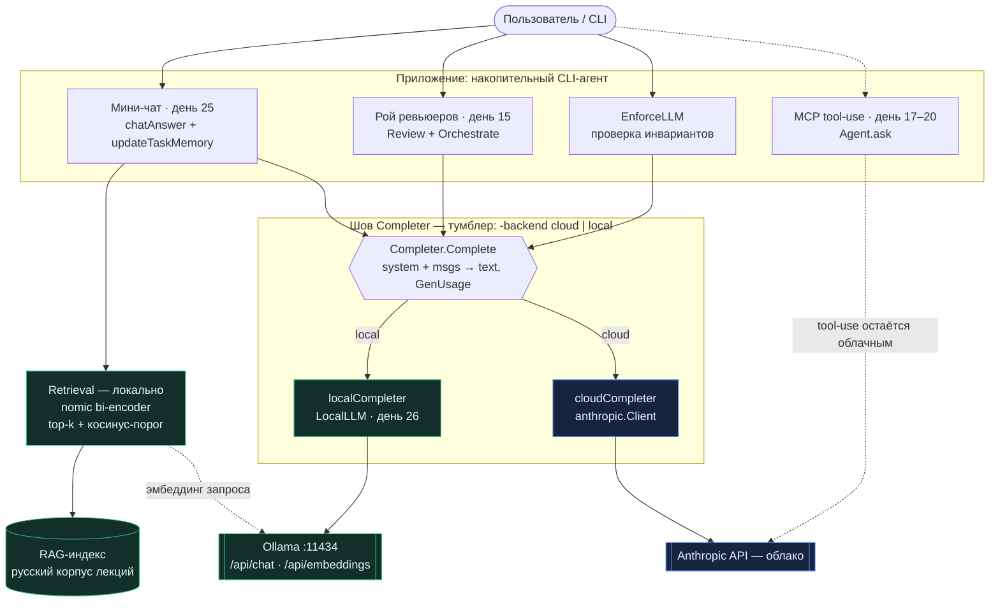

# День 27. Интеграция локальной LLM в приложение

> Неделя 6. Накопительный агент: `week-6/task-27/` = копия `week-6/task-26/` + **одна** новая фича —
> тумблер бэкенда `Completer` (`-backend cloud|local`), гоняющий наши **агентские флоу** на локальной
> модели.

## Задание (дословно, из Telegram)

> 🔥 **День 27. Интеграция локальной LLM в приложение**
> Интегрируйте локальную модель в реальное приложение: CLI-утилита / телеграм-бот / веб-приложение /
> или другое приложение на ваш выбор.
> Сделайте так, чтобы: приложение отправляло запросы в локальную LLM; получало и отображало ответы;
> **работало без облачных моделей**.
> **Результат:** Приложение, использующее локальную LLM. **Формат:** Видео + Код.

---

## Что говорит курс про этот день (разбор чата)

Ключевое — задание НЕ про «отдельное приложение», а про то, чтобы **агентские флоу поехали на локали**.
Гладков разжевал прямо (07.07):

- «здесь мы её интегрируем **во все сценарии**… **агентские флоу должны отрабатывать**»;
- «в чат мало запихнуть — надо, чтобы **агентская сеть отработала**».

И принятый эталон от Murad: «CLI-чат, там **рой агентов и стейдж-агенты**, просто **заменил Deepseek
на локалку — и это работает**» (пусть и с сомнительным качеством). Anastasiya: агент, писанный 3 недели,
поехал на `gemma3:12b` — «неплохо».

**Вывод:** наш CLI-агент и есть «реальное приложение». «Интеграция» = сменить бэкенд генерации так,
чтобы мини-чат (RAG+память задачи) и рой ревьюеров работали на локальной модели, без облака.

---

## Выжимка курсового чата — всё по заданиям недели 6 (дни 26–28)

Пересказ реплик, которые касаются заданий (без флуда). Сгруппировано по дням.

### День 26 — запуск локальной LLM

- **Гладков:** два РАЗНЫХ класса моделей — **векторизующие** (эмбеддер, вектор, не отвечает) и
  **генерирующие** (LLM, отвечает); неделя 5 была про первые, неделя 6 — про вторые. Для генерации
  «подойдут любые, даже очень простенькие».
- **Denis Abrashkin:** «в видео намёк — на этой неделе надо построить вокруг модели все джедайские
  техники». **Andrey:** изначально всё строил вокруг локальной модели.
- **Модели, что реально гоняли:** `qwen2.5:7b-instruct` для генерации (Temi4); `gemma4`/`gemma` на
  Mac M4 Pro 48 ГБ — «хорошо, без проблем», но RAG на локали медленный, для демо переключался на
  gemini (Denis Suprun); `qwen2.5:7b` в 4-бит на M2 Air 16 ГБ — «не супер шустро, но справляется»
  (Dmitri Vizgin); `qwen2.5:3b` на Windows — 20% RAM, ~2 ГБ, «быстро и осмысленно», но по-русски
  плохо и **вставляет китайские иероглифы** (Denis Kotov).
- **Железо / грабли ресурсов:** на Windows две модельки (эмбеддер+реранкер) еле тянутся, ручной
  контроль памяти и перезагрузки (Denis Kotov); Mac «прихуел» на связке эмбеддер+реранкер+whisper
  (Well); эмбеддинг книги 83 стр. локально ~1 час (Murad); Andrey держал эмбеддер на Mac, реранкер на
  стационаре; всё крутится и на Linux. Вывод по железу: маленькие модели для обучения — норм, ответы
  «такие себе», но принцип осваивается.
- **Реранк на локали (пригодится в дне 28):** `bge-reranker-v2-m3` в Ollama падает
  (`GGML_ASSERT`, Ollama не адаптирован под reranker-архитектуру) — Dmitry Kuznetsov ушёл на ONNX;
  как вариант — `qwen3-reranker` (yes/no) или LLM-судья/Deepseek для реранка (Murad). Наш выбор
  (LLM-судья) этим и подтверждается.

### День 27 — интеграция во все флоу (главное)

- **Гладков (ключевое):** «вчера пощупали локальную LLM, **сегодня интегрируем во все сценарии** —
  агентские флоу должны отрабатывать; в чат мало запихнуть, надо, чтобы **агентская сеть отработала**».
- **Murad (принятый эталон):** CLI-чат с **роем агентов и стейдж-агентами**, «просто **заменил
  Deepseek на локалку — работает**, хоть и с сомнительным качеством»; «5 стейджей прошли». Бинарник
  собирает на CI под платформы. **Temi4:** под капотом — логика, отбивающая мусор из чата.
- **Anastasiya:** прогнала агента, писанного 3 недели, на **`gemma3:12b`** — «весьма неплохо, думала
  будет хуже». (Для строгого роя `gemma3:12b` предпочтительнее 7B.)
- **Форма приложения:** «консоль в IntelliJ — это CLI-утилита?» (Александр К — да, CLI подходит);
  **Svyatoslav** хочет прикрутить веб к CLI. То есть CLI-агент как «приложение» — легитимно.
- **Vladislav (осторожность с данными):** телеграм-чаты как база знаний так себе — флуд,
  невалидная/противоречивая инфа, догадки. (У нас корпус — лекции, не чат, так что нас не касается.)
- **Джедайские техники на локали (skills):** скиллы ≈ агенты/тулинг, принцип как у MCP, просто более
  специализированы; на уровне кода — «реализация интерфейса с чётким входом/выходом и детерминированной
  последовательностью» (Гладков). Нюанс для локали: у локальной модели **нет команды-триггера скилла**
  — надо слать весь промпт (Стас); **локаль хуже держит контекст** → бить крупное на подскиллы (Стас);
  описывать скиллы лучше на родном языке (Dmitry Kuznetsov). Это не входит в день 27, но подсвечивает,
  почему тумблер важно держать на reasoning-флоу, а не на тонких tool-цепочках.

### День 28 — локальная LLM + RAG (анонсирован 08.07, уже виден)

- **Задание:** retrieval локально + генерация локальной моделью; **сравнить** local↔cloud;
  **оценить** качество / скорость / стабильность. Результат — RAG, полностью работающий локально.
- **«индекс из Недели 6» — опечатка** (сошлись в чате, Denis Kotov): имеется в виду наш RAG-индекс
  недели 5. Нового индексирования не требуется. Anastasiya подтвердила, что «сейчас и есть неделя 6».
- **Грабли, которые уже назвали:** `Qwen 3-14B` — таймауты до **5 минут** (у нас таймаут клиента уже
  5 мин); главная боль — **русский запрос ↔ английский документ**: локаль часто говорит «не найдено»,
  даже подняв нужный чанк, тогда как GPT-5 через мультиязычный поиск справляется (Руслан). Лечение из
  чата — **переводить запрос пользователя на английский в пайплайне** (Denis Kotov: «все проблемы
  пропали»). Нас на русском корпусе не задевает; на кодовом (RU-вопрос ↔ EN-код) — задело бы.
- **Идея (Murad):** кэш на эмбеддингах — если вопрос семантически совпадает (индекс ≥ порога), ответ
  из кэша в обход реранка/поиска; порог надо долго подбирать, иначе матчит по словам, а не по смыслу.

---

## Развилка дня 26 → решение дня 27

На дне 26 я специально отложил тумблер и оставил шов. Сегодня достаём вариант **B**, но **с чёткой
границей** (иначе это «дорогая переделка»):

| Флоу | Бэкенд после дня 27 | Почему |
|---|---|---|
| Мини-чат (chatAnswer, updateTaskMemory) | **тумблер** cloud/local | ядро «агентского флоу» дня 25 |
| Рой ревьюеров + оркестратор (swarm) | **тумблер** cloud/local | «агентская сеть» (Murad) |
| LLM-проверка инвариантов (EnforceLLM) | **тумблер** cloud/local | тот же текст-ин/текст-аут |
| MCP-цикл tool-use (`Agent.ask`) | **облако** (пока) | завязан на `tool_use`/`tool_result` SDK; надёжный tool-calling на 7B — отдельная тема |
| RAG-реранк/rewrite (rerank.go), grounded (cite.go) | **облако** (пока) | на локали чат идёт по bi-encoder+порогу; локальный реранк — **день 28** |

Граница честная и совпадает с тем, что в чате все гоняют на локали именно **reasoning-флоу**
(swarm/стейджи), а не тулы.

---

## Дизайн: шов `Completer`

Все «текстовые» точки вызова — это один паттерн: `system + сообщения → текст`. На дне 25 они звали
**конкретный** `anthropic.Client.Messages.New`. Вводим интерфейс:

```go
type Completer interface {
Complete(ctx, system string, msgs []Msg, opt CompleteOpts) (string, GenUsage, error)
Name() string
}
```

Две реализации (`completer.go`):
- `cloudCompleter` — обёртка над `anthropic.Client` (тот же вызов, что был);
- `localCompleter` — обёртка над `LocalLLM` дня 26 (Ollama `/api/chat`).

Тумблер = какую реализацию положили в агента (`a.SetCompleter`) и в рой (`NewSwarm(gen, …)`). Вызывающий
код (`chatAnswer`, `updateTaskMemory`, `Swarm.Review/Orchestrate`, `EnforceLLM`) теперь **не знает**,
какой бэкенд под ним.



(Схема также лежит отдельным файлом `architecture.mermaid`.)

`GenUsage{Input,Output}` унифицирует расход токенов: у облака — из ответа API, у локали — из счётчиков
Ollama (`prompt_eval_count`/`eval_count`).

---

## Файлы

| Файл | Статус | Что |
|---|---|---|
| `completer.go` | **новый** | `Completer`, `Msg`, `GenUsage`, `CompleteOpts`, `cloudCompleter`, `localCompleter` |
| `agent27.go` | **новый** | `runAgent27` — демо агентских флоу (мини-чат + рой) на локали |
| `agent.go` | изменён | поле `gen Completer` + дефолт-облако в `NewAgent` + `SetCompleter`; `EnforceLLM(ctx, a.gen, …)` |
| `chat.go` | изменён | `chatAnswer`/`updateTaskMemory` → `a.gen.Complete` (убран `model`-параметр и импорт SDK) |
| `swarm.go` | изменён | `Swarm.gen Completer`; `Review`/`Orchestrate` → `gen.Complete` (убран импорт SDK) |
| `enforce.go` | изменён | `EnforceLLM(ctx, gen Completer, …)` (убран импорт SDK) |
| `report.go` | изменён | `NewSwarm(newCloudCompleter(client, model), …)` |
| `main.go` | изменён | флаги `-backend`/`-agent27`; сборка `gen`; `SetCompleter`; на local `rcfg.Rerank=false` |
| `local.go`, `local26.go` | без изменений | переносятся из дня 26 |

### Сборка (накопительно)

```bash
cp -r week-6/task-26 week-6/task-27
grep -rl 'week-6/task-26/ragcore' week-6/task-27 | xargs sed -i '' 's#week-6/task-26/ragcore#week-6/task-27/ragcore#g'
# положить новые/изменённые: completer.go, agent27.go, agent.go, chat.go, swarm.go, enforce.go, report.go, main.go
go vet ./week-6/task-27/... && go build ./week-6/task-27/...
```

---

## Запуск

### Демо на видео — агентские флоу на локали (без облака)

```bash
ollama serve &                 # если ещё не запущен
ollama pull qwen2.5:7b         # или gemma2:9b / gemma3:12b — что тянет машина
go run ./week-6/task-27 -agent27 -backend local -local-model qwen2.5:7b
```

Прогонит **мини-чат** (RAG local + история + автоизвлечение памяти задачи) и **рой ревьюеров**
(несколько агентов + оркестратор) — всё на локальной модели, ключ ANTHROPIC не нужен.

### Тот же тумблер в остальных режимах

```bash
go run ./week-6/task-27 -chat  -backend local          # интерактивный мини-чат на локали
go run ./week-6/task-27 -swarm -backend local          # рой ревьюеров в основном REPL на локали
go run ./week-6/task-27 -chat  -backend cloud          # то же самое в облаке — для сравнения
```

Лектор советовал сделать «тумблер, который то так, то так работает, и сравнивать два ответа» — это ровно
`-backend cloud` ↔ `-backend local` на одном и том же флоу.

---

## Фактические прогоны

### (A) Проверено в песочнице — **реально**

Полный проект в песочнице не собирается (нужны `anthropic-sdk-go v1.46` + MCP-SDK, как и всю неделю 5).
Но после рефактора `swarm.go` и `enforce.go` стали **чистыми** (без SDK), поэтому я собрал остров
`completer.go + swarm.go + enforce.go + agent27.go` против **стаб-SDK** (минимальная поверхность, что
реально используется) и прогнал `localCompleter` в рантайме против фейкового Ollama:

```
BUILD OK — completer/swarm/enforce/agent27 типизируются
VET OK

backend: ollama/qwen2.5:7b
Complete → "ЛОКАЛЬ: Чем L1 отличается от L2?"        # шов вернул текст
GenUsage → вход 30 ток, выход 150 ток               # и расход токенов
с историей ок → вход 30 ток                          # путь user→assistant→user работает
```

Аудит согласованности сигнатур (определение ↔ все вызовы) прошёл для `chatAnswer`, `updateTaskMemory`,
`EnforceLLM`, `NewSwarm`; SDK-импорт убран из `enforce/swarm/chat`; `gofmt` чистый на всех 8 файлах.

> Что НЕ проверено сборкой здесь: `agent.go`, `chat.go`, `main.go`, `report.go` (тянут MCP-SDK/остальной
> проект). Правки в них — механические (подмена вызова на `gen.Complete` + пломбировка `gen`),
> сверены грепом. Полный `go build` — на твоей машине.

### (B) Реальный прогон на `qwen2.5:7b` (M3 Max) — и найденный баг

**Флоу 2 (рой) — сразу заработал идеально.** Все три ревьюера + оркестратор отработали на локальной
модели, вердикты связные:

```
━━━ ФЛОУ 2: рой ревьюеров (агентская сеть) ━━━
  ревьюер[корректность]: OK — Все пункты плана выполнены. Хендлер /health реализован с ответом и тестами.
  ревьюер[инварианты]:   OK — только stdlib, тяжёлых зависимостей и секретов нет.
  ревьюер[качество]:     OK — реализовано идиоматично, тесты покрывают основные случаи.
  оркестратор → PASS=true · /health добавлен без новых зависимостей, инварианты и качество соблюдены.
```

**Флоу 1 (мини-чат) — в первом прогоне везде «не знаю»** (при этом память задачи корректно
эволюционировала — цель росла, термины `бэггинг; случайный лес; бустинг` извлеклись):

```
[1] Пользователь: Что такое бэггинг?
    Ассистент: Не нашёл в базе знаний релевантного контекста… (режим «не знаю»)
    память задачи → цель: Объяснить концепцию бэггинга
…
Итог флоу 1: цель отслеживается: "Выбрать метод … при ограниченных данных и устойчивости"
            зафиксированные термины: бэггинг; случайный лес; бустинг
```

**Диагноз (реальный баг, не поломка поиска).** То, что термины извлеклись, доказывает: поиск **находил**
чанки — «не знаю» ложное. Причина — **рассинхрон шкалы порога**: порог «не знаю» = 3.0 задавался под
шкалу **LLM-реранка 0–10** (день 25, реранк был включён). На `-backend local` реранк выключен, поэтому
`hits[0].Score` — это **косинус bi-encoder (~0..1)**, для которого `best < 3.0` истинно ВСЕГДА → каждый
ход «не знаю».

**Фикс (в поставке).** На `-backend local` (реранк off) порог «не знаю» переводится в косинусную шкалу
(**0.35**, как в запросе 3 дня 26). Программа теперь печатает это явно:

```
Порог «не знаю»: 0.35 (косинусная шкала — реранк на локали выключен)
```

**После фикса — подтверждённый прогон флоу 1 на `qwen2.5:7b` (M3 Max):**

```
━━━ ФЛОУ 1: мини-чат (RAG + память задачи) ━━━
корпус: 473 чанков · strategy=structural · model=ollama/nomic-embed-text · dim=768 · top-4

[1] Что такое бэггинг?
    → Бэггинг объединяет несмещённые, но чувствительные к выборке алгоритмы в композицию с низкой
      дисперсией; хорошее семейство базовых — решающие деревья (низкое смещение, но легко переобучаются).
    источники: lecture01-intro#para-006, lecture10-ensembles#para-002, lecture08-ensembles#para-025 …
    память задачи → цель: объяснить бэггинг

[2] А чем случайный лес отличается от обычного бэггинга?
    → Случайный лес — реализация бэггинга над деревьями + случайный отбор признаков в сплитах.
    память задачи → цель: объяснить бэггинг и его реализации (например, случайный лес)

[3] Теперь про бустинг — чем он идейно отличается от бэггинга?
    → В бэггинге модели учатся независимо и усредняются; в бустинге — последовательно, каждая
      исправляет ошибки предыдущей.
    память задачи → цель: объяснить различия между бэггингом и бустингом

[4] Возвращаясь к моей цели: если данных немного и важна устойчивость — лес или бустинг?
    → Лес: усредняет много деревьев (↓ дисперсия, устойчивость); бустинг при малых данных легче
      переобучается.
    память задачи → цель: выбрать алгоритм для малых выборок с акцентом на устойчивость

Итог: цель отслеживается — "выбрать алгоритм для малых выборок с акцентом на устойчивость"
      термины: бэггинг; решающее дерево; случайный лес; бустинг
```

Флоу 1 отвечает по существу; ответы верны и заземлены; **память задачи эволюционирует правильно** и на
ходе 4 агент вернулся к исходной цели («возвращаясь к моей цели») — нить удержана. Баг закрыт.

> Наблюдение (не баг, → день 28): в ходах 3–4 в top-4 иногда попадает соседний по смыслу чанк
> (`lecture06-linclass`, `lecture07-trees`). На ответ здесь не повлияло, но это ровно то, что вычистит
> **локальный реранк** в дне 28. Локаль недетерминирована — формулировки между прогонами плавают.

---

## Честные находки и пределы

- **Полный проект в песочнице не собирается** (SDK + MCP). Проверил всё, что смог без них (см. выше);
  полный build — у тебя. Контракт прежний.
- **Tool-use остаётся облачным.** Если запустить основной REPL с реальным MCP на `-backend local`,
  сам tool-loop (`ask`) всё равно пойдёт в облако. Это осознанная граница дня 27 (и она в таблице выше).
- **Локальный реранк выключен.** На `-backend local` чат идёт по bi-encoder + порогу (как запрос 3
  дня 26). Поэтому в источниках может проскочить слабый чанк (мы это видели на дне 26:
  `lecture08-ensembles` в ответе про L1/L2). Реранк на локали + сравнение качества — **день 28**.
- **Баг шкалы порога «не знаю» (найден в первом прогоне, исправлен).** Порог 3.0 был в шкале
  реранка 0–10; на локали score — косинус (~0..1), поэтому все ходы падали в «не знаю». Фикс: на
  local порог переводится в косинусную шкалу (0.35). Урок на будущее: **порог и score обязаны быть в
  одной шкале** — при смене конвейера это первое, что нужно перепроверять.
- **Качество 7B.** Рой на локали может давать более шумные вердикты, чем Haiku; формат `VERDICT/NOTES`
  иногда плывёт (парсер `parseReview` терпит — дефолт `OK`). Для строгого роя лучше `-local-model`
  покрупнее (`gemma3:12b`, что хвалила Anastasiya).
- **Кросс-язык RU↔EN** (важно для дня 28): в чате (Руслан) локаль на русском вопросе по английскому
  документу часто говорит «не найдено», даже подняв нужный чанк. Нас на **русском** корпусе не задевает,
  но на **кодовом** корпусе задело бы — лечится переводом запроса в пайплайне (Denis Kotov). Учтём в 28.
- **Недетерминизм** — как и на неделе 5, для видео берём удачный дубль.

---

## FAQ

**Это точно «реальное приложение», а не игрушка?** Да: CLI-агент с RAG, памятью задачи и роем
ревьюеров, работающий полностью офлайн. Гладков дословно просил «чтобы агентские флоу отрабатывали» —
здесь отрабатывают два (чат и рой).

**Почему не переписал rerank/cite на Completer тоже?** Они — RAG-путь, а их сравнение local↔cloud —
буквально задание **дня 28**. Не съедаю завтрашний день; шов уже готов, подключить их — тривиально.

**Ключ реально не нужен?** На `-backend local` для `-agent27`/`-chat`/`-swarm` — нет. `.env` не фаталит
(с дня 26), клиент облака строится, но не вызывается.

**А телеграм-бот/веб, как в задании?** Задание допускает «или другое приложение на ваш выбор» — наш CLI
подходит и сохраняет накопительность. Обёртку в бота можно сделать поверх той же `Completer` за вечер,
если захочется (шов бэкенд-независимый).

---

## Что дальше — день 28 (детали в разделе «Выжимка чата» выше)

День 28 = «Локальная LLM + RAG»: retrieval локально + генерация локальной моделью + **сравнение**
local↔cloud + **eval** качество/скорость/стабильность. У нас retrieval+генерация на локали уже есть
(день 26 запрос 3, день 27 мини-чат), а шов `Completer` даёт готовый тумблер для сравнения — значит
день 28 подключается почти бесплатно. К переносу: локальный реранк (сейчас выключен), перевод запроса
для кросс-языка (лечит боль Руслана на кодовом корпусе) и метрики. «Индекс недели 6» — опечатка,
берём индекс недели 5.

## Выводы

- Тумблер `-backend cloud|local` протянут через агентские флоу (мини-чат, рой, enforce); MCP-tool-loop
  осознанно оставлен облачным.
- Приложение (CLI-агент) отправляет запросы в локальную LLM, отображает ответы и работает без облака —
  задание закрыто.
- Шов `Completer` проверен: типизация + рантайм локального пути; полный build — на машине Den.
- День 28 (RAG-сравнение local↔cloud + eval) подключается поверх готового шва почти бесплатно.