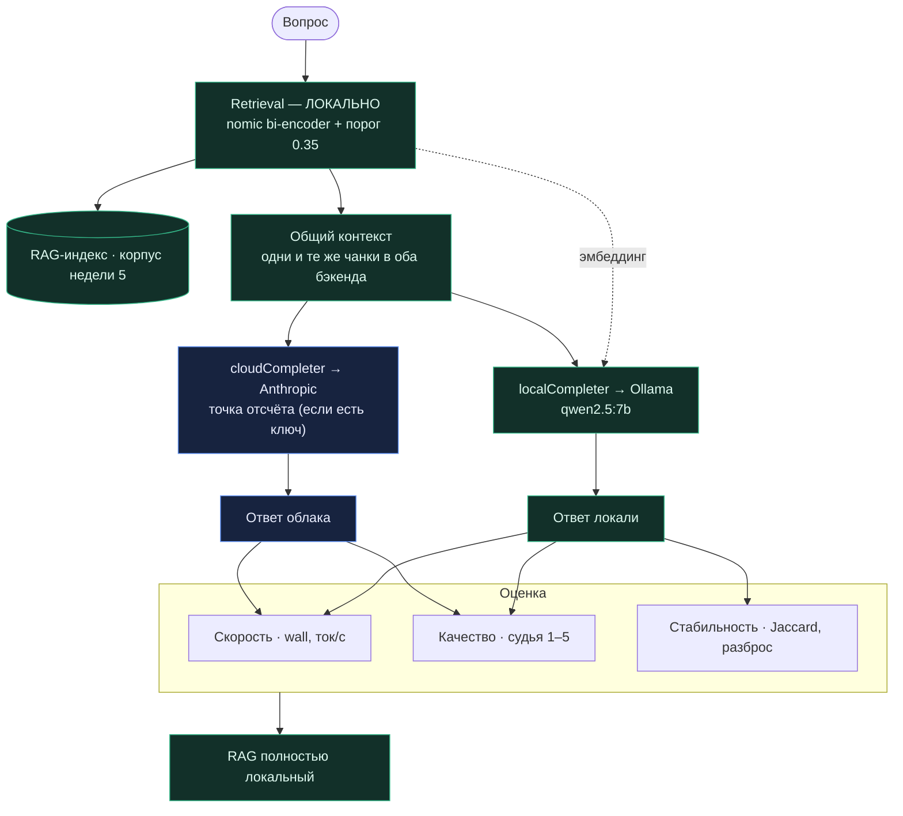

# День 28. Локальная LLM + RAG

> Неделя 6. Накопительный агент: `week-6/task-28/` = копия `week-6/task-27/` + **одна** новая фича —
> харнесс `-compare28`: полностью локальный RAG + сравнение local↔cloud + оценка (качество/скорость/
> стабильность).

## Задание (дословно, из Telegram)

> 🔥 **День 28. Локальная LLM + RAG**
> Подключите локальную LLM к вашему RAG-пайплайну: используйте индекс из Недели 6; retrieval выполняется
> локально; генерация ответа — через локальную модель.
> **Сравните:** ответы локальной модели / ответы облачной модели (если есть).
> **Оцените:** качество / скорость / стабильность.
> **Результат:** RAG-система, полностью работающая локально. **Формат:** Видео + Код.

---

## Что нового и что уже было

Полностью локальный RAG у нас **уже работает** с дней 26–27: retrieval — `nomic` (bi-encoder, локально),
генерация — `LocalLLM` (день 26, запрос 3; день 27, флоу 1). Поэтому фича дня 28 — не «сделать локальный
RAG» (он есть), а **харнесс сравнения и оценки** `-compare28`, который закрывает «сравните» и «оцените».

- «индекс из Недели 6» — **опечатка** (подтвердил Гладков в чате 09.07): имеется в виду индекс,
  разобранный на **прошлой неделе** (наш RU-корпус недели 5). «Так-то можно любой брать» — т.е. допустим
  и индекс всего челленджа (Kirill спрашивал). Берём наш RU-индекс.

---

## Методика сравнения (честная)

Ключевой принцип — **retrieval один раз и локально**, одни и те же чанки идут в оба бэкенда. Так мы
сравниваем ровно **генерацию**, а не поиск (иначе мешали бы два фактора). Промпт и контекст идентичны для
локали и облака (тот же `groundedSystem` + `buildContext`, что в дне 26).

**Метрики:**
- **Скорость** — `wall`-время вокруг каждого вызова (единообразно для обоих) и выход-ток/с (`GenUsage.Output / wall`).
- **Качество** — оба ответа печатаются рядом (судит человек/видео) + **облачный судья 1–5** за
  заземлённость (если задан ключ). Автометрика качества без эталона честнее как «оценщик», чем как
  «истина».
- **Стабильность** — `K` локальных прогонов одного вопроса (флаг `-stab-runs`, дефолт 3): разброс
  задержки (min/max/avg), разброс длины ответа (mean±sd токенов) и **средний попарный лексический
  Jaccard** ответов (1.0 = детерминизм, ниже = локаль «плавает»). Плюс счётчик ложных «не знаю».

«Полностью локально» — это **результат**: при отсутствии ключа облачная ветка пропускается, RAG работает
как есть, оффлайн.

## Схема



(Также отдельным файлом `architecture.mermaid`.)

---

## Файлы

| Файл | Статус | Что |
|---|---|---|
| `compare28.go` | **новый** | `runCompare28` + метрики (скорость/качество/стабильность, Jaccard, судья) |
| `main.go` | изменён | флаги `-compare28`, `-stab-runs`; диспетч строит оба бэкенда (облако опционально) |
| остальное | копия дня 27 | `cp -r task-27 task-28` + `sed` импорт-пути |

### Сборка (накопительно)

```bash
cp -r week-6/task-27 week-6/task-28
grep -rl 'week-6/task-27/ragcore' week-6/task-28 | xargs sed -i '' 's#week-6/task-27/ragcore#week-6/task-28/ragcore#g'
# положить: compare28.go, main.go
go vet ./week-6/task-28/... && go build ./week-6/task-28/...
```

---

## Запуск

### Команда для видео (одна)

```bash
go run ./week-6/task-28 -compare28 -local-model qwen2.5:7b
```

Полное сравнение локаль↔облако + судья качества по трём вопросам со сводкой. Перед записью:
`ollama serve &`, `ollama pull qwen2.5:7b` (nomic уже есть с недели 5), для облачной ветки — `ANTHROPIC_API_KEY`
в `.env`. Сделай один «холостой» прогон до записи — первый запрос грузит веса (`load_duration`) и завышает
скорость первого вопроса. Больше прогонов на стабильность — `-stab-runs 5`.

### Прочие режимы

```bash
ollama serve &
ollama pull qwen2.5:7b        # генерация; nomic-embed-text уже есть с недели 5

# полное сравнение (локаль + облако + судья), нужен ANTHROPIC_API_KEY в .env:
go run ./week-6/task-28 -compare28 -local-model qwen2.5:7b

# полностью офлайн (только локаль, без облака и судьи) — RAG всё равно работает:
ANTHROPIC_API_KEY= go run ./week-6/task-28 -compare28 -local-model qwen2.5:7b

# больше прогонов на стабильность:
go run ./week-6/task-28 -compare28 -stab-runs 5
```

Полностью локальный RAG-чат (интерактив) остаётся с дня 27: `-chat -backend local` / `-agent27 -backend local`.

---

## Фактические прогоны

### (A) Проверено в песочнице — **реально**

Полный проект не собирается без SDK+MCP (как всю неделю). Но `compare28.go` типизируется против реальных
сигнатур (стаб-SDK/ragcore), а **чистые метрики я прогнал по-настоящему** — это ядро «оценки»:

```
parseScore("SCORE: 4 / NOTE: …")          → 4, "заземлён, но многовато воды"
looksLikeIDK("Не нашёл в базе")=true   looksLikeIDK("L1 обнуляет веса")=false
Jaccard(похожие)=0.50   Jaccard(разные)=0.00       # стабильность считается корректно
meanPairwiseJaccard([a,b,c])=0.17
meanSD([100,120,110]) → mean=110.0 sd=8.2
minMaxAvg → 2s..4s avg 3s
speedVerdict(4s, 1s) → "облако быстрее ×4.0"
```

`go build` + `go vet` + `gofmt` — чисто.

### (B) Реальный прогон на `qwen2.5:7b` (M3 Max), судья — `claude-opus-4-8`

```
Локаль: ollama/qwen2.5:7b · retrieval: nomic (локально)
Облако: cloud/claude-opus-4-8 · судья качества: облако
корпус: 473 чанков · … · top-4 · порог 0.35 · стабильность: 3 прогона

━━━ ВОПРОС 1: Чем L1-регуляризация отличается от L2? ━━━
  [локаль] L1 приводит к обнулению части весов, L2 — нет или с меньшей вероятностью…
           скорость: 5.33s · 106 ток · 19.9 ток/с
  [облако] 1. Обнуление весов: L1 зануляет часть весов [3], у L2 меньше шансов [1]. 2. Различие по норме…
           скорость: 4.65s · 228 ток · 49.0 ток/с
           СКОРОСТЬ: облако быстрее ×1.1
           КАЧЕСТВО (судья 1-5): локаль 4/5 vs облако 5/5
  [стабильность ×3] задержка 1.4s..1.81s (avg 1.58s) · токенов 103±12 · лексич.сходство 0.42

━━━ ВОПРОС 2: Что такое бэггинг и зачем он нужен? ━━━
  контекст: lecture06-linclass#para-58 · …#para-55 · …#para-64 · lecture07-trees#para-27
  [локаль] База знаний не содержит информации о бэггинге. В контексте — классификация и регрессия…
           скорость: 1.54s · 58 ток · 37.7 ток/с
  [облако] В приведённом контексте нет информации о бэггинге. Есть лишь упоминания о лесах и бустинге [4]…
           скорость: 2.4s · 75 ток · 31.2 ток/с
           СКОРОСТЬ: локаль быстрее ×1.6
           КАЧЕСТВО (судья 1-5): локаль 5/5 vs облако 5/5
  [стабильность ×3] задержка 950ms..1.01s (avg 980ms) · токенов 61±2 · лексич.сходство 0.91

━━━ ВОПРОС 3: Чем случайный лес отличается от градиентного бустинга? ━━━
  [локаль] 1. Структура: лес — глубокие деревья (низкое смещение); бустинг — неглубокие (3-6 ур.)…
           скорость: 5.71s · 336 ток · 58.9 ток/с
  [облако] Глубина/смещение: лес [2] — глубокие деревья; бустинг [2] — неглубокие (3–6 ур.)…
           скорость: 5.28s · 343 ток · 64.9 ток/с
           СКОРОСТЬ: облако быстрее ×1.1
           КАЧЕСТВО (судья 1-5): локаль 4/5 vs облако 5/5
  [стабильность ×3] задержка 4.56s..4.85s (avg 4.68s) · токенов 322±9 · лексич.сходство 0.41

──────────────── СВОДКА ────────────────
Отвечено вопросов: 3/3
Скорость (avg wall): локаль 4.19s vs облако 4.11s → облако быстрее ×1.0
Скорость локали (avg): 38.8 ток/с
Качество (avg, судья 1-5): локаль 4.3 vs облако 5.0
Стабильность локали (avg лексич.сходство): 0.58  (1.0 = детерминизм)
```

**Что показал прогон (содержательно):**
- **Качество:** локаль **4.3** vs облако **5.0**. Локаль отвечает верно, но короче и без нумерованной
  структуры/ссылок `[n]`, которые облако держит стабильно. Ожидаемый разрыв 7B↔Opus.
- **Скорость:** по wall почти **вровень** (4.19 vs 4.11s) — у локали нет сети, но генерация медленнее
  (38.8 ток/с против ~50–65 у облака). На длинных ответах (Q3) облако заметно быстрее по ток/с.
- **Стабильность:** avg **0.58**. Наглядно: короткий отказ Q2 — **0.91** (почти детерминирован), длинные
  генеративные ответы Q1/Q3 — **0.41–0.42** (сильное перефразирование). Это свойство генерации, не баг.
- **Заземление сработало (важно): Q2 «бэггинг» — обе модели честно сказали «нет в базе»**, ни одна не
  выдумала → судья дал 5/5 обоим. Но это вскрыло **провал recall поиска без реранка**: retrieval подтянул
  чанки `lecture06-linclass` (классификация), а не лекции про ансамбли, где бэггинг реально описан. На
  дне 27 «Что такое бэггинг?» находил ансамбли; здесь «…и зачем он нужен?» сместил эмбеддинг запроса,
  и нужные чанки не поднялись выше порога. Это ровно тот кейс, что чинит **локальный реранк** — и прогон
  доказал это на реальных данных, а не в теории.

---

## Честные находки и пределы

- **Песочница не запускает Ollama/модель** — реальные числа только на твоей машине. Проверил всё, что
  без них: типизация + чистые метрики.
- **Судья качества — облачный.** Без ключа автооценки качества нет (остаются скорость + стабильность +
  глазами). Локальный судья возможен, но 7B-оценщик сам шумит — оставил облачного как более надёжного.
- **Стабильность через Jaccard — прокси.** Меряет лексическую близость, а не смысловую; при
  температуре 0.2 ждём ~0.6–0.8. Низкое сходство при верных ответах = перефразирование, не ошибка.
- **Recall поиска без реранка — подтверждён на реальных данных (Q2).** В прогоне «Что такое бэггинг и
  зачем он нужен?» retrieval поднял чанки `lecture06-linclass` вместо лекций про ансамбли → обе модели
  честно ответили «нет в базе». Заземление отработало верно (никто не выдумал, судья 5/5), но recall
  провалился: формулировка «…и зачем он нужен?» сместила эмбеддинг запроса. Лечение — **локальный
  реранк** (llmRerank через `localCompleter`, шов готов, ~пара правок в `rerank.go`) или гибридный
  поиск. Не делал в дне 28 (задание — сравнение/оценка), но это первый кандидат на улучшение, и теперь
  под него есть конкретное доказательство.
- **Стабильность падает на длинных ответах.** Реальные числа: короткий отказ Q2 — 0.91, длинные
  генеративные Q1/Q3 — 0.41–0.42 (avg 0.58). Это перефразирование при `temperature=0.2`, не ошибка;
  снизить температуру → выше сходство, но суше ответы (это уже день 29).
- **Кросс-язык RU↔EN** (из чата, Руслан/Svyatoslav/Denis Kotov): на кодовом корпусе локаль плохо
  матчит RU-запрос ↔ EN-документ; лечится сетью-переводчиком в пайплайне («дипсик хорошо переводит»).
  Наш RU-корпус этим не затронут — оставил как опцию на будущее.
- **Недетерминизм** — для видео берём удачный дубль.

---

## Как включить локальный реранк (чтобы Q2 находил ансамбли) — рецепт

Провал recall на Q2 лечится тем, что реранк тоже переводится на локаль (сейчас он облачный и на
`-backend local` выключен). Шов `Completer` уже есть, поэтому это тот же механический перевод, что мы
делали в дне 27, + откат двух локальных твинков порога. Конкретно:

1. **`rerank.go` → `llmRerank`.** Сейчас функция зовёт `a.client.Messages.New(...)` напрямую (облако) и
   возвращает hits со score в шкале 0–10. Перевести на сменный бэкенд:
  - сменить сигнатуру `llmRerank(ctx, a *Agent, model anthropic.Model, …)` → `llmRerank(ctx, a *Agent, …)`
    (убрать `model`), и заменить тело:
    ```go
    out, _, err := a.gen.Complete(ctx, sys,
        []Msg{{Role: roleUser, Text: user}}, CompleteOpts{MaxTokens: 400})
    if err != nil { return topKByScore(hits, topK), err }
    scores, ok = parseScores(out, len(hits))
    ```
    (тот же паттерн, что применён к `chatAnswer`/`swarm`/`enforce`; ретрай ×2 и откат на
    `topKByScore` при кривом JSON — оставить, 7B чаще ломает формат).
  - убрать импорт `anthropic` из `rerank.go`, если он больше нигде не нужен (проверить `rewriteQuery`
    — его можно перевести так же).
  - поправить единственный вызов в `retrieveAdvanced` (`rerank.go`): `llmRerank(ctx, a, cfg.Model, q, …)`
    → `llmRerank(ctx, a, q, …)`.

2. **`main.go` → откат двух локальных твинков** (они были нужны только потому, что реранк был выключен):
  - убрать `rcfg.Rerank = false` в ветке `-backend local` — теперь реранк работает и на локали;
  - убрать перевод порога в косинус (`chatKnow = 0.35`) — реранк возвращает шкалу 0–10, значит порог
    «не знаю» снова 3.0 (дефолт). Т.е. блок `if *backend == "local" && !rcfg.Rerank { chatKnow = 0.35 }`
    станет неактуален (реранк включён → условие ложно → порог 3.0 сам собой).

3. **Цена.** +1 локальный вызов на запрос (батч-оценка чанков) → медленнее; на 7B score-JSON иногда
   кривой, но `parseScores` + ретрай + откат на bi-encoder это уже переживают. Для `-compare28` это ещё
   и честнее: сравнивать облачный и локальный **реранк** отдельной осью.

Это ~15 строк в двух файлах. В день 28 не делал намеренно (задание — сравнение/оценка, а не улучшение
поиска), но рецепт полный — можно применить как первый шаг дня 29.


**Почему retrieval общий, а не по разу на бэкенд?** Чтобы сравнивать генерацию при равных входных
данных. Иначе разница в ответах мешала бы с разницей в поиске.

**Что если облака нет?** `-compare28` печатает только локаль + скорость + стабильность и явно пишет,
что RAG полностью локальный. Задание («если есть» про облако) это допускает.

**Это «полностью локальный RAG»?** Да: и retrieval (nomic), и генерация (qwen2.5) — на машине, без сети.

---

## Что дальше — день 29 (анонсирован в чате 09.07)

> «Оптимизация локальной LLM: параметры (temperature, max tokens, context window), квантование,
> prompt-шаблон под кейс. Сравнить качество до/после + скорость/ресурсы.»

- Гладков: **не обязательно RAG** («скорее нет»), настраивать лучше **на стороне своего софта**, а не в
  LM Studio («могут лишить доступа к чему угодно»). У нас параметры уже пробрасываются (`CompleteOpts` →
  `temperature`/`num_predict` в `LocalLLM`), так что «крутилки» на стороне кода готовы — день 29 ляжет
  поверх.

## Выводы

- RAG работает **полностью локально** (retrieval nomic + генерация локальной модели), офлайн и приватно.
- `-compare28` закрывает «сравните» и «оцените»: скорость (wall/ток/с), качество (облачный судья 1–5),
  стабильность (Jaccard + разбросы) — с честной методикой общего локального retrieval.
- Метрики проверены реально; полный прогон — на машине Den, вывод идёт в видео.