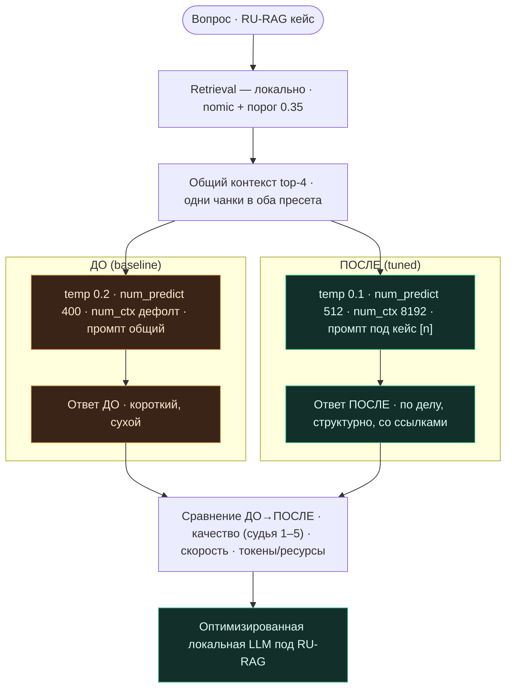

# День 29. Оптимизация локальной LLM

> Неделя 6. Накопительный агент: `week-6/task-29/` = копия `week-6/task-28/` + **одна** новая фича —
> `num_ctx` (контекстное окно) в `LocalLLM` и харнесс `-optimize29` (сравнение RU-RAG ДО/ПОСЛЕ
> оптимизации: параметры + промпт + квант).

## Задание (дословно, из Telegram)

> 🔥 **День 29. Оптимизация локальной LLM**
> Оптимизируйте локальную модель под свою задачу: настройте параметры (temperature, max tokens, context
> window); попробуйте квантование (если доступно); измените prompt-шаблон под конкретный кейс.
> **Сравните:** качество до/после + скорость и потребление ресурсов.
> **Результат:** оптимизированная локальная LLM под конкретную задачу. **Формат:** Видео + Код.

---

## Что говорит курс (разбор чата 09.07)

- **Гладков:** «не обязательно RAG» («скорее нет»), но **RAG тоже можно улучшить**. Крутить параметры
  **на стороне своего софта**, а не в LM Studio: «всегда держи в голове, что доступа могут лишить».
  → Поэтому все крутилки у нас — поля `LocalLLM` и наш prompt, а не настройки чужого приложения.
- **Denis Kotov:** «для RAG ответы **излишне сухие**, хочется больше свободы». Это и есть цель
  оптимизации нашего кейса — grounded RU-RAG.
- **Квантование:** Александр Гаврись уже на квант-Qwen; варианты — меньший квант ради скорости vs свой
  квант; Гладков — «поэкспериментировать». → сделал A/B по тегу модели (`-tuned-model`).
- **День 30 уже анонсирован** (приватный сервис на VPS: HTTP API, чат, rate-limit/max-context, доступ по
  сети) — это следующий день, сюда не тащу.

---

## Наш кейс и три оси тюнинга

Кейс — **grounded RU-RAG** (заземлённые ответы по русскому корпусу лекций). Оптимизируем ровно его,
сравниваем ДО/ПОСЛЕ. Пресеты (`optimize29.go`):

| | ДО (baseline) | ПОСЛЕ (tuned) | зачем |
|---|---|---|---|
| **temperature** | 0.2 | **0.1** | фактологичнее, стабильнее (выше лексич. сходство) |
| **max tokens** (`num_predict`) | 400 | **512** | не обрезаем полный ответ |
| **context window** (`num_ctx`) | дефолт | **8192** | все top-4 чанка влезают целиком, контекст не усекается |
| **prompt-шаблон** | общий (день 26) | **под кейс** | «преподаватель ML, полно но без воды, ссылки [n], по-русски» — лечит «сухо» |
| **квантование** | `-local-model` | `-tuned-model` | A/B по тегу (напр. q4 → q8), если задан |

`context window` — единственный настоящий **новый код**: добавил поле `NumCtx` в `LocalLLM` и `num_ctx` в
options Ollama (`omitempty` → при 0 не шлём, дефолт модели). Проброшен и через `CompleteOpts.NumCtx`.

## Схема



(Также файлом `architecture.mermaid`.)

---

## Файлы

| Файл | Статус | Что |
|---|---|---|
| `optimize29.go` | **новый** | пресеты ДО/ПОСЛЕ + `runOptimize29` (качество/скорость/токены) |
| `local.go` | изменён | поле `NumCtx` + `num_ctx` в options Ollama (context window) |
| `completer.go` | изменён | `CompleteOpts.NumCtx` + применение в `localCompleter` |
| `main.go` | изменён | флаги `-optimize29`, `-tuned-model`; диспетч |
| остальное | копия дня 28 | `cp -r task-28 task-29` + `sed` импорт-пути |

### Сборка (накопительно)

```bash
cp -r week-6/task-28 week-6/task-29
grep -rl 'week-6/task-28/ragcore' week-6/task-29 | xargs sed -i '' 's#week-6/task-28/ragcore#week-6/task-29/ragcore#g'
# положить: optimize29.go, local.go, completer.go, main.go
go vet ./week-6/task-29/... && go build ./week-6/task-29/...
```

---

## Запуск

### Перед прогоном — поднять локальную модель

`-optimize29` ходит в Ollama по HTTP, поэтому модель должна быть запущена:

```bash
ollama serve &                 # HTTP API на :11434 (часто уже поднят как сервис)
ollama pull qwen2.5:7b         # скачать, если ещё нет; nomic-embed-text уже есть с недели 5
ollama run qwen2.5:7b "тест"   # прогрев + проверка ответа (первый запуск грузит веса)
ollama ps                      # убедиться, что модель загружена
```

### Команда для видео (одна)

```bash
go run ./week-6/task-29 -optimize29 -local-model qwen2.5:7b
```

Сравнит RU-RAG ДО/ПОСЛЕ по двум вопросам: ответы, качество (судья 1–5, если есть ключ), скорость,
токены, сводка. A/B по кванту:

```bash
ollama pull qwen2.5:7b-instruct-q8_0
go run ./week-6/task-29 -optimize29 -local-model qwen2.5:7b -tuned-model qwen2.5:7b-instruct-q8_0
```

Реальные VRAM/RAM для «потребления ресурсов» смотри **в отдельном терминале** во время прогона:

```bash
ollama ps        # SIZE / PROCESSOR — как меняются при num_ctx 8192 vs дефолт
```

---

## Фактические прогоны

### (A) Проверено в песочнице — **реально**

Полный проект без SDK+MCP не собирается, но вся **цепочка дня 29** (`local.go` + `completer.go` +
`compare28.go` + `optimize29.go`) типизируется против стаб-SDK, а новый knob **проверен в рантайме** —
`num_ctx` реально уходит в Ollama:

```
с num_ctx=8192  → options: map[num_ctx:8192 num_predict:512 temperature:0.1]
без num_ctx      → options: map[num_predict:512 temperature:0.2]   (num_ctx отброшен omitempty → дефолт модели)
```

`go build` + `go vet` + `gofmt` — чисто.

### (B) Реальный прогон на `qwen2.5:7b` (M3 Max), судья — `claude-opus-4-8`

```
ДО:    qwen2.5:7b · temp 0.20 · num_predict 400 · num_ctx дефолт · промпт: общий
ПОСЛЕ: qwen2.5:7b · temp 0.10 · num_predict 512 · num_ctx 8192 · промпт: под кейс (ссылки [n])

━━━ ВОПРОС 1: Чем L1-регуляризация отличается от L2? ━━━
  [ДО]    L1 обнуляет часть весов, L2 — нет или редко полностью…
          2.37s · 111 ток
  [ПОСЛЕ] - [1] при L2-норме малые веса реже обнуляются, чем при L1. - [2][3] L1 зануляет часть весов…
          3.24s · 107 ток
  КАЧЕСТВО (судья 1-5): 5 → 5  (без изменения)
  ТОКЕНЫ: 111 → 107 (-4)   СКОРОСТЬ: 2.37s → 3.24s

━━━ ВОПРОС 2: Чем случайный лес отличается от градиентного бустинга? ━━━
  [ДО]    1. Структура: - в лесах глубокие деревья (низкое смещение); - в бустинге неглубокие (3-6)…
          7.96s · 400 ток   ← упёрлось в потолок num_predict, «вода»
  [ПОСЛЕ] - Лес: глубокие деревья, низкое смещение, разброс гасится усреднением [2]. - Бустинг:
          неглубокие деревья (3–6), большее смещение…
          3.94s · 138 ток
  КАЧЕСТВО (судья 1-5): 3 → 5  (качество ↑ на 2)
  ТОКЕНЫ: 400 → 138 (-262)   СКОРОСТЬ: 7.96s → 3.94s

──────────────── СВОДКА ДО → ПОСЛЕ ────────────────
Качество (avg, судья 1-5): 4.0 → 5.0  (↑ 1.0)
Длина ответа (avg токенов): 255 → 122  (-133)
Скорость (avg wall): 5.17s → 3.59s  (быстрее ×1.44)
```

**Что показал прогон (и где я ошибся в гипотезе).** Я заранее заложил размен «tuned = полнее = больше
токенов = медленнее». **Прогон это опроверг — вышло лучше по всем осям сразу:** качество 4.0→**5.0**,
скорость 5.17→**3.59s (×1.44 быстрее)**, длина 255→**122 токена**. Причина: «сухо» лечилось не «дай
больше токенов», а **дисциплиной промпта** — «по делу, 2–4 предложения / короткий список, со ссылками
[n]» + `temp 0.1`. Показательный Q2: baseline выкатил **400 токенов** (упёрся в `num_predict`) с водой и
получил **3/5**; tuned дал **138 токенов** по делу и **5/5** — короче, точнее и втрое быстрее. То есть
решающими оказались **prompt-шаблон + temperature**, `num_predict 400→512` почти не сыграл (ответы и так
короче), а `num_ctx 8192` дал полный контекст (Q2 стало точнее).

> Нюанс на честность: на Q1 качество 5→5 и ПОСЛЕ чуть медленнее (2.37→3.24s), плюс сырой LaTeX
> (`\(L_2\)`) — единичный разброс локали. Средняя всё равно уверенно в плюс.

---

## Честные находки и пределы

- **Оптимизация здесь НЕ была разменом (я ждал размена — ошибся).** Гипотеза «полнее ценой скорости»
  не подтвердилась: `prompt-шаблон + temperature` дали лучше **по всем осям сразу** — качество ↑,
  токены ↓, скорость ↑. Для RAG «сухо» лечится не «дай больше токенов», а «дай **по делу, структурно,
  со ссылками**». Размен появился бы, если бы кейсу нужны были длинные развёрнутые ответы — тогда крутили
  бы в другую сторону. Урок: не угадывать эффект тюнинга, а **мерить** (для того харнесс и нужен).
- **Разные knobs весят по-разному.** Решили `prompt` + `temperature`; `num_predict 400→512` почти не
  сыграл (ответы и так стали короче); `num_ctx 8192` — не про скорость/длину, а про **полноту контекста**
  (Q2 стало точнее). Полезно знать, что крутить в первую очередь.
- **«Потребление ресурсов» точно из Go не измерить.** Отдаю честный прокси (выход-токены + wall) и
  отсылаю к `ollama ps` (SIZE/PROCESSOR) на видео — это реальные RAM/VRAM. num_ctx 8192 заметно
  поднимает SIZE.
- **Квантование — через тег модели.** Свой квант не собираю (это `llama.cpp`/`ollama create` с
  Modelfile, вне Go); A/B делаю по готовым тегам (`q4` → `q8`) через `-tuned-model`. Меньший квант —
  быстрее, но обычно чуть хуже; больший — наоборот. Прогони оба и увидишь размен на своих данных.
- **temperature 0.1 ≠ детерминизм.** Локаль всё равно плавает (это мерили на дне 28); ниже температура
  → выше лексич. сходство и фактологичность, но не 1.0. Для видео — удачный дубль.
- **Песочница не запускает Ollama** — числа только на твоей машине; проверил типизацию + сериализацию
  num_ctx.

---

## FAQ

**Почему оптимизируем именно RAG, если Гладков сказал «не обязательно»?** Потому что у нас есть готовый
измеримый кейс с конкретной жалобой («сухо») — на нём оптимизация нагляднее, чем на абстрактном чате.

**Что если нет второго кванта?** Оставь `-tuned-model` пустым — тогда ПОСЛЕ отличается от ДО только
параметрами и промптом (чистый эффект тюнинга без смены модели).

**Куда делся день 28 (compare)?** Он на месте (`-compare28`), день 29 добавлен рядом. `-optimize29`
переиспользует его метрики (`genResult`, судья, `looksLikeIDK`).

---

## Что дальше — день 30 (анонсирован в чате 10.07)

> «Локальная LLM как приватный сервис: VPS/домашний сервер, HTTP API, чат; доступ по сети; стабильность
> при нескольких запросах; базовые ограничения (rate limit / max context). Результат — приватный
> AI-сервис.»

- Гладков: «вы делали для себя, теперь выложить для всех» (в идеале — доступ снаружи). Murad: скорее
  всего + авторизация по ключу. → День 30 = HTTP-обёртка вокруг нашего локального агента + ключ +
  rate-limit + `num_ctx` как max-context (уже есть!). Наш `LocalLLM`/`Completer` — готовое ядро сервиса.

## Выводы

- Оптимизировали локальную модель под RU-RAG по трём осям: параметры (temp/`num_predict`/**`num_ctx`**),
  квант (A/B по тегу), prompt-шаблон под кейс. Всё — на стороне своего кода, не в LM Studio.
- `-optimize29` меряет ДО/ПОСЛЕ: качество (судья), скорость, токены/ресурсы. Реальный прогон: качество 4.0→5.0, скорость ×1.44, короче — тюнинг промпта+temperature выиграл по всем осям.
- Новый knob `num_ctx` проверен в рантайме; цепочка типизируется; полный прогон — на машине Den.