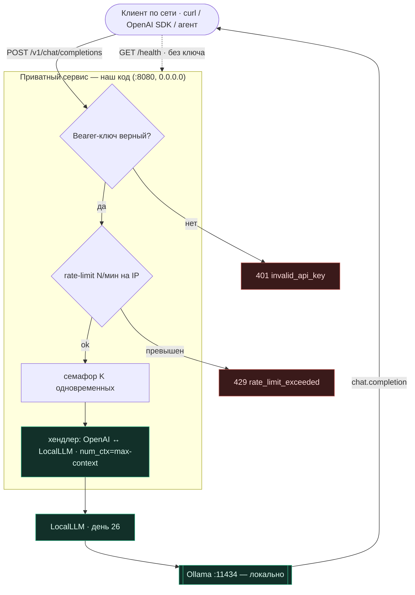

# День 30. Локальная LLM как приватный сервис

> Неделя 6, финал. Накопительный агент: `week-6/task-30/` = копия `week-6/task-29/` + **одна** новая
> фича — `serve30.go`: приватный **HTTP-сервис** на локальной LLM, **OpenAI-совместимый**, с ключом,
> rate-limit и max-context.

## Задание (дословно, из Telegram)

> 🔥 **День 30. Локальная LLM как приватный сервис**
> Разверните локальную LLM как сервис: на VPS или домашнем сервере; с HTTP API; с возможностью чата.
> **Проверьте:** доступ к модели по сети; стабильность при нескольких запросах; базовые ограничения
> (rate limit / max context).
> **Результат:** приватный AI-сервис на базе локальной LLM. **Формат:** Видео + Код.

---

## Что говорит курс (разбор чата 10.07)

- **Гладков:** «вы делали для себя — теперь **выложить для всех**»; в идеале — чтобы «я снаружи тоже мог
  постучаться». **Murad:** «скорее всего + **авторизация по ключу**».
- **Руслан:** доступ по сети = `baseURL` вместо `localhost`, напр. `http://192.168.1.201:1234/v1` —
  путь `/v1` намекает на **OpenAI-совместимый** API (его отдаёт LM Studio).
- **Примеры участников:** Олег поднял `Qwen2.5-1.5B` на VPS 1 vCPU/2GB (криво, но для демо ок); Стас —
  за reverse-proxy с логином/паролем. То есть ожидается: HTTP + аутентификация + доступ по сети + лимиты.

---

## Решение и альтернативы

Ты попросил зафиксировать выбор по каждому пункту. Вот они (выбранное — жирным):

| Аспект | **Выбрано** | Почему | Альтернатива |
|---|---|---|---|
| **API-формат** | **OpenAI `/v1/chat/completions`** | к сервису сразу подходят готовые клиенты (OpenAI SDK, другой агент, LM Studio-совместимые тулы); Руслан упоминал `/v1` | свой простой `/chat {message}→{answer}` — нагляднее, меньше кода, но не стыкуется с экосистемой |
| **Бэкенд** | **только локальная LLM** | это и делает сервис приватным — ноль облачных вызовов, ключ Anthropic не нужен | тумблер cloud/local (шов `Completer` готов) — но тогда не «приватный» |
| **Аутентификация** | **Bearer-ключ** (`Authorization: Bearer …`) | конвенция OpenAI + совет Murad; клиенты шлют его из коробки | basic-auth логин/пароль (как у Стаса); auth на reverse-proxy; mTLS |
| **Rate-limit** | **in-memory токен-бакет на IP** | stdlib, ноль зависимостей, хватает для приватного сервиса | nginx `limit_req`; Redis (для нескольких инстансов); лимит на ключ, а не IP |
| **Max-context** | **`num_ctx`** (день 29) | уже есть knob; задаёт потолок окна модели | обрезать вход по токенам; отклонять длинные запросы |
| **Стабильность при нагрузке** | **семафор конкурентности (K)** | Ollama сам сериализует тяжёлую генерацию; семафор бережёт память и даёт предсказуемость | очередь с приоритетами; несколько инстансов модели за балансировщиком |
| **Стриминг** | **нет** (`stream:false`) | наглядность демо; меньше кода; честно отвечаем 400 на `stream:true` | SSE-стриминг (OpenAI `data:` чанки) |
| **Доступ наружу** | **по сети LAN/VPS** (`0.0.0.0:port`) | твой выбор — проще; для видео достаточно | reverse-proxy (Caddy/nginx) + HTTPS + домен для доступа из интернета |

## Схема



(Также файлом `architecture.mermaid`.)

---

## Эндпоинты

| Метод | Путь | Ключ | Назначение |
|---|---|---|---|
| GET | `/health` | нет | liveness + доступность модели |
| GET | `/v1/models` | да | список моделей (OpenAI) |
| POST | `/v1/chat/completions` | да | чат (OpenAI) |

Ответ чата — стандартный `chat.completion` OpenAI: `choices[0].message.content` + `usage`
(`prompt_tokens`/`completion_tokens`/`total_tokens`, берём из счётчиков Ollama).

---

## Файлы

| Файл | Статус | Что |
|---|---|---|
| `serve30.go` | **новый** | HTTP-сервис: OpenAI-эндпоинты, Bearer-auth, rate-limit, семафор, health + демо-режим `-serve30-demo` |
| `main.go` | изменён | флаги `-serve30 -serve30-demo -addr -api-key -rate-rpm -max-ctx -max-concurrent`; диспетч |
| остальное | копия дня 29 | `cp -r task-29 task-30` + `sed` импорт-пути |

### Сборка (накопительно)

```bash
cp -r week-6/task-29 week-6/task-30
grep -rl 'week-6/task-29/ragcore' week-6/task-30 | xargs sed -i '' 's#week-6/task-29/ragcore#week-6/task-30/ragcore#g'
# положить: serve30.go, main.go
go vet ./week-6/task-30/... && go build ./week-6/task-30/...
```

---

## Запуск

### Команда для видео (одна — сама всё покажет)

```bash
ollama serve &            # если не запущен
ollama pull qwen2.5:7b    # если нет
go run ./week-6/task-30 -serve30-demo -local-model qwen2.5:7b
```

Вариант со **своим ключом в кадре** (иначе демо подставит дефолтный `demo-key`):

```bash
SERVICE_API_KEY=ai2026 go run ./week-6/task-30 -serve30-demo -local-model qwen2.5:7b
```

`-serve30-demo` поднимает сервис, **сам прогоняет все проверки** (health, чат с ключом → реальный ответ,
без ключа → 401, `/v1/models`, `stream` → 400, rate-limit → 429), печатает отчёт и **оставляет сервис
работать** — чтобы ты показал доступ по сети с другого устройства (см. ниже). Одна команда = весь день 30.

Для реального деплоя (без авто-проверок, просто сервис до Ctrl+C) — режим `-serve30`:

### 1. Поднять локальную модель и сервис (ручной режим)

```bash
ollama serve &
ollama pull qwen2.5:7b

SERVICE_API_KEY=ai2026 go run ./week-6/task-30 -serve30 \
  -local-model qwen2.5:7b -addr :8080 -rate-rpm 20 -max-ctx 4096 -max-concurrent 2
```

Сервис слушает `:8080` на всех интерфейсах → доступен по сети как `http://<ip-машины>:8080`
(узнать IP: `ipconfig getifaddr en0` на macOS). Ключ можно и флагом: `-api-key ai2026`.

### 2. Дёрнуть по HTTP (то, что показать на видео)

```bash
# health — без ключа
curl http://localhost:8080/health

# чат в формате OpenAI — с ключом
curl http://localhost:8080/v1/chat/completions \
  -H "Authorization: Bearer ai2026" -H "Content-Type: application/json" \
  -d '{"model":"qwen2.5:7b","messages":[{"role":"user","content":"Что такое бэггинг?"}]}'

# по сети с другой машины — тот же запрос на http://<ip>:8080/...
```

Поскольку API **OpenAI-совместимый**, к сервису подходит и официальный клиент:

```python
from openai import OpenAI
c = OpenAI(base_url="http://<ip>:8080/v1", api_key="ai2026")
print(c.chat.completions.create(model="qwen2.5:7b",
      messages=[{"role":"user","content":"Что такое бэггинг?"}]).choices[0].message.content)
```

---

## Фактические прогоны

### (A) Проверено в песочнице — **реально**

`serve30.go` использует только stdlib + наш `LocalLLM`, поэтому я **поднял сервис против фейкового
Ollama и подёргал его по HTTP** (это проверяет весь путь: auth → rate-limit → OpenAI-маппинг):

```
GET  /health                          [200] {"model":"qwen2.5:7b","status":"ok"}
POST /v1/chat/completions (без ключа)  [401] {"error":{"type":"invalid_api_key",...}}
POST /v1/chat/completions (с ключом)   [200] {"object":"chat.completion",
       "choices":[{"index":0,"message":{"role":"assistant","content":"…"},"finish_reason":"stop"}],
       "usage":{"prompt_tokens":12,"completion_tokens":34,"total_tokens":46}}
rate-limit (rpm=3)                     сработал на 4-м запросе → [429] rate_limit_exceeded
GET  /v1/models                        [200] {"object":"list","data":[{"id":"qwen2.5:7b",...}]}
POST stream=true                       [400] {"error":{"type":"unsupported",...}}  ← честный отказ
```

`go build` + `go vet` + `gofmt` — чисто. Живая модель — на твоей машине.

### (B) Реальный прогон `-serve30-demo` на `qwen2.5:7b` (M3 Max)

Одна команда сама печатает весь отчёт:

```
Модель:   ollama/qwen2.5:7b (локально, без облака)
Адрес:    http://localhost:8080  (по сети: http://<ip-машины>:8080)
Лимиты:   20 req/min на IP · 2 одновременно · num_ctx 4096

━━━ ПРОВЕРКА 1: /health (без ключа) ━━━
  GET /health → [200]  {"model":"qwen2.5:7b","status":"ok"}

━━━ ПРОВЕРКА 2: чат БЕЗ ключа → должен быть 401 ━━━
  POST /v1/chat/completions → [401]  {"error":{"type":"invalid_api_key",...}}

━━━ ПРОВЕРКА 3: чат С ключом → ответ локальной модели (OpenAI-формат) ━━━
  POST /v1/chat/completions → [200]
  ответ: Бэггинг (Bootstrap aggregating) — метод, уменьшающий вариацию алгоритмов и повышающий
         точность за счёт множества независимых моделей…  [usage: prompt 38, completion 495]

━━━ ПРОВЕРКА 4: /v1/models (OpenAI) ━━━
  GET /v1/models → [200]  {"data":[{"id":"qwen2.5:7b","object":"model","owned_by":"local"}],...}

━━━ ПРОВЕРКА 5: stream=true → честный 400 (не поддержан) ━━━
  POST /v1/chat/completions → [400]  {"error":{"type":"unsupported",...}}

━━━ ПРОВЕРКА 6: rate-limit (20/мин на IP) — жмём подряд, ловим 429 ━━━
  коды подряд: [200 ×18 · 429 ×5]
  → rate-limit сработал на запросе #19 (429)

──────────────── ИТОГ ────────────────
Сервис ПРОДОЛЖАЕТ РАБОТАТЬ: локально http://localhost:8080 · по сети http://<ip-машины>:8080
```

Разбор: чат отдал живой ответ (495 токенов, формат OpenAI с `usage`); rate-limit сработал на 19-м —
сходится (демо уже потратило 2 токена из 20 в проверках 3–4, значит 18×`200`, затем `429`). Ключ в
проверке 3 — `demo-key` (демо-режим подставляет дефолт, если не задан `SERVICE_API_KEY`); для своего
ключа в кадре — `SERVICE_API_KEY=ai2026 go run … -serve30-demo`.

**Для видео добавь только доступ по сети:** сервис остаётся живым, поэтому с другого устройства в той же
сети дёрни `curl http://<ip>:8080/v1/chat/completions -H "Authorization: Bearer <ключ>" …` — это закрывает
пункт «доступ к модели по сети». `<ip>` = `ipconfig getifaddr en0` (macOS). Плюс `ollama ps` в соседнем
окне — что модель локальная.

---

## Деплой на VPS / домашний сервер (для «наружу»)

- **Домашний сервер / LAN:** запусти как выше, открой порт в файрволе, ходи по `http://<lan-ip>:8080`.
- **VPS:** та же команда; для интернета — **не** выставляй `:8080` голым наружу, а поставь reverse-proxy
  (Caddy даёт HTTPS в одну строку) и проксируй на `127.0.0.1:8080`. Тогда ключ идёт по TLS. Это
  альтернатива из таблицы, её я не кодил (твой выбор — «только по сети»), но путь понятен.
- **Слабый VPS без GPU** (как у Олега, 1 vCPU/2GB): бери маленькую модель — `-local-model qwen2.5:1.5b`.
  Работает на CPU, медленнее, но для приватного демо-сервиса ок.

---

## Честные находки и пределы

- **Песочница не запускает Ollama** — сервис проверен против фейкового Ollama (весь HTTP-путь реален),
  живая генерация — на твоей машine.
- **Rate-limit — на IP и in-memory.** Сбрасывается при рестарте, не шарится между инстансами. Для
  приватного сервиса норм; для продакшена — Redis/nginx (в таблице).
- **Стриминг не поддержан** — на `stream:true` честно отвечаем `400`, а не молчим. Клиенты, требующие
  стрим, надо звать с `stream:false`.
- **Семафор ≠ очередь.** При K занятых слотах новые запросы ждут освобождения (в пределах таймаута
  клиента). Это бережёт память, но под шквалом лучше очередь/несколько инстансов.
- **`max-ctx` — это потолок окна, не «умное» усечение.** Очень длинный диалог всё равно может упереться;
  умную обрезку истории оставил на потом.
- **Открытый режим.** Без `-api-key` сервис открыт — баннер об этом предупреждает. Для «приватного»
  всегда задавай ключ.

---

## FAQ

**Почему OpenAI-формат, а не свой?** Чтобы к сервису подходили готовые клиенты (SDK, агенты). Свой JSON
нагляднее, но приватный сервис ценнее совместимым — тогда его можно воткнуть куда угодно как «локальный
OpenAI».

**Это точно приватно?** Да: бэкенд — только локальная модель, ни одного облачного вызова, ключ Anthropic
не нужен. «Приватность» тут = данные не покидают твою машину + доступ по ключу.

**Чем отличается от дней 26–29?** Там мы дёргали модель из своего же процесса (CLI). Здесь — **сетевой
сервис**: к модели можно постучаться по HTTP с другой машины, с аутентификацией и лимитами.

## Итог недели 6

- **26** запуск локальной LLM → **27** агентские флоу на локали (тумблер `Completer`) → **28** локальный
  RAG + сравнение/оценка → **29** оптимизация под кейс → **30** приватный сетевой сервис.
- День 30: локальная модель отдаётся по сети как OpenAI-совместимый сервис с ключом, rate-limit и
  max-context — приватно, без облака. Все три «проверьте» закрыты. Ядро (`LocalLLM` + `num_ctx`)
  переиспользовано, новый код — только HTTP-обвязка.