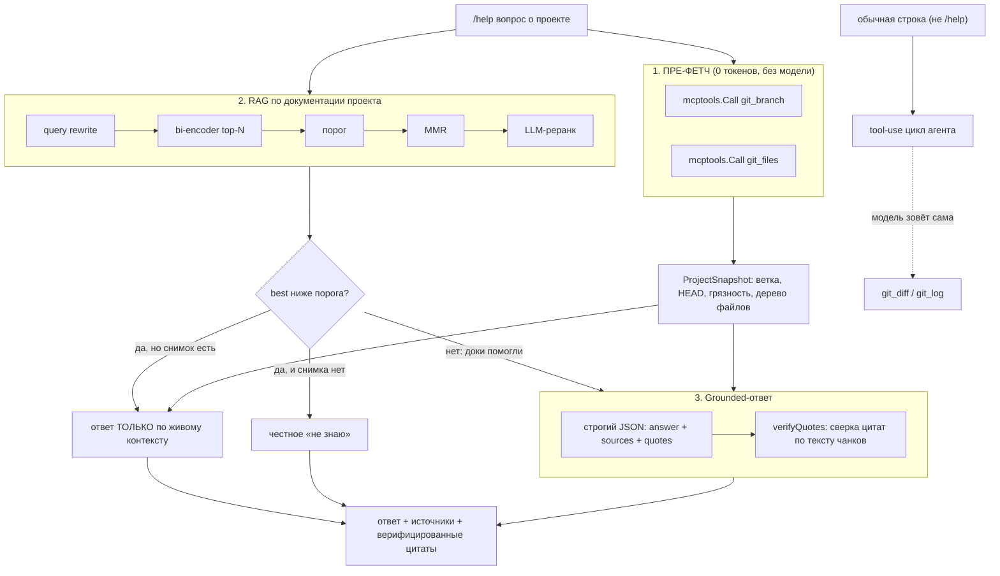

# День 31. Ассистент разработчика

> Неделя 7. Накопительный агент: `week-7/task-31/` = копия `week-6/task-30/` + **одна** новая
> фича — `/help`: ассистент, понимающий проект. Два источника в одном ответе: **документация
> проекта** (RAG) и **живой контекст проекта** (git через MCP).

## Задание (дословно, из Telegram)

> 🔥 **День 31. Ассистент разработчика**
>
> Используйте RAG для подключения к документации вашего проекта:
> 👉 README
> 👉 project/docs
> 👉 схемы данных или API-описания
>
> Через MCP подключите ассистента к проекту:
> 👉 минимум — получение текущей git-ветки
> 👉 по желанию — список файлов или diff
>
> Реализуйте команду:
> 👉 `/help` — ассистент отвечает на вопросы о проекте
> 👉 использует документацию и контекст проекта
>
> **Минимальный результат:**
> 👉 README + папка docs в RAG
> 👉 MCP — хотя бы git branch
> 👉 `/help` отвечает на вопросы о структуре проекта
>
> **Результат:** Ассистент разработчика, понимающий проект. **Формат:** Видео + Код

## Что говорит курс (разбор чата и лекции недели 7)

- **Лекция:** неделя заключительная, посвящена сборке всего вместе. Темы: субагенты
  (fan-out / chain / router), system tooling (Tool Registry → Executor), AI-пайплайны,
  error handling с human-in-the-loop, метрики (latency / cost / quality / reliability).
  Установка Гладкова: «берите реальные продукты, заморочьтесь на архитектуру и рефакторинг,
  выйдите не с демо-образцом».
- **Опасные операции.** Лекция отдельно требует гейта на `rm`, `git push`, правку конфигов —
  «примерно по схеме, как вы раньше инварианты делали». См. «Честные находки»: мы решили это
  иначе, и это осознанно.
- **Гладков (13.07):** «на этой неделе задания довольно конкретные, тут нужно **именно с
  гитом** поработать». GitLab тоже засчитывается.
- **Гладков (14.07):** «с этой недели **опять можно облачную**» модель. Это сняло вопрос
  локализации реранка — он остаётся облачным (Haiku).
- **День 32 уже вышел** (реактивный пайплайн: PR → diff → RAG «документация + код» → ревью
  комментами в PR). Он определил часть решений дня 31 — см. ниже.
- **Из чата:** Temi4 спрашивал про крон на переиндексацию; Denis Kotov: «у меня 700 файлов,
  индексация 20–30 минут». У нас корпус — 46 файлов, крон не нужен; честный ответ в FAQ.
- **Anastasiya:** «можно взять другую репу, не текущую». **Denis Abrashkin:** «жёсткий бульон:
  код-ассистент, который помогает по кодовой базе самописного код-агента». Мы осознанно взяли
  свой проект — см. «Решение и альтернативы».

## Решение и альтернативы

### 1. Что индексировать (корпус RAG)

| Вариант | Плюсы | Минусы | Итог |
|---|---|---|---|
| **Каталог `week-7/task-31` целиком** | один срез кода; настоящая папка `docs/`; готов к дню 32 | документации не было — её пришлось написать | **выбрано** |
| Весь репозиторий `ai-challenge` | больше текста | **11 почти идентичных копий агента** (`task-21…task-31` — накопительность!): поиск поднимал бы один и тот же чанк из десяти разных дней; MMR это не лечит | отклонено |
| Рабочий проект (внутренний GitLab) | «настоящий» проект | GitHub Action дня 32 туда не поставить; код закрытый | отклонено |
| Подмешать доки к корпусу лекций | ничего не собирать | разные домены в одном индексе — гарантированная деградация поиска | отклонено |

**Следствие выбора:** папки `docs/` у проекта не было — значит день 31 включает написание
проектной документации. Она и есть корпус:

| Файл | Что | Пункт задания |
|---|---|---|
| `readme.md` | этот файл | README |
| `docs/architecture.md` | слои агента, `Completer`, FSM, инварианты, RAG, `/help` | project/docs |
| `docs/mcp-tools.md` | все MCP-серверы и их тулы, контракты вход/выход | **API-описания** |
| `docs/index-format.md` | `ragcore.Chunk` / `ragcore.Index`, стратегии chunking, эмбеддер | **схемы данных** |
| `docs/cli.md` | все флаги и команды REPL | project/docs |

Плюс в индекс идёт **сам код агента** (`.go`): день 32 требует RAG по «документации **и
коду**», поэтому корпус собран сразу под оба дня.

### 2. MCP git-сервер: свой, и только на чтение

Свой (`gitserver/`) — по образцу `weatherserver` (день 17) и `notesserver` (день 20). Каркас
`ConnectMCP` уже был, добавился третий `ServerSpec`.

Четыре тула вместо минимального одного: `git_branch`, `git_files`, `git_diff`, `git_log`.
Причина не в жадности: **день 32 без `git_diff` не существует**. Сделать сегодня «только
`git_branch`» — значит переписывать сервер завтра.

**Только чтение — архитектурно.** Белый список подкоманд (`rev-parse`, `status`, `ls-files`,
`diff`, `log`), запись невозможна по построению.

### 3. Как `/help` получает git-контекст: **гибрид**

| Вариант | Что даёт | Чем плох |
|---|---|---|
| **Гибрид (выбрано)** | ветка и структура — детерминированным пре-фетчем (0 токенов, есть в **каждом** ответе, работает и на локали); diff/log — тулами в tool-use цикле | две дороги вместо одной |
| Только пре-фетч | максимально детерминированно | diff в каждый промпт не затащить — он бывает на десятки КБ |
| Только tool-use | модель сама решает, что дёрнуть | прибивает `/help` к облаку; 7B-локаль tool-calling не потянет; контекст проекта появляется, только «если модель догадается» |

Отсюда распределение в REPL:

- `/help <вопрос>` → пре-фетч (`git_branch` + `git_files` прямым вызовом `mcptools.Call`) +
  RAG по докам → grounded-ответ с источниками и цитатами;
- обычная строка → tool-use цикл агента, где `git_diff` / `git_log` доступны модели как тулы.

### 4. Порог «не знаю» в `/help` означает не то, что в дне 24

`groundedReply` (день 24) при `best < threshold` сразу отвечает «не знаю» — он знает ровно
**один** источник. Но `/help` знает **два**. Вопрос «какая сейчас ветка?» по документации не
находит ничего (и правильно — этого нет ни в одном README), и старый порог убил бы ответ,
хотя ответ уже лежит в пре-фетче.

Поэтому в `helpReply` порог означает **«документация не помогла»**:

- чанков нет **и** контекста проекта нет → честное «не знаю»;
- чанков нет, но контекст проекта есть → отвечаем **только по нему** (`sources` пуст);
- чанки есть → обычный grounded-ответ с цитатами + контекст проекта сверху.

Дни 24–25 не тронуты — у них свой `groundedReply`.

### 5. Контекст проекта — не источник для цитирования

`git branch` — это **состояние мира**, а не документ: у него нет `chunk_id`, цитировать его
как знание нельзя. Поэтому он уходит в промпт отдельным блоком (`Agent.SetProjectContext`) и
**не участвует в верификации цитат** — иначе модель сочинила бы `chunk_id`, и `verifyQuotes`
пометил бы цитату как выдуманную (проходили на дне 24).

## Схема



## Файлы

### Новые (6)

| Файл | Что |
|---|---|
| `gitserver/main.go` | третий MCP-сервер: `git_branch`, `git_files`, `git_diff`, `git_log`. Только чтение, белый список подкоманд, валидация аргументов |
| `help31.go` | `ProjectSnapshot`, пре-фетч, `helpReply`, `runHelp` (REPL), `runHelp31` (демо для видео), `defaultGitScope` |
| `docs/architecture.md` | документация: архитектура (слои, `Completer`, FSM, RAG, `/help`) |
| `docs/mcp-tools.md` | документация: **API-описание** всех MCP-тулов |
| `docs/index-format.md` | документация: **схема данных** индекса (`ragcore.Chunk` / `Index`) |
| `docs/cli.md` | документация: все флаги и команды REPL |

### Изменённые (6 + readme)

| Файл | Строк | Что именно |
|---|---:|---|
| `ragindex/chunk.go` | 214 | потолок размера чанка: `mdMaxRunes` + `packMarkdown` + `atomizeMarkdown` (для `.md`), `goMaxRunes` + `packGo` (для `.go`) — фикс тихой потери recall |
| `main.go` | 59 | третий `ServerSpec` (git); флаги `-help31` / `-index-docs` / `-help-know-threshold` / `-git-scope`; диспетч `-help31` после `ConnectMCP`; команда `/help` в REPL; счётчик серверов больше не захардкожен в `2` |
| `cite.go` | 19 | `groundedAnswer` подмешивает блок «КОНТЕКСТ ПРОЕКТА» и запрещает цитировать его; `buildGroundedContext` терпит пустые hits |
| `agent.go` | 14 | поле `projCtx` + `SetProjectContext` / `ProjectContext` |
| `ragindex/report.go` | 14 | `defaultSkipDirs`: исключены `corpus-ru`, `ragindex-ru`, `ragindex-docs` |
| `ragindex/main.go` | 45 | `os.MkdirAll` для `-out` + fail fast; отчёт об усечениях **по стратегиям** — оба фикса с реальных прогонов |
| `help31.go` | — | фикс инвертированного булева (`Call` возвращает `isError`, а не `ok`); шапка со счётчиками файлов не выбрасывается, а идёт в промпт |
| `gitserver/main.go` | — | `git_files` смотрит **рабочее дерево** (`--cached` + `--others --exclude-standard`), а не только индекс git |
| `main.go` | +1 | дефолт `-rerank-model` → `claude-haiku-4-5-20251001` (прежний ретайрнут, 404) |
| `agent.go` | +40 | tool-use цикл: пустой список блоков больше не превращается в невалидное сообщение; `nonEmpty()`; диагностика по типам блоков |
| `gitserver/main.go` | — | `git_branch`: `--untracked-files=all` + раздельные счётчики «изменённых / новых» |
| `help31.go` | — | классификация ответа по `rep.Sources`, а не по порогу retrieval |
| `readme.md` | — | переписан под день 31 |

### Не тронуты, но отличаются от `task-30`

`chat.go`, `compare28.go`, `eval.go`, `local26.go`, `optimize29.go`, `rag.go`, `rag23.go`,
`rerank.go`, `ragindex/compare.go` — в них **ноль** содержательных правок.
Отличие ровно одно: `sed`-переписывание импорт-пути `week-6/task-30/ragcore` →
`week-7/task-31/ragcore`, то есть обычный ритуал накопительности.

Проверяется так (должны быть нули):

```bash
for f in chat.go compare28.go eval.go local26.go optimize29.go rag.go rag23.go rerank.go; do
  printf "%-16s %s\n" "$f" \
    "$(diff <(sed 's#week-6/task-30#week-7/task-31#g' week-6/task-30/$f) week-7/task-31/$f | grep -c '^[<>]')"
done
```

## Запуск

### Что чем считается (и почему нужны ОБА бэкенда)

Частый вопрос: «локальную LLM запускать надо?» Надо — но **только как векторизатор**. Это то
самое различие, которое разбиралось на дне 26: модели бывают **векторизующие** (эмбеддер,
`/api/embeddings`, отвечать не умеет) и **генерирующие** (LLM, `/api/chat`).

| Что делает день 31 | Чем считается | Нужна Ollama | Нужен `ANTHROPIC_API_KEY` |
|---|---|:--:|:--:|
| Индексация корпуса (шаг 2) | `nomic-embed-text` | **да** | нет |
| Эмбеддинг запроса при `/help` | `nomic-embed-text` | **да** | нет |
| Query rewrite + LLM-реранк | Haiku (облако) | нет | **да** |
| Grounded-ответ + tool-use цикл | Opus (облако) | нет | **да** |
| Пре-фетч git-контекста, MCP-серверы | сам `git` | нет | нет |

Генерирующая локальная модель (`qwen2.5:7b`) в дне 31 **не нужна**: `-backend` по умолчанию
`cloud`, и Гладков вернул разрешение на облако с этой недели. Она понадобится, только если
захочешь прогнать `/help` через `-backend local` (не проверено, см. «Пределы»).

### Шаг 0. Предусловия

```bash
# Go 1.25.x
go version

# Ollama с ЭМБЕДДЕРОМ (генерирующая модель для дня 31 не нужна)
ollama serve                       # если не запущена
ollama pull nomic-embed-text
curl -s localhost:11434/api/tags | grep nomic     # должен найтись

# Ключ облака — в .env в корне репозитория
echo 'ANTHROPIC_API_KEY=sk-ant-...' >> .env

# Проект должен лежать ВНУТРИ git-репозитория:
# gitserver ищет корень через `git rev-parse --show-toplevel`
git -C week-7/task-31 rev-parse --show-toplevel
```

### Шаг 1. Сборка (накопительно)

```bash
cp -r week-6/task-30 week-7/task-31
grep -rl 'week-6/task-30/ragcore' week-7/task-31 | xargs sed -i '' 's#week-6/task-30/ragcore#week-7/task-31/ragcore#g'
# положить: gitserver/main.go, help31.go, docs/*.md, agent.go, cite.go, main.go,
#           ragindex/chunk.go, ragindex/report.go, readme.md

go vet ./week-7/task-31/... && go build ./week-7/task-31/...
gofmt -l week-7/task-31          # должно быть пусто
```

### Шаг 2. Собрать индекс документации проекта

Это корпус `/help`: `readme.md` + `docs/*.md` + весь код агента (`.go`).
Нужна **только Ollama**, ключ облака здесь не используется.

```bash
go run ./week-7/task-31/ragindex \
  -out week-7/task-31/ragindex-docs \
  -ext .md,.go
```

Ожидаемо: **46 файлов → ~634 structural-чанка** (fixed-size — ~114), dim=768. В конце —
отчёт об усечениях **по стратегиям**:

```
Усечено на эмбеддинге (лимит 1800 символов):
  structural: 0 из 634 чанков  ← это индекс, который использует агент; потолок чанка держит
  fixed-size: 85 из 114 чанков  ← ожидаемо: -chunk-size задан в СЛОВАХ (500 ≈ 3000 символов > лимита)
               fixed-size — только baseline для сравнения, агент его не читает.
```

**Смотреть надо на строку `structural` — там должен быть ноль.** Ненулевой `fixed-size` — не
беда: 500 слов ≈ 2900 символов, он превышал лимит эмбеддера с самого дня 21, и это неотъемлемое
свойство baseline-стратегии, а не регрессия.

Число чанков немного плавает: корпус включает и сам этот `readme.md`, поэтому правка README
меняет счётчик. Что не должно меняться — нулевые усечения в `structural`.

Быстрая проверка без Ollama (только chunking и сравнение стратегий, эмбеддинги пропускаются):

```bash
go run ./week-7/task-31/ragindex -out week-7/task-31/ragindex-docs -ext .md,.go -dry-run
```

Можно сразу проверить поиск: `-query` пересобирает индекс и прогоняет по нему top-k **по обеим
стратегиям** — удобно, чтобы одной командой убедиться, что корпус ищется:

```bash
go run ./week-7/task-31/ragindex \
  -out week-7/task-31/ragindex-docs -ext .md,.go \
  -query "что такое Completer и зачем он нужен" -k 3
```

### Шаг 3. Команда для видео (одна — сама всё покажет)

```bash
go run ./week-7/task-31 -help31
```

Печатает по шагам:

1. **MCP** — три сервера, тулы git-сервера, живой вызов `git_branch` (без модели, 0 токенов),
   `git_files`, размер блока «КОНТЕКСТ ПРОЕКТА».
2. **RAG** — подключённый индекс документации, порог и его шкала.
3. **Шесть вопросов через `/help`**, каждый бьёт в свой источник: архитектура → схема данных →
   API тулов → флаги CLI → **живой git** (в документации этого нет) → **заведомо чужой вопрос**
   (ожидаем честное «не знаю»). На каждом: ответ, источники, цитаты со сверкой по тексту
   чанков, трасса retrieval.
4. **Diff по требованию** — обычный tool-use: модель сама зовёт `git_diff` / `git_log`.
5. **Итог** — чеклист задания.

Чтобы на видео был непустой diff (шаг 4), достаточно любой незакоммиченной правки:

```bash
echo "# проверка diff" >> week-7/task-31/docs/cli.md
go run ./week-7/task-31 -help31
git checkout -- week-7/task-31/docs/cli.md    # откатить после записи
```

### Шаг 4. Интерактивный режим

```bash
go run ./week-7/task-31

> /help какие MCP-серверы подключены и что умеет git-сервер?
> /help что лежит в чанке индекса и какие есть стратегии chunking?
> /help на какой я ветке и сколько файлов в проекте?
> покажи через git, что сейчас изменено в рабочем дереве
> /mem
> exit
```

Первые три идут через `/help` (пре-фетч + RAG + цитаты). Четвёртая — **без слэша**: это обычный
tool-use цикл, где модель сама зовёт `git_diff` / `git_log`. В этом и состоит гибрид.

### Полезные варианты запуска

```bash
# другой индекс / другой каталог проекта для git_files
go run ./week-7/task-31 -help31 \
  -index-docs week-7/task-31/ragindex-docs/index-structural.json \
  -git-scope week-7/task-31

# отключить LLM-реранк (retrieval только bi-encoder + MMR)
# ВАЖНО: тогда score — косинус (0..1), и порог надо переводить в ту же шкалу
go run ./week-7/task-31 -help31 -rerank=false -help-know-threshold 0.35

# больше чанков в контексте
go run ./week-7/task-31 -help31 -rag-k 6 -topn 15

# /help на локальной генерации (НЕ ПРОВЕРЕНО — grounded-ответ требует строгого JSON)
ollama pull qwen2.5:7b
go run ./week-7/task-31 -help31 -backend local -local-model qwen2.5:7b
```

### Если что-то не поднялось

| Симптом | Причина | Что делать |
|---|---|---|
| `RAG: индекс … не найден` | не собран индекс документации | выполнить шаг 2 |
| `индекс … пуст или без векторов` | собран с `-dry-run` | пересобрать без `-dry-run` |
| `[контекст проекта] недоступен` | MCP не поднялся или проект вне git-репозитория | посмотреть `git.log` рядом с `main.go`; проверить `git rev-parse --show-toplevel` |
| `/help` на всё отвечает «не знаю» | порог и score в разных шкалах (урок дня 27) | с реранком порог ~3.0 (шкала 0–10), без реранка ~0.35 (косинус) |
| ошибки эмбеддинга / пустой поиск | `-embed-model` не совпал с моделью индекса | обе должны быть `nomic-embed-text` |

## Фактические прогоны

### (A) Проверено в песочнице — **реально**

- `go build` и `go vet` — чисто, на **Go 1.25.9** (та же версия, что на рабочей машине;
  `anthropic-sdk-go` и `go-sdk/mcp` подтянуты настоящие).
- **`gitserver` поднят как MCP-сабпроцесс и опрошен по-настоящему** (без Ollama и без ключа):
  `ListTools` вернул 4 тула; `git_branch`, `git_files`, `git_log`, `git_diff --stat`
  отработали на живом репозитории.
- **Проверки безопасности git-сервера — отбились все три:**

```
── git_files {"path":"--output=/tmp/pwned"}
   ошибка: аргумент "--output=/tmp/pwned" начинается с дефиса — запрещено (выглядит как флаг git)
── git_diff {"ref":"../../../etc"}
   ошибка: выход за пределы репозитория запрещён: "../../../etc"
── git_diff {"ref":"HEAD; rm -rf /"}
   ошибка: недопустимый символ ';' в аргументе "HEAD; rm -rf /"
```

- **Индексация корпуса прогнана (`-dry-run`, эмбеддинги пропущены):** 46 файлов, ~41 650
  слов; structural = **629 чанков**, fixed-size = 113. Целостных границ: structural 79%
  против fixed-size 42%.

### (B) Реальный прогон на рабочей машине (MacBook M3 Max) — **полный, все 4 шага**

**Индексация:** 46 файлов → structural **654 чанка**, dim=768. Усечено на эмбеддинге:
`structural: 0 из 654` (потолок держит), `fixed-size: 92 из 121` (ожидаемо, baseline).

**Шаг 1 — MCP:** 16 тулов с 3 серверов, ленивый режим.

```
git_branch (прямой вызов тула, без модели):
   репозиторий: ai-challenge
   ветка: main
   HEAD: 96066bf
   рабочее дерево: изменённых (видит git diff): 0 · новых, не в индексе: 79

git_files: файлов: 79 (под git: 0, новых — ещё не в индексе: 79)
Блок «КОНТЕКСТ ПРОЕКТА» — 1604 символа.
```

**Шаги 2–3 — шесть вопросов `/help`:**

| # | Вопрос | Откуда ответ | score | Цитаты |
|---|---|---|---|---|
| 1 | слои агента и `Completer` | `docs/architecture.md` + `completer.go` + `agent.go` | 10.0 | **5 ✓дословно** |
| 2 | что в чанке, стратегии chunking | `ragcore/index.go` + `docs/index-format.md` | 10.0 | 2 ✓дословно |
| 3 | MCP-серверы и тулы git | `main.go` + `readme.md` ×2 + `docs/mcp-tools.md` | 10.0 | 3 ✓дословно |
| 4 | что меняет `-backend local` | `main.go` (1 источник) | 10.0 | 1 ✓дословно — **ответ неполный, см. п. 10** |
| 5 | **на какой ветке, сколько файлов** | **живой git — источников нет** | 9.0 | — |
| 6 | рецепт борща | — | 0.51 | **честное «не знаю»** |

**Ни одной выдуманной цитаты за весь прогон: `✗нет = 0` во всех шести.**

Вопрос 5 отработал ровно как проектировался:

```
ОТВЕТ (по живому контексту проекта; чанки поднялись (best=9.00), но модель на них не сослалась):
  Проект находится на ветке main. В рабочем дереве всего 79 файлов (все новые, не добавленные в индекс).
```

**Шаг 4 — diff по требованию (tool-use).** Модель сама выстроила цепочку из трёх вызовов:

```
[lazy] load_tools {"server":"git"} → подмешано тулов: 4
[agent→mcp] git_branch {}
[agent→mcp] git_diff {"stat":true}   → изменений нет (пустой diff)
[agent→mcp] git_log {"limit":3}

ОТВЕТ АГЕНТА:
Рабочее дерево
- Отслеживаемых изменений: 0 (git diff пуст).
- Но есть 79 новых файлов, не добавленных в индекс — git diff их не видит.
  Проверь git status / git add -N, если они должны попасть в коммит.

Ветка: main @ 96066bf, upstream не задан.

Последние 3 коммита
  96066bf  2026-07-11  feat: task-30
  d8b46ea  2026-07-11  feat: task-29
  8c4f6cf  2026-07-09  feat: add task-28
```

После фикса п. 9 фантомного расхождения нет: агент сразу видит «0 изменённых / 79 новых» и даже
даёт по делу совет (`git add -N`).

**Итог демо:**

```
RAG по документации проекта (README + docs/ + код):  ✓ (654 чанка)
MCP — минимум git branch:                             ✓
MCP — опция: список файлов и diff:                    ✓ (git_files + git_diff/git_log)
/help отвечает на вопросы о структуре проекта:        ✓
  из них по документации:   4
  из них по живому git:     1
  честное «не знаю»:        1 (ожидалось 1 — вопрос про борщ)
```

Все пункты задания закрыты.

## Честные находки и пределы

### 1. Найден тихий баг: 19.3% корпуса не доезжало до вектора

Не «мог бы возникнуть», а **измерен на этом корпусе**.

`OllamaEmbedder` молча усекает вход до `-max-embed-chars` (1800 символов) и считает усечения
в `emb.Truncated`. При этом ни `chunkMarkdown`, ни `chunkGo` **не имели потолка размера**.
Итог: длинный чанк лежал в индексе целиком (`Text`) и уходил в промпт целиком — но **искался
по своим первым 1800 символам**.

Замер ДО фикса:

```
всего чанков: 563; из них >1800 символов: 25   (.md = 0, .go = 25)
ТОП: main.go · func main             25 424 символа  → в вектор попадало 7%
     gitserver/main.go · func main    4 789
     compare28.go · func runCompare28 4 598
     optimize29.go · func runOptimize29 4 117
символов вне вектора: 58 038 из 300 854 = 19.3%
```

**Фикс:**

- `.md` — секция пакуется в под-чанки ≤1500 символов по границам **абзацев и целых
  код-блоков**; word-overlap не нужен (мысль не рвётся), вместо него в каждый под-чанк
  дублируется **строка заголовка** — эмбеддеру важно знать, что это за раздел.
- `.go` — крупная декларация режется по **границам строк** (код строкоориентирован), и в
  каждую часть дублируется **строка сигнатуры** как якорь: без неё «часть 7 из 18» — это
  безымянный кусок тела функции, который ничем не найдётся.

Замер ПОСЛЕ фикса:

```
всего чанков: 629; из них >1800 символов: 0
символов вне вектора: 0 из 306 014 = 0.0%
main.go · func main → 18 частей, каждая ≤1501 символа, в каждой строка сигнатуры
```

Замер воспроизводим: поставь `mdMaxRunes`/`goMaxRunes` в `ragindex/chunk.go` заведомо большими
(эмуляция старого чанкера), прогони `-dry-run`, верни обратно — и сравни.

**Урок:** усечение на эмбеддинге — не ошибка, а тихая деградация. Счётчик `emb.Truncated`
существовал с дня 21 и всё это время был ненулевым — просто на корпусе лекций (короткие
абзацы) почти не срабатывал, и никто на него не смотрел. Первый же корпус с длинными
разделами и кодом вскрыл проблему. **Метрика, на которую не смотрят, не работает.**

### 2. Баг с реального прогона: работа сделана и выброшена

Нашёлся не в песочнице, а на живой машине — и это ровно тот класс багов, который песочница
пропускает: я создавал каталог `-out` руками (`mkdir -p`), поэтому не заметил, что
**`ragindex` не создаёт его сам**.

Симптом был обманчивым — падало не там, где сломалось:

```
2026/07/14 21:00:07 не записал comparison.md: open …/ragindex-docs/comparison.md: no such file or directory
Эмбеддинги (fixed-size):
  эмбеддинг 113/113
2026/07/14 21:00:14 save …/ragindex-docs/index-fixed.json: … no such file or directory
exit status 1
```

Первая ошибка (нет каталога) была **проглочена** — всего лишь `log.Printf`, идём дальше. Затем
честно посчитались все 113 эмбеддингов. И только на сохранении процесс упал. Семь секунд работы
и весь прогон Ollama — в мусор.

**Фикс:** `os.MkdirAll(*out)` сразу после `flag.Parse()`, с `log.Fatalf` при неудаче.

**Урок сильнее самого бага:** проверка того, что мы **сможем записать результат**, обязана стоять
**ДО** дорогой работы, а не после неё. Здесь ценой была минута; в пайплайне дня 32, где прогон
стоит денег и времени CI, такая же ошибка стоила бы куда дороже. Проверено обеими сторонами:
каталога нет → создаётся сам; `-out` принципиально неписуемый → падаем **до** первого
эмбеддинга.

### 3. Ложная тревога: 85 усечений, которые оказались чужими

Сразу после фикса потолка чанков реальный прогон напечатал:

```
усечено входов до 1800 символов (лимит контекста эмбеддера): 85
```

Выглядело как провал: потолок поставили, а усечения остались. Померили — и оказалось, что
**все 85 из `fixed-size`, а в `structural` их ноль**:

```
fixed      : чанков 114, длиннее 1800 символов: 85
structural : чанков 634, длиннее 1800 символов:  0
```

Причина: `emb.Truncated` — **кумулятивный счётчик эмбеддера**, а печатался одним числом в конце,
после обеих стратегий. Кто именно усёкся — из вывода понять было нельзя.

При этом само усечение `fixed-size` — не баг и не регрессия: `-chunk-size` задан в **словах**
(500 ≈ 2900 символов), он превышал лимит эмбеддера **с самого дня 21**. Просто `fixed-size` —
это baseline для сравнения стратегий, агент его не читает, и никто туда не смотрел.

**Фикс:** обнуляем счётчик между стратегиями и печатаем отчёт **раздельно**, с пояснением, на
какую строку смотреть.

**Урок:** агрегированная метрика без разреза — это метрика, которая умеет врать в обе стороны.
Здесь она чуть не заставила «чинить» то, что работает.

### 4. Инвертированный булев: успех, прочитанный как ошибка

`-help31` упал так:

```
help31: снимок проекта не собран: git_branch: репозиторий: ai-challenge
ветка: main HEAD: 96066bf upstream: (не задан) рабочее дерево: 1 изменённых файл(ов)
```

Абсурд: «снимок не собран» — и тут же **совершенно корректный вывод `git_branch`** внутри
текста ошибки.

Причина: `MCPTools.Call` возвращает `(текст, isError)`, а **не** `(текст, ok)`. В `agent.go`
это видно по имени переменной (`out, isErr := a.mcp.Call(...)`), а все остальные вызывающие
(`watch.go`, `/track`, `/summary`) второе значение просто глотают в `_` — поэтому неверная
трактовка нигде и не всплывала. Прочитав его как `ok`, мы развернули смысл наизнанку: успешный
вызов (`isError == false`) уходил в ветку ошибки.

**Урок — родной брат урока дня 30** («перед добавлением имён грепай проект на коллизии»):
**читай сигнатуру, а не догадывайся о ней.** Особенно когда возвращается голый `bool` без имени.
Настоящая же причина живучести бага — в том, что девять из десяти вызывающих выбрасывали это
значение в `_`: неиспользуемый результат некому опровергнуть.

### 5. Ассистент был слеп к собственному коду: `git ls-files` показывает только индекс

Самый содержательный баг дня. `-help31` отработал, но напечатал:

```
git_files: 1 файл(ов) в week-7/task-31
В промпт уйдёт блок «КОНТЕКСТ ПРОЕКТА» (187 символов).
```

Один файл. Блок контекста — 187 символов вместо ожидаемых ~2000. То есть ассистент, задача
которого — отвечать **на вопросы о структуре проекта**, этой структуры практически не видел.

Причина: `git ls-files` перечисляет **только отслеживаемые** файлы. Каталог `task-31` ещё не
закоммичен → для git его почти не существует.

Соблазн — сказать «ну закоммить и всё пройдёт». Это неверный вывод. **Ассистент разработчика
обязан видеть рабочее дерево, а не индекс git**: файл, который ты только что создал и ещё не
добавил, — как раз самый интересный для вопроса «что у меня в проекте». Мы бы получили
ассистента, слепого именно к свежей работе.

**Фикс:** `git ls-files --cached` + `git ls-files --others --exclude-standard` (новые файлы, с
уважением к `.gitignore`).

Проверено на самом жёстком сценарии — репозиторий, где `task-31` **не закоммичен вовсе**:

```
git ls-files week-7/task-31   →  0 файлов   (старое поведение)
git_files (после фикса)       →  69 файлов  (под git: 0, новых: 69)
блок «КОНТЕКСТ ПРОЕКТА»       →  1327 символов
```

**Побочная находка при фиксе.** Первая версия дописывала `[новый, не в индексе git]` к каждому
пути. На незакоммиченном каталоге, где новые ВСЕ файлы, блок распух до **3166 символов** чистого
шума — и этот шум улетал бы в **каждый** промпт. Пометку унесли в шапку (`под git: 0, новых: 69`),
блок ужался до 1327. Урок: **контекст, который уходит в каждый запрос, надо считать в символах,
а не «пусть будет подробнее».**

### 6. Протухший дефолт модели: 404 на реранке

```
POST https://api.anthropic.com/v1/messages: 404 not_found_error
{"message":"model: claude-3-5-haiku-latest"}
```

`-rerank-model` со дня 23 указывал на `claude-3-5-haiku-latest`. Модель **ретайрнута** — API
отдаёт 404. Первый же облачный вызов (`rewriteQuery`) валит весь прогон.

**Фикс:** дефолт `claude-haiku-4-5-20251001`.

Заметь класс ошибки: код не менялся, тесты бы не помогли, `go vet` чист — **сломалось снаружи**.
Это ровно то, о чём говорил Гладков в контексте локальных моделей: «всегда держи в голове, что
доступа могут лишить чего угодно». Строковый дефолт на внешний ресурс — это скрытая зависимость
с собственным сроком годности.

### 7. Пустое сообщение, которое ломает диалог: `messages.24.content: Field required`

Шаги 1–3 демо прошли полностью, а tool-use цикл упал:

```
[lazy] load_tools {"server":"git"} → подмешано тулов: 4
400 invalid_request_error: messages.24.content: Field required
```

**Механизм — воспроизведён сериализацией, а не угадан:**

```
anthropic.NewUserMessage()   // пустой список блоков
  → {"role":"user"}          // поля content НЕТ ВООБЩЕ → 400
```

В цикле `Agent.ask` мы фильтруем блоки строго по `block.Type == "tool_use"`. Типов у SDK
много (`text`, `thinking`, `redacted_thinking`, `tool_use`, `server_tool_use`,
`*_tool_result`, `container_upload`). Если модель прислала `stop_reason=tool_use`, но ни один
блок фильтр не прошёл, `results` оставался пуст — и мы **молча** отправляли сообщение без
`content`.

**Почему индекс 24, а не 2.** Считаем: память отдаёт ≤20 реплик + текущий вопрос = 21;
раунд 0 (`load_tools`) добавляет 2 → 23; раунд 1 добавляет ещё 2 → 25, индексы 0…24. То есть
`messages.24` — это tool_result-сообщение **раунда 1**, и `[agent→mcp]` не напечатался именно
потому, что исполнимых блоков не нашлось.

**Фикс — три слоя:**

1. **Пустой список блоков — это не сообщение.** Не отправляем. Если у модели есть текст —
   отдаём его (деградация вместо падения); если нет — честная ошибка **с перечнем типов
   блоков, которые реально пришли**. При повторе будет диагноз, а не индекс сообщения.
2. **`nonEmpty()`** — вторая мина того же класса: `tool_result` с пустым текстом API тоже не
   принимает. Инструмент вправе вернуть пустую строку, и это не должно ронять диалог.
3. **Демо tool-use больше не тащит историю.** Вопрос самодостаточный, а `FullPolicy` подмешивал
   20 реплик из прошлых сессий — шум для модели и лишние токены. С `ShortTermN: 0` диалог
   короткий и детерминированный.

**Урок:** ошибка была видна на **следующем** запросе и в виде индекса сообщения. Валидировать
структуру запроса надо там, где она собирается, а не ждать, пока это сделает чужой API. Ровно
то, о чём лекция недели 7 говорит в разделе error handling: «не должно быть такого, что упало —
и мы не знаем почему».

### 8. Итоговый чеклист врал: нельзя классифицировать ответ по СВОЕМУ порогу

Прогон дошёл до конца, и в итоге напечаталось:

```
/help отвечает на вопросы о структуре проекта:  ✓
  из них по документации:   5
  из них по живому git:     0
```

**«По живому git: 0» — неправда.** Вопрос 5 («на какой ветке проект?») ответил именно по живому
git: в его выводе блок `ИСТОЧНИКИ` **отсутствует вовсе**, модель не сослалась ни на один чанк.

Причина: мы классифицировали ответ по **своему порогу** — `len(hits) == 0`. А LLM-реранк выдал
заведомо нерелевантному чанку `score=4.00` (в предыдущем прогоне того же вопроса — вообще
`10.00`!). Порог 3.0 не сработал, `hits` оказались непусты → ответ уехал в графу «по
документации».

Тут два урока, и второй важнее.

**Первый:** правильный признак — не наш порог, а **поведение модели**. Пустой `rep.Sources`
означает «в документации ответа не было». Модель — единственный участник, который реально
прочитал и чанки, и контекст проекта; её отказ цитировать информативнее нашей эвристики.
Классификатор переписан на `len(rep.Sources) == 0`.

**Второй, неприятный:** LLM-реранк **не является детектором релевантности**. Он ранжирует то,
что ему дали, и охотно ставит 10/10 чанку, который к вопросу отношения не имеет — просто
потому, что это лучший из четырёх предложенных. На вопросах ВНЕ корпуса его оценка бессмысленна.
Заметьте контраст: вопрос про борщ получил `0.52` и честное «не знаю» — там реранк сработал.
А вопрос про ветку — `4.00`, потому что он звучит «по-проектному» и чанки про git в корпусе
есть. **Порог ловит чужие темы, но не ловит свои темы без ответа.** Именно поэтому ветка
`helpReply` (ответ по живому контексту) не может опираться на порог — и хорошо, что не опирается.

### 9. `git status --porcelain` схлопывает неотслеживаемые каталоги

В tool-use цикле агент выдал отличный ответ — и в нём же вскрыл наш баг:

> Есть расхождение: `git_branch` показывает 1 изменённый файл, но `--stat` diff пустой.
> Значит, это скорее всего untracked-файл.

Расхождения не было. `git status --porcelain` **схлопывает неотслеживаемый каталог в одну
запись** (`?? week-7/task-31/`). Мы печатали «рабочее дерево: 1 изменённых файл(ов)» — за этой
единицей стояли **79 файлов**. Модель потратила ход на разгадывание нашей же кривой метрики
(и, к её чести, разгадала верно).

**Фикс:** `--untracked-files=all` + раздельные счётчики, потому что это **разные вещи**:

```
рабочее дерево: изменённых (видит git diff): 0 · новых, не в индексе (git diff их НЕ покажет): 69
```

Теперь `git_branch` согласован с `git_files` (69 = 69), и разгадывать нечего.

**Урок:** дефолты git заточены под ЧЕЛОВЕКА за терминалом (схлопнуть каталог — удобно). Отдавая
вывод инструмента МОДЕЛИ, дефолты надо пересматривать: ей нужна полнота, а не компактность.

### 10. Корпус начал отравлять сам себя: README вытеснил документацию

Последний прогон дал **регрессию качества**, и она поучительна.

Вопрос 4 («какой флаг переключает генерацию на локальную модель и **что он ещё меняет**»):

| | Источник | Ответ |
|---|---|---|
| ранний прогон | `docs/cli.md` | полный: выключает облачный реранк **и переводит порог в косинусную шкалу 0.35** |
| последний прогон | `main.go · func main (часть 4/18)` | пересказ описания флага. На «что он ещё меняет» ассистент **не ответил** |

Score в обоих случаях 10.0, цитата дословная, галлюцинаций нет — формально всё хорошо. Плохо по
существу: retrieval поднял объявление флага вместо раздела, который объясняет его последствия.

Причина видна в источниках вопроса 3: там всплыл чанк **`readme.md · Новые (6)`** — таблица
файлов. **Этот README разросся до ~40% корпуса** и начал вытеснять `docs/` из top-4.

Тут ловушка, которую стоит назвать вслух: **разделы «Честные находки» и «Фактические прогоны» —
это рабочий журнал, а не документация проекта.** Для человека разница очевидна. Для retrieval —
нет: это такой же markdown с заголовками, в тех же терминах, про те же файлы. Чем добросовестнее
мы ведём журнал, тем сильнее он глушит доки, ради которых RAG и строился.

Ирония в том, что корпус **самореферентен**: каждая новая находка, записанная сюда, ухудшает
поиск по докам. Мы буквально наблюдали это в трёх последовательных прогонах.

**Чего мы НЕ стали делать сегодня** (одна фича в день, и день закрыт):

- поднять `-rag-k` с 4 до 6 — дешёвый костыль, вернёт `docs/cli.md` в выдачу, но лечит симптом;
- исключить `readme.md` из корпуса — нельзя, задание прямо требует README в RAG;
- **правильное лечение — разделить документацию и журнал**: вынести devlog в отдельный файл
  (`CHANGELOG.md` / `docs/devlog.md`) и не индексировать его, оставив в корпусе только то, что
  описывает проект, а не историю его починки. Это первый кандидат на день 32, где корпус
  («документация + код») используется для ревью PR — и где журнал багов в выдаче будет мешать
  ещё сильнее.

**Урок:** корпус RAG — это не «все .md, что нашлись». Это **кураторское решение**, и оно
протухает по мере роста проекта. Метрика recall тут не поможет: она покажет 10.0 и дословную
цитату — из неправильного файла.

### 11. Про гейт опасных операций — мы сделали не то, что просила лекция

Лекция требует: анализировать опасность операции и спрашивать у человека, «примерно по схеме
инвариантов». Это **процедурная** защита: код умеет `git push`, но обещает сначала спросить.

Мы выбрали **архитектурную**: git-сервер физически не умеет писать. Белый список из пяти
читающих подкоманд, всё остальное отсекается до вызова `exec`. Гейт не нужен, потому что
гейтить нечего.

Это сознательный отход от буквы задания ради более сильной гарантии. Но у него есть граница:
**как только появится операция, меняющая мир снаружи — а она появится завтра, в дне 32, когда
ассистент пойдёт постить комменты в PR, — human-in-the-loop понадобится по-настоящему.** Тогда
это будет честная новая работа, а не галочка.

### 12. Кросс-язык оказался слабее, чем ждали

Боль Руслана из чата дня 28 (русский запрос ↔ английский документ) у нас проявляется мягче:
`readme.md` и все `docs/*.md` — **по-русски**, комментарии в коде тоже. Английские только
идентификаторы (`Completer`, `num_ctx`, `-serve30-demo`). Поэтому `rewrite` оставлен включённым
с `Corpus: "code"`, но решающей роли тут не играет. **Это предположение, а не измерение** —
проверится на первом прогоне `-help31`.

### 13. Чего мы НЕ сделали

- **Инкрементальной переиндексации нет.** Индекс собирается целиком каждый раз. На 46 файлах
  это секунды, поэтому манифест по mtime/hash пока не нужен.
- **Локальный реранк не включали.** Гладков вернул разрешение на облако, а облачный Haiku
  качественнее — переписывать `llmRerank` на `a.gen.Complete` было бы работой без выигрыша.
  На `-backend local` реранк по-прежнему выключается, и порог переезжает в косинусную шкалу
  (0.35) — механика дня 27 не тронута.
- **`/help` на локальном бэкенде не проверен.** Пре-фетч и retrieval заработают (они не
  требуют tool-calling), но grounded-ответ требует строгого JSON — 7B-модель может на нём
  спотыкаться. Не проверено — не заявляем.

## FAQ

**Почему не весь репозиторий в индексе?**
`task-21 … task-31` — одиннадцать копий одного агента (накопительность челленджа). Поиск
поднимал бы один и тот же чанк из десяти разных дней. Индексируем один актуальный срез.

**Почему `git_files` — пре-фетч, а `git_diff` — тул?**
Список файлов маленький, стабильный и нужен почти в каждом вопросе о структуре → дешевле
всегда класть в промпт. Diff бывает на десятки килобайт и нужен редко → пусть модель зовёт его
сама, когда действительно требуется.

**Нужен ли крон на переиндексацию (вопрос Temi4 из чата)?**
Нам — нет: 46 файлов, полная пересборка занимает секунды. Тем, у кого 700 файлов и 20–30 минут
(Denis Kotov), крон по расписанию — плохая идея: он платит полную цену за каждый мелкий коммит.
Правильнее хук/CI-джоба **на изменённые файлы** (для этого уже есть `git_diff` и стабильные
`chunk_id`), либо пересборка по завершении спринта — как Котов и предложил.

**`/help` спросили про ветку, а он ответил «не знаю» — почему?**
Не должен: в этом и смысл `helpReply` (см. «Решение», п. 4). Если всё же ответил — значит MCP
не поднялся и снимок пуст. В выводе это видно строкой `[контекст проекта] недоступен: …`.

**Почему `git_branch` показывает 4 изменённых файла, а `git_diff --stat` — только 2?**
`git_branch` считает по `git status --porcelain`, куда попадают и **неотслеживаемые** файлы.
`git diff` показывает изменения только в отслеживаемых. Это не расхождение, а два разных
вопроса — и теперь в выводе видно оба.

## Что дальше (день 32)

День 31 специально собран как фундамент под день 32:

- `git_diff` и `git_files` — **уже есть** (поэтому и не делали «только `git_branch`»);
- корпус RAG — **уже содержит и документацию, и код** (день 32 требует именно этого);
- проект на GitHub → Action на PR ставится без переделок.

Останется: триггер на PR, получение diff'а из события, промпт ревьюера и постинг коммента
обратно в PR. Вот там и понадобится настоящий human-in-the-loop, о котором говорит лекция.

**Плюс один долг, который придётся отдать:** разделить документацию и рабочий журнал (п. 10).
День 32 использует тот же корпус («документация + код») для ревью PR — и раздел «Честные
находки» с историей чужих багов в выдаче ревьюера будет мешать сильнее, чем сегодня.

## Выводы

1. **Ассистент проекта — это два источника, а не один.** Документация отвечает «как устроено»,
   git — «что сейчас». Смешивать их в одну кучу чанков нельзя: у состояния мира нет `chunk_id`,
   его нельзя цитировать. Разделение источников — главное решение дня.
2. **Порог — это не всегда «не знаю».** Когда источников два, «документация не помогла» и «я не
   знаю» — разные вещи. Не заметив этого, мы бы получили ассистента, который не может ответить,
   на какой он ветке.
3. **Метрика, на которую не смотрят, не работает.** `emb.Truncated` считал усечения десять дней.
   Хватило сменить корпус — и оказалось, что 19.3% текста никогда не доезжало до вектора.
4. **Безопасность лучше делать конструкцией, а не обещанием.** Сервер, который не умеет писать,
   надёжнее сервера, который умеет, но обещает спросить.
5. **Формально зелёные метрики врут громче всего.** За день корпус трижды показывал `score=10.0`
   и дословные цитаты — и трижды это скрывало проблему: 19.3% текста мимо вектора, реранк 9/10
   нерелевантному чанку, ответ из объявления флага вместо раздела о его последствиях. Ни один
   из трёх багов не виден по метрикам качества — все три видны только глазами на реальном
   прогоне. **Шесть из тринадцати находок дня пойманы прогонами, а не рассуждением.**