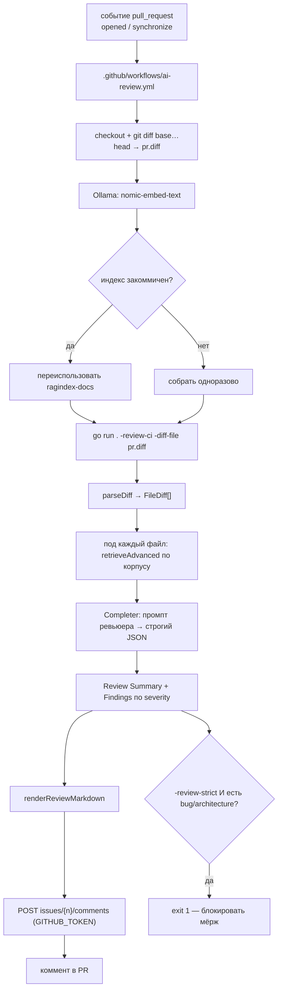

# День 32. Автоматизация ревью кода

> Неделя 7. Накопительный агент: `week-7/task-32/` = копия `week-7/task-31/` + новая фича —
> реактивное AI-ревью PR: diff → RAG (документация + код) → ревью комментом в PR. Плюс закрыт
> долг дня 31 (самоотравление корпуса).

## Задание (дословно, из Telegram)

> 🔥 **День 32. Автоматизация ревью кода**
>
> Настройте пайплайн, в котором ассистент анализирует новый PR.
> Ассистент должен:
> 👉 получать diff и изменённые файлы
> 👉 использовать RAG (документация + код)
> 👉 выдавать текст ревью
>
> **Минимальный результат:**
> 👉 пайплайн (например GitHub Action) запускается на PR
> 👉 ассистент получает diff
> 👉 возвращает: потенциальные баги / архитектурные проблемы / рекомендации
>
> **Результат:** Автоматическое AI-ревью кода. **Формат:** Видео + Код

## Что говорит курс (разбор чата)

- **Реактивность обязательна.** Гладков (14.07): «нужно именно реактивное действие», на вопрос
  про запуск командой — «нет». Возврат ревью — **комментами в PR**: «он может прям в гитхаб
  возвращать, в виде комментов».
- **Не обязательно GitHub.** Гладков (15.07): «не обязательно гитхаб, любая платформа по
  управлению кодом».
- **Свой хостинг — по желанию.** На вопрос «надо хостить сервис, куда Action сходит?» Гладков:
  reverse-proxy / ngrok / cloudflare tunnel. Мы выбрали путь БЕЗ хостинга (self-contained в
  раннере) — см. «Решение».
- **«Строить RAG каждый раз — избыточно»** (Гладков, 15.07, в ответ на вопрос Юрия). Anastasiya
  описала продакшн-путь: однократная индексация + шедулер + ручной ретригер. Это ровно наш долг
  дня 31 — закрыт здесь.
- **Претензия Гаврися:** «задание особо не связано с ассистентом, локальные модели не
  используются». У нас — связано: ревьюер это режим того же агента, тот же корпус, тот же
  `gitserver`. И он поедет на локали через `Completer`, если попросить.

## Решение и альтернативы

### 1. Реактивность: self-contained в раннере

| Вариант | Плюсы | Минусы | Итог |
|---|---|---|---|
| **Self-contained в GitHub runner** | ноль хостинга и туннелей; постинг через встроенный `GITHUB_TOKEN`; для видео — один экран браузера | `ANTHROPIC_API_KEY` в secrets (норма CI); Ollama поднимается в раннере | **выбрано** |
| Action → мой сервис через ngrok/cloudflare | «настоящий» сервис | нужен живой хостинг + туннель, который на записи может отвалиться | отклонено |
| GitLab CI | засчитывается | `ai-challenge` (корпус) на GitHub, не на GitLab | отклонено |

### 2. Ревьюер — режим нашего агента, а не скрипт

Ревьюер переиспользует `retrieveAdvanced` (rewrite → bi-encoder → порог → MMR → LLM-реранк) и
`Completer` (шов облако/локаль). Это то «целостное», о котором говорил Гладков, и ответ на
претензию Гаврися.

**Почему RAG, а не «отдай diff модели»:** diff показывает «что изменилось», но не «как в этом
проекте принято». Ценность даёт контекст — конвенции из `docs/`, смежный код. Под каждый
изменённый файл строится точечный запрос к корпусу.

### 3. Долг дня 31 закрыт: корпус больше не отравляет сам себя

День 31 (находка 10): рабочий журнал в составе README разросся до ~40% корпуса и вытеснял
`docs/` из выдачи. Здесь:

- **`devlog.md` вынесен** — «Честные находки» и «Фактические прогоны» дня 31 переехали в
  `docs/devlog.md`, который **не индексируется** (`skipFiles()` в `ragindex`);
- **индекс переиспользуется** — в CI собирается заново только если не закоммичен («строить
  каждый раз избыточно»).

Компромисс (честно): закоммиченный индекс протухает по мере правок кода — как заметила
Anastasiya. Для нашего масштаба (46 файлов) решается ретригером; для больших реп — шедулером.

## Схема



## Файлы

### Новые (5)

| Файл | Что |
|---|---|
| `reviewdiff.go` | `parseDiff` — разбор unified diff в `FileDiff[]` (файлы, +/- строки, new/deleted) |
| `review.go` | `reviewPR` — ядро: diff → RAG под файлы → LLM → `Review{Summary, Findings}`; рендер в markdown |
| `reviewrun.go` | раннер: `runReview32` (локально), `runReviewCI` (реактив), `postPRComment` |
| `.github-workflows-ai-review.yml` | GitHub Action на `pull_request` (положить как `.github/workflows/ai-review.yml`) |
| `docs/review.md` | документация ревьюера (в корпус RAG) |

### Изменённые (3 + readme)

| Файл | Что |
|---|---|
| `main.go` | флаги `-review32` / `-review-ci` / `-diff-file` / `-review-strict` / `-review-dry`; диспетч |
| `ragindex/report.go` | `skipFiles()` — `devlog.md` не индексируется (долг дня 31) |
| `ragindex/corpus.go` | `loadCorpus` принимает список файлов-исключений |
| `readme.md` | переписан; журнал вынесен в `docs/devlog.md` |

## Запуск

### Шаг 0. Запуск моделей (что и зачем поднимать)

В дне 32 участвуют ДВЕ модели с разными ролями — не путать:

| Роль | Модель | Как «запускается» | Нужно поднимать? |
|---|---|---|---|
| Пишет ревью | Claude (облако, `newCloudCompleter`) | сама, при вызове API | нет — только `ANTHROPIC_API_KEY` |
| Эмбеддинги для RAG | `nomic-embed-text` (Ollama, локально) | `ollama serve` | **да** |

То есть «запуск модели» здесь = поднять локальный **эмбеддер** (генерирующую `qwen2.5:7b` для
дня 32 поднимать НЕ надо — ревьюер по умолчанию идёт в облако).

```bash
# 1. Облачная модель (ревьюер): просто ключ в окружении
export ANTHROPIC_API_KEY=sk-ant-...
#    (или положить в .env в корне репозитория)

# 2. Локальная модель (эмбеддер для RAG): поднять Ollama и скачать эмбеддер
ollama serve &                       # запустить сервер Ollama (если не запущен)
ollama pull nomic-embed-text         # скачать модель эмбеддингов
curl -s localhost:11434/api/tags | grep nomic   # проверить, что модель на месте
```

Если хочешь прогнать ревьюер ПОЛНОСТЬЮ локально (без облака) — тогда нужна и генерирующая
модель, и флаг `-backend local` (не проверено, grounded-JSON на 7B может спотыкаться):

```bash
ollama pull qwen2.5:7b
go run ./week-7/task-32 -review32 -diff-file /tmp/pr.diff -backend local -local-model qwen2.5:7b
```

## Сценарий A — одна команда для видео (терминал, без озвучки)

Самодокументируемая команда: сама берёт встроенный образец кода с типовыми проблемами и
печатает весь пайплайн по шагам (разбор diff → RAG → ревью → итог с severity и блокерами).

**Подготовка (один раз):**

```bash
cd ~/projects/ai-challenge

# 1. эмбеддер для RAG
ollama serve &
ollama pull nomic-embed-text

# 2. ключ облачной модели (ревьюер)
export ANTHROPIC_API_KEY=sk-ant-...

# 3. индекс документации+кода проекта
go run ./week-7/task-32/ragindex -out week-7/task-32/ragindex-docs -ext .md,.go
```

**Запись — одна команда:**

```bash
go run ./week-7/task-32 -review-demo
```

На экране по порядку: какой код ревьюим → подключение контекста проекта → найденные баги по
severity (🔴 баги / 🟠 архитектура / 🟡 рекомендации) → вердикт по блокерам для CI. Достаточно
записать один прогон.

Другие локальные варианты (если нужен свой diff):

```bash
# ревью конкретного diff из файла
git diff main...HEAD > /tmp/pr.diff
go run ./week-7/task-32 -review32 -diff-file /tmp/pr.diff

# ревью diff из stdin
git diff HEAD~1 | go run ./week-7/task-32 -review32
```

## Сценарий B — реактив: создать PR и увидеть коммент

Показывает то, что просил курс: «создал PR → коммент от бота появился сам».

### B0. Подготовка (один раз, ДО записи)

```bash
cd ~/projects/ai-challenge

# 1. положить workflow в стандартную папку GitHub Actions
mkdir -p .github/workflows
cp week-7/task-32/.github-workflows-ai-review.yml .github/workflows/ai-review.yml

# 2. собрать индекс, чтобы Action не строил его на каждом PR (эмбеддер должен быть поднят)
go run ./week-7/task-32/ragindex -out week-7/task-32/ragindex-docs -ext .md,.go

# 3. закоммитить всё в main
git add .github/ week-7/task-32/
git commit -m "day 32: AI review workflow"
git push origin main
```

Затем создать секрет с ключом Claude — **обязательный** шаг, без него Action не сработает
(ревьюер не сгенерирует текст, будет ошибка авторизации).

1. Открыть репозиторий на github.com
2. **Settings** (вкладка репозитория, не настройки аккаунта)
3. Слева: **Secrets and variables → Actions**
4. **New repository secret**
5. **Name:** `ANTHROPIC_API_KEY` (ровно так — workflow ищет это имя)
6. **Secret:** твой ключ `sk-ant-...` → **Add secret**

Право бота постить коммент даёт `permissions` в самом workflow (менять не нужно, уже задано):

```yaml
permissions:
  contents: read
  pull-requests: write   # разрешает боту постить коммент в PR
```

> ⚠️ **Главная грабля.** Workflow должен быть в `main` ДО создания PR: GitHub берёт определение
> Action из целевой ветки PR, а не из ветки самого PR. Поэтому шаг 3 (push в main) — первым.

### B1. Создать PR с проблемным кодом

```bash
cd ~/projects/ai-challenge
git checkout -b test-review

# файл с типовыми проблемами (пароль в лог + SQL-инъекция)
cat > week-7/task-32/badcode.go <<'EOF'
package main

import "database/sql"

func BadLogin(db *sql.DB, user, pass string) {
	println("login user=" + user + " pass=" + pass)
	db.Query("SELECT * FROM users WHERE name='" + user + "'")
}
EOF

git add week-7/task-32/badcode.go
git commit -m "test: code for AI review"
git push origin test-review
```

Затем на GitHub нажать **Compare & pull request** (база `main`, ветка `test-review`) → **Create
pull request**.

### B2. Увидеть коммент (главный кадр)

1. Вкладка **Actions** — идёт запуск «AI Review (day 32)».
2. Ждёшь ~1–2 минуты (первый прогон дольше: раннер ставит Go и Ollama).
3. Возвращаешься во вкладку **Pull requests → твой PR** → внизу появился **коммент-ревью от
   бота** с багами по severity.

Долгую установку в Actions на видео можно перемотать/склеить. После записи ветку можно удалить:
`git push origin --delete test-review`.

### Как убрать AI-ревью после проверки

Чтобы Action не срабатывал на каждый PR — удалить `.github/workflows/ai-review.yml` из `main`.

## Фактические прогоны (MacBook M3 Max)

### Индексация корпуса

```
Корпус: 50 файлов, ~44126 токенов
Чанки: fixed-size=120, structural=670
Целостных границ: fixed-size 46% · structural 74%
Усечено на эмбеддинге: structural 0 из 670 (потолок держит), fixed-size 91 из 120 (baseline)
```

devlog.md в корпус не попал (долг дня 31 закрыт), дубликаты каталогов (`task-32 2`)
отфильтрованы — 50 файлов, а не 100 (см. «Найденные баги»).

### Ревью проблемного кода (`-review-demo`)

Самодокументируемая команда `-review-demo` берёт встроенный образец (`badcode.go` с паролем
в логе и SQL-конкатенацией) и печатает пайплайн по шагам. Итог ревью:

```
### 🔴 Потенциальные баги
- SQL-инъекция через конкатенацию строк → параметризованный запрос
- Логирование пароля в открытом виде → утечка чувствительных данных
- Игнорирование ошибки и утечка *sql.Rows (rows.Close() через defer) от db.Query

### 🟠 Архитектурные проблемы
- Функция логина не возвращает (result, error)

### 🟡 Рекомендации
- println вместо стандартного логгера проекта

Найдено замечаний: 5 (🔴 3 · 🟠 1 · 🟡 1) · блокеры: true · токены: вход 1724 · выход 789
```

Три наблюдения:

1. **Ревьюер нашёл больше, чем заложено в примере.** Пароль и SQL-инъекция очевидны, но про
   **игнорируемый `error` и незакрытый `*sql.Rows`** (утечка соединений из пула) в diff'е
   явного намёка не было — ревьюер увидел это сам, зная семантику `db.Query`, и предложил
   `defer rows.Close()`.
2. **RAG связал `println` с конвенцией проекта** — «в проекте принято `fmt`/структурный
   логгер». Этого линтер не даст: замечание опирается на код проекта, а не на общее правило.
3. **Severity сработали все три уровня**, `HasBlockers()` вернул `true` (есть bug/architecture) —
   на этом строится строгий режим CI.

Забавная петля: в контекст ревьюер подтянул `reviewrun.go · const sampleBadDiff` и разделы
README про ревью — нашёл в проекте описание собственного тестового образца. Это подтверждает,
что порог релевантности (см. «Найденные баги», п. 2) работает: подтягивается родственное, а
не случайное.

## Найденные баги (по ходу реальных прогонов)

### 1. Корпус удваивался: `task-32 2` попадал в индекс

Первый прогон дал **100 файлов и 1337 чанков** вместо ~50/670, а в источниках ревью всплыл
`task-32 2/local26.go`. Причина: Finder/IDE при копировании каталога создаёт дубликат
`task-32 2` ВНУТРИ проекта, и индексатор его засасывал — корпус удваивался.

**Фикс:** `isDupDir` в `ragindex/corpus.go` отсекает каталоги вида «имя <число>»
(`task-32 2`, `ragcore 3`). Легитимных имён с таким паттерном у нас нет.

### 2. Нерелевантный контекст в комменте

Для изолированного `badcode.go`, у которого в корпусе нет близкой родни, LLM-реранк всё равно
поднимал «лучшее из худшего» — и нерелевантный чанк (`local26.go`) утекал в блок «Контекст из
проекта». На качество ревью не влияло (модель его игнорировала, все баги найдены по diff), но
в комменте было мусором и удваивало входные токены (1368 → 623 после фикса).

**Фикс:** порог релевантности в `gatherReviewContext` — слабые хиты не идут в контекст. Шкала
зависит от наличия LLM-реранка (score 0–10) или его отсутствия (косинус 0–1) — тот же урок
дня 27 про согласование шкал.

## Ссылка на видео

Продублировать ссылкой (как принято в челлендже).

## Границы и пределы

- **Ревьюим скоуп `week-7/task-32/`** в workflow — чтобы Action не ревьюил чужие дни челленджа.
  Для реального проекта скоуп убирается.
- **Ревью не построчное, а один сводный коммент.** Задание просит «текст ревью» — сводный
  коммент это выполняет. Построчные комменты — следующий шаг (нужен `pulls/{n}/comments` с
  позициями в diff).
- **Строгий режим (`-review-strict`) выключен по умолчанию** — чтобы AI-ревью не блокировало
  мёрж на ложных срабатываниях. Включается осознанно.
- **Diff усекается** по `MaxDiffChars` (12000) — большой PR не должен снести контекст модели.
  Крупнейшие по объёму правок файлы идут первыми.

## Что дальше

- Построчные комменты (review comments с позициями в diff) вместо одного сводного.
- Инкрементальная переиндексация вместо «собрать заново, если нет» — настоящий ответ на
  «строить каждый раз избыточно».
- Тот же ревьюер как MCP-тул для дня 33 (ассистент поддержки), если понадобится ревью тикетов.

## Выводы

1. **Ревью без контекста проекта — это линтер.** Ценность AI-ревьюера не в том, что он читает
   diff, а в том, что он знает конвенции ЭТОГО проекта. Поэтому RAG под каждый изменённый файл,
   а не «diff в промпт».
2. **Реактивность дешевле, чем кажется.** Self-contained в раннере убирает хостинг и туннель;
   `GITHUB_TOKEN` уже есть у Action. Вся «инфраструктура» — один workflow-файл.
3. **Долг надо отдавать там, где он мешает.** Самоотравление корпуса (день 31) било бы по
   ревьюеру сильнее, чем по `/help`: журнал чужих багов в выдаче ревьюера — прямой шум. Поэтому
   закрыли здесь, а не «когда-нибудь».