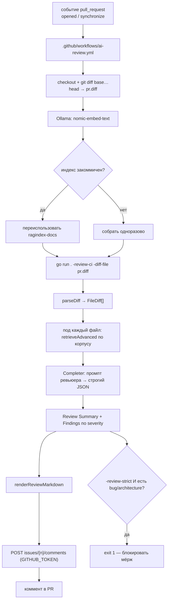

# День 32. Автоматизация ревью кода

> Неделя 7. Накопительный агент: `week-7/task-32/` = копия `week-7/task-31/` + новая фича —
> реактивное AI-ревью PR: diff → RAG (документация + код) → ревью комментом в PR. Плюс закрыт
> долг дня 31 (самоотравление корпуса).

## Задание (дословно, из Telegram)

> 🔥 **День 32. Автоматизация ревью кода**
>
> Настройте пайплайн, в котором ассистент анализирует новый PR.
> Ассистент должен:
> 👉 получать diff и изменённые файлы
> 👉 использовать RAG (документация + код)
> 👉 выдавать текст ревью
>
> **Минимальный результат:**
> 👉 пайплайн (например GitHub Action) запускается на PR
> 👉 ассистент получает diff
> 👉 возвращает: потенциальные баги / архитектурные проблемы / рекомендации
>
> **Результат:** Автоматическое AI-ревью кода. **Формат:** Видео + Код

## Что говорит курс (разбор чата)

- **Реактивность обязательна.** Гладков (14.07): «нужно именно реактивное действие», на вопрос
  про запуск командой — «нет». Возврат ревью — **комментами в PR**: «он может прям в гитхаб
  возвращать, в виде комментов».
- **Не обязательно GitHub.** Гладков (15.07): «не обязательно гитхаб, любая платформа по
  управлению кодом».
- **Свой хостинг — по желанию.** На вопрос «надо хостить сервис, куда Action сходит?» Гладков:
  reverse-proxy / ngrok / cloudflare tunnel. Мы выбрали путь БЕЗ хостинга (self-contained в
  раннере) — см. «Решение».
- **«Строить RAG каждый раз — избыточно»** (Гладков, 15.07, в ответ на вопрос Юрия). Anastasiya
  описала продакшн-путь: однократная индексация + шедулер + ручной ретригер. Это ровно наш долг
  дня 31 — закрыт здесь.
- **Претензия Гаврися:** «задание особо не связано с ассистентом, локальные модели не
  используются». У нас — связано: ревьюер это режим того же агента, тот же корпус, тот же
  `gitserver`. И он поедет на локали через `Completer`, если попросить.

## Решение и альтернативы

### 1. Реактивность: self-contained в раннере

| Вариант | Плюсы | Минусы | Итог |
|---|---|---|---|
| **Self-contained в GitHub runner** | ноль хостинга и туннелей; постинг через встроенный `GITHUB_TOKEN`; для видео — один экран браузера | `ANTHROPIC_API_KEY` в secrets (норма CI); Ollama поднимается в раннере | **выбрано** |
| Action → мой сервис через ngrok/cloudflare | «настоящий» сервис | нужен живой хостинг + туннель, который на записи может отвалиться | отклонено |
| GitLab CI | засчитывается | `ai-challenge` (корпус) на GitHub, не на GitLab | отклонено |

### 2. Ревьюер — режим нашего агента, а не скрипт

Ревьюер переиспользует `retrieveAdvanced` (rewrite → bi-encoder → порог → MMR → LLM-реранк) и
`Completer` (шов облако/локаль). Это то «целостное», о котором говорил Гладков, и ответ на
претензию Гаврися.

**Почему RAG, а не «отдай diff модели»:** diff показывает «что изменилось», но не «как в этом
проекте принято». Ценность даёт контекст — конвенции из `docs/`, смежный код. Под каждый
изменённый файл строится точечный запрос к корпусу.

### 3. Долг дня 31 закрыт: корпус больше не отравляет сам себя

День 31 (находка 10): рабочий журнал в составе README разросся до ~40% корпуса и вытеснял
`docs/` из выдачи. Здесь:

- **`devlog.md` вынесен** — «Честные находки» и «Фактические прогоны» дня 31 переехали в
  `docs/devlog.md`, который **не индексируется** (`skipFiles()` в `ragindex`);
- **индекс переиспользуется** — в CI собирается заново только если не закоммичен («строить
  каждый раз избыточно»).

Компромисс (честно): закоммиченный индекс протухает по мере правок кода — как заметила
Anastasiya. Для нашего масштаба (46 файлов) решается ретригером; для больших реп — шедулером.

## Схема



## Файлы

### Новые (5)

| Файл | Что |
|---|---|
| `reviewdiff.go` | `parseDiff` — разбор unified diff в `FileDiff[]` (файлы, +/- строки, new/deleted) |
| `review.go` | `reviewPR` — ядро: diff → RAG под файлы → LLM → `Review{Summary, Findings}`; рендер в markdown |
| `reviewrun.go` | раннер: `runReview32` (локально), `runReviewCI` (реактив), `postPRComment` |
| `.github-workflows-ai-review.yml` | GitHub Action на `pull_request` (положить как `.github/workflows/ai-review.yml`) |
| `docs/review.md` | документация ревьюера (в корпус RAG) |

### Изменённые (3 + readme)

| Файл | Что |
|---|---|
| `main.go` | флаги `-review32` / `-review-ci` / `-diff-file` / `-review-strict` / `-review-dry`; диспетч |
| `ragindex/report.go` | `skipFiles()` — `devlog.md` не индексируется (долг дня 31) |
| `ragindex/corpus.go` | `loadCorpus` принимает список файлов-исключений |
| `readme.md` | переписан; журнал вынесен в `docs/devlog.md` |

## Запуск

### Локально (разработка и видео)

```bash
# 1. индекс (если ещё не собран) — нужна Ollama
go run ./week-7/task-32/ragindex -out week-7/task-32/ragindex-docs -ext .md,.go

# 2а. ревью произвольного diff из файла
git diff main...HEAD > /tmp/pr.diff
go run ./week-7/task-32 -review32 -diff-file /tmp/pr.diff

# 2б. ревью diff из stdin
git diff HEAD~1 | go run ./week-7/task-32 -review32
```

Нужен `ANTHROPIC_API_KEY` (ревьюер и реранк — облако) + Ollama (эмбеддинги).

### Реактивно (GitHub Action)

1. Положить workflow: `.github/workflows/ai-review.yml` (файл в поставке — `.github-workflows-ai-review.yml`).
2. В настройках репо → Secrets: добавить `ANTHROPIC_API_KEY`.
3. (Опц.) закоммитить `ragindex-docs/index-structural.json`, чтобы не строить индекс на каждом PR.
4. Открыть PR → в течение прогона Action появится коммент-ревью.

Для видео: создать PR с намеренно проблемным кодом (пароль в лог, SQL-конкатенация) → показать
браузер, где ревью само появилось комментом.

## Ссылка на видео

Продублировать ссылкой (как принято в челлендже).

## Границы и пределы

- **Ревьюим скоуп `week-7/task-32/`** в workflow — чтобы Action не ревьюил чужие дни челленджа.
  Для реального проекта скоуп убирается.
- **Ревью не построчное, а один сводный коммент.** Задание просит «текст ревью» — сводный
  коммент это выполняет. Построчные комменты — следующий шаг (нужен `pulls/{n}/comments` с
  позициями в diff).
- **Строгий режим (`-review-strict`) выключен по умолчанию** — чтобы AI-ревью не блокировало
  мёрж на ложных срабатываниях. Включается осознанно.
- **Diff усекается** по `MaxDiffChars` (12000) — большой PR не должен снести контекст модели.
  Крупнейшие по объёму правок файлы идут первыми.

## Что дальше

- Построчные комменты (review comments с позициями в diff) вместо одного сводного.
- Инкрементальная переиндексация вместо «собрать заново, если нет» — настоящий ответ на
  «строить каждый раз избыточно».
- Тот же ревьюер как MCP-тул для дня 33 (ассистент поддержки), если понадобится ревью тикетов.

## Выводы

1. **Ревью без контекста проекта — это линтер.** Ценность AI-ревьюера не в том, что он читает
   diff, а в том, что он знает конвенции ЭТОГО проекта. Поэтому RAG под каждый изменённый файл,
   а не «diff в промпт».
2. **Реактивность дешевле, чем кажется.** Self-contained в раннере убирает хостинг и туннель;
   `GITHUB_TOKEN` уже есть у Action. Вся «инфраструктура» — один workflow-файл.
3. **Долг надо отдавать там, где он мешает.** Самоотравление корпуса (день 31) било бы по
   ревьюеру сильнее, чем по `/help`: журнал чужих багов в выдаче ревьюера — прямой шум. Поэтому
   закрыли здесь, а не «когда-нибудь».
