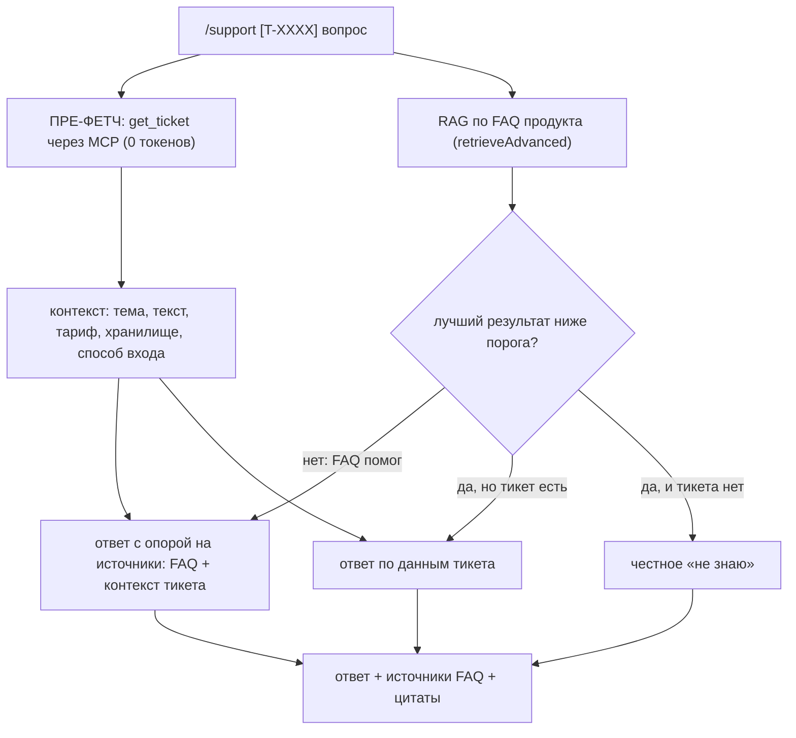

# День 33. Ассистент поддержки пользователей

Это тридцать третий день челленджа. Как и в предыдущие дни, я не пишу проект заново, а
продолжаю накопительный агент: каталог `week-7/task-33/` — это копия вчерашнего `task-32/`,
в которую добавлена одна новая возможность. В этот раз — команда `/support`: ассистент
службы поддержки, который отвечает на вопросы пользователей о продукте. Он опирается на два
источника сразу: базу знаний продукта (через RAG) и данные конкретного обращения — тикет и
профиль пользователя (через MCP). Продукт я придумал сам, это вымышленный сервис заметок под
названием **CloudNote**.

## Задание (дословно, из Telegram)

> 🔥 **День 33. Ассистент поддержки пользователей**
>
> Сделайте мини-сервис для поддержки пользователей.
> Ассистент должен:
> 👉 отвечать на вопросы о продукте
> 👉 использовать RAG (FAQ, документация)
> 👉 учитывать контекст пользователя или тикета
>
> Через MCP:
> 👉 подключите CRM
> 👉 или JSON с пользователями / тикетами
>
> Пример:
> 👉 «Почему не работает авторизация?»
> 👉 ассистент отвечает с учётом данных тикета
>
> **Результат:** AI-ассистент для поддержки пользователей. **Формат:** Видео + Код

## Что говорит курс (разбор чата)

В обсуждении задания в чате было несколько моментов, которые повлияли на мои решения.

Во-первых, автор курса разрешил не искать настоящую CRM. Дословно: «crm можно на коленке
наваять, можно взять готовую», а на реплику «у меня нет ни продукта, ни тикетов» он ответил:
«у тебя есть LLM, создай». Поэтому я со спокойной совестью сделал CRM в виде JSON-файлов с
выдуманным продуктом.

Во-вторых, дедлайн недели — понедельник, и будет проверка для тех, кто хочет перенести срок.

В-третьих, один из участников (Писаков) высказал претензию, что задания недели сводятся к
«своему claude code на минималках, который выбросят после челленджа». Эта мысль показалась мне
справедливой, и день 33 как раз позволяет от неё уйти: поддержка пользователей — это отдельный
продуктовый домен, никак не связанный с нашим собственным репозиторием. Именно поэтому я взял
вымышленный сторонний продукт, а не стал делать FAQ по своему же коду.

## Решение и альтернативы

По своей механике это задание почти повторяет день 31 (команду `/help`): там тоже был RAG плюс
контекст из MCP, собранные в один ответ. Отличается только предметная область. Ниже — три
основных решения, которые пришлось принять.

### 1. Какой продукт поддерживаем: вымышленный SaaS CloudNote

| Вариант | Итог |
|---|---|
| **Вымышленный SaaS (CloudNote): FAQ + тикеты** | **выбрано** — чистый отдельный домен, не путается с корпусом кода, уводит от «claude code на минималках» |
| Поддержка по самому агенту (FAQ по task-31/32) | отклонено — это снова «про свой же код», ровно то, на что жаловался Писаков |
| Поддержка по рабочей SMS-платформе | отклонено — закрытый домен, его сложнее показать на видео |

CloudNote — это придуманный мной SaaS-сервис для заметок с синхронизацией между устройствами.
Я выбрал именно такой продукт, потому что у сервисов этого типа есть узнаваемый набор проблем,
с которыми люди обращаются в поддержку, — а значит, ассистенту будет на чём себя показать.
Конкретно я заложил пять тем обращений: вход по magic-link (это когда вместо пароля на почту
приходит одноразовая ссылка для входа, как в Slack или Notion), синхронизацию заметок между
устройствами и конфликты при ней, три тарифа (Free, Pro, Team), лимиты на объём хранилища и
экспорт заметок.

Все данные продукта я разложил по двум каталогам внутри проекта. В `support/faq/` лежат
markdown-файлы с ответами на частые вопросы — по этим файлам работает RAG, это и есть база
знаний продукта. В `support/crm/` лежат JSON-файлы с тикетами и пользователями — это данные
CRM, которые ассистент подтягивает через MCP, чтобы учесть контекст конкретного обращения.

### 2. Как подключаем CRM: свой MCP-сервер (`crmserver`)

Задание прямо просит подключить CRM «через MCP», поэтому я написал для этого отдельный
MCP-сервер — по тому же образцу, что серверы предыдущих дней (`notesserver`, `gitserver`). Он
становится пятым по счёту рядом с серверами погоды, заметок и git. Как и git-сервер дня 31, он
работает только на чтение: менять тикеты он не умеет, потому что такого кода в нём просто нет.

Сервер даёт четыре инструмента: `get_ticket` (получить тикет по номеру), `get_user` (получить
пользователя), `list_tickets` (список тикетов) и `search_tickets` (поиск по тексту). Главный из
них — `get_ticket`: он возвращает не только сам тикет, но и данные пользователя, который его
создал, — его тариф, занятое хранилище, способ входа. Это сделано намеренно, потому что именно
эти данные о пользователе меняют правильный ответ (об этом — в пункте 4 ниже).

### 3. Как соединяем FAQ и контекст тикета: гибрид

Здесь я использую ту же схему, что и в команде `/help` дня 31, только вместо ветки git в неё
подставляется тикет. Работает она так. Если пользователь указал номер тикета, ассистент сразу,
до всякого обращения к модели, сам вызывает `get_ticket` и получает данные тикета — это
детерминированный шаг, он ничего не стоит в токенах. Параллельно по вопросу пользователя идёт
поиск в базе знаний (RAG): переписывание запроса, поиск по эмбеддингам, отсев по порогу,
переранжирование и, наконец, ответ с проверяемыми цитатами.

Порог отсечения здесь означает «база знаний не помогла». Если в FAQ ничего подходящего не
нашлось, но есть данные тикета — ассистент отвечает по ним. Если нет ни того ни другого — он
честно говорит «не знаю», а не выдумывает ответ.

### 4. Почему контекст тикета именно решает, а не украшает ответ

Это самое важное отличие поддержки от справочной команды `/help`. Данные тикета не просто
дополняют ответ — они его меняют по существу. Один и тот же вопрос «не могу сохранить заметку,
пишет про лимит» требует разных ответов в зависимости от тарифа пользователя: на Free лимит
хранилища — 1 гигабайт, на Pro — 50, и правильный ответ в этих двух случаях разный. Другой
пример: на вопрос «как сделать бэкап» пользователю на Free нужно ответить «экспорт на вашем
тарифе недоступен, нужен Pro», а вовсе не «зайдите в Настройки → Экспорт», хотя раздел FAQ про
экспорт при этом один и тот же. Поэтому тариф, вычитанный из тикета, обязан влиять на то, какой
ответ ассистент соберёт из базы знаний.

При этом контекст тикета, в отличие от FAQ, не является источником для цитирования — у него нет
идентификатора фрагмента, как у чанков базы знаний. Поэтому он попадает в запрос к модели
отдельным блоком, и механизм проверки цитат его не касается. Ровно так же был устроен git-контекст
в дне 31.

## Схема



## Файлы

Что добавилось в этот день:

| Новый файл | Что в нём |
|---|---|
| `crmserver/main.go` | пятый MCP-сервер: инструменты `get_ticket`, `get_user`, `list_tickets`, `search_tickets` (только чтение) |
| `support33.go` | команда `/support`: пре-фетч тикета, функция ответа `supportReply`, режим REPL `runSupport`, демо-режим `runSupport33` |
| `support/faq/*.md` | база знаний продукта CloudNote: авторизация, синхронизация, тарифы, экспорт — корпус для RAG |
| `support/crm/*.json` | данные CRM: `tickets.json` и `users.json` |

Что изменилось в существующих файлах:

| Изменённый файл | Что именно |
|---|---|
| `main.go` | добавлен пятый сервер (`crm`) в список MCP-серверов; новые флаги `-support33`, `-index-faq`, `-ticket`, `-support-know-threshold`; их обработка; команда `/support` в интерактивном режиме |

## Запуск

Сначала подготовка — она нужна один раз. Ассистенту требуются две модели: локальная модель
эмбеддингов (для поиска по базе знаний) и облачная модель (для самих ответов). Первую поднимает
Ollama, для второй нужен ключ API.

```bash
cd ~/projects/ai-challenge

# модель эмбеддингов для поиска по FAQ
ollama serve &
ollama pull nomic-embed-text

# ключ облачной модели, которая пишет ответы
export ANTHROPIC_API_KEY=sk-ant-...

# собрать поисковый индекс по базе знаний продукта
go run ./week-7/task-33/ragindex -docs week-7/task-33/support/faq -out week-7/task-33/ragindex-faq -ext .md
```

### Одна команда для видео

```bash
go run ./week-7/task-33 -support33
```

Эта команда сама себя объясняет: она печатает весь процесс по шагам. Сначала показывает
CRM-сервер и список открытых тикетов, затем подключённый индекс базы знаний, затем прогоняет
шесть обращений в поддержку (каждое со своим тикетом и своей темой) и в конце подводит итог.
Пятое обращение — специально подстроенная ловушка: пользователь на тарифе Free спрашивает про
бэкап, а экспорт на Free недоступен, так что ассистент обязан учесть тариф, а не ответить
шаблонно. Шестое обращение — вопрос про погоду, то есть вообще не про продукт; на нём ассистент
должен честно сказать «не знаю».

### Интерактивный режим

```bash
go run ./week-7/task-33

> /support T-5003 не могу сохранить заметку, пишет про лимит
> /support T-5001 почему не приходит письмо для входа
> /support как экспортировать заметки        # без номера тикета — ответ по одной базе знаний
> exit
```

Можно задать один вопрос по конкретному тикету и без интерактивного режима:

```bash
go run ./week-7/task-33 -ticket T-5002 "пропала заметка, помогите"
```

## Фактический прогон (на моём MacBook M3 Max)

Индекс базы знаний собрался из 4 файлов в 26 фрагментов, без потерь при усечении. Команда
`-support33` прогнала шесть обращений:

| # | Вопрос | Тикет | Откуда ответ | «Не знаю»? |
|---|---|---|---|---|
| 1 | не приходит письмо для входа | T-5001 (Дмитрий, корпоративная почта) | FAQ про авторизацию + тикет | нет |
| 2 | пропала заметка после синхронизации | T-5002 (срочный) | FAQ про синхронизацию (Корзина 30 дней) + тикет | нет |
| 3 | не могу сохранить, пишет про лимит | T-5003 (Иван, **Pro, занято 48.9 из 50 ГБ**) | FAQ + тикет | нет |
| 4 | что будет с общими заметками при переходе Team → Pro | T-5004 (владелец команды) | FAQ про тарифы + тикет | нет |
| 5 | как сделать бэкап | T-5005 (Марина, **Free**) | FAQ про экспорт + тикет | нет |
| 6 | какая погода в Москве | — | вопрос не про продукт | **да** |

Главный результат прогона в том, что контекст тикета действительно менял ответ, а не просто
присутствовал рядом. Это лучше всего видно на двух обращениях. В третьем ассистент ответил, что
на тарифе Pro лимит хранилища всё-таки есть и пользователь почти его исчерпал (занято 48.9 из
50 гигабайт), — то есть он прочитал занятое место из тикета, а не выдал заготовку «на Pro
лимитов нет». В пятом на вопрос про бэкап ассистент ответил, что экспорт на тарифе Free
недоступен и нужен Pro, — хотя раздел FAQ про экспорт был один и тот же, ответ изменил именно
тариф пользователя из тикета. В шестом обращении, про погоду, ассистент честно сказал «не знаю»
(релевантность найденного — 0.30 при пороге 3.0) и ничего не стал придумывать.

Ещё важная деталь: контекст тикета нигде не попал в список цитат — и это правильно, потому что
цитировать можно только фрагменты базы знаний, у которых есть идентификатор. Цитаты из FAQ при
этом были дословными, ни одной выдуманной.

### Найденный дефект: итоговая метрика не различала два источника

Первый прогон показал в итоговой сводке «ответов по данным тикета: 0», хотя тикет на самом деле
учитывался в каждом из пяти содержательных ответов — третье и пятое обращения это прямо
доказывают. Причина была в том, что я классифицировал ответы по одному признаку: есть ли у
ответа ссылки на FAQ. Но FAQ и тикет — это два независимых источника, они срабатывают
одновременно, и одного признака мало, чтобы их различить. Это ровно та же ошибка, что была в
итоговом чеклисте дня 31.

Исправил это в файле `support33.go`, в функции `runSupport33`. Вместо одного признака теперь два
независимых: «ответ сослался на FAQ» (у ответа есть источники) и «ответ учёл тикет» (тикет был
успешно загружен пре-фетчем). Плюс отдельно считается, сколько раз сработали оба сразу. Старые
счётчики `fromFAQ` и `fromTicket` я заменил на `usedFAQ`, `usedTicket` и `usedBoth`. После
исправления итог на реальном прогоне выглядит честно: с опорой на FAQ — 5 ответов, с контекстом
тикета — 5, где сошлось и то и другое — 5, честное «не знаю» — 1.

## Границы решения

Стоит честно назвать, что в этом решении упрощено.

CRM работает только на чтение — так же, как git-сервер дня 31. Ассистент не может менять или
закрывать тикеты, только читать их. Данные вымышлены: четыре пользователя и пять тикетов. Этого
хватает, чтобы показать главное — как тариф пользователя (Free, Pro или Team) меняет ответ, — но
это не полноценная база. База знаний тоже небольшая: четыре темы, 26 фрагментов. Для демонстрации
этого достаточно, а реальный продукт с большой документацией индексируется точно так же, разницы
в коде нет.

## Связь с остальной неделей

Этим днём в общий каркас агента добавился уже пятый MCP-сервер: погода, заметки, git и теперь
CRM. Команда `/support` не пишет ничего нового «под капотом» — она целиком переиспользует
поисковый конвейер RAG, отлаженный в дни 21–31, и общий механизм генерации, поэтому при желании
поедет и на локальной модели. Новизна здесь в предметной области: впервые за неделю агент
работает не со своим собственным кодом, а со сторонним продуктом. Это и есть ответ на претензию
Писакова про «claude code на минималках».

## Ссылка на видео

Продублировать ссылкой.